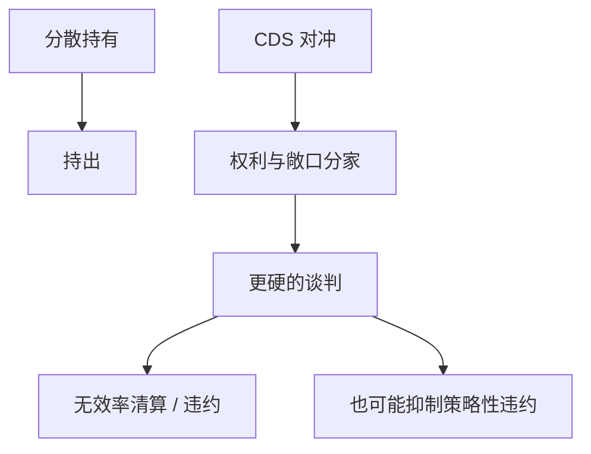

# 债权人协调与空壳债权人

    
分散的债权人难以同意减记；若有人用信用违约互换对冲到「违约更赚钱」，他更会阻止有效重整——债权人身份与经济敞口分家。

    <footer>—— Hu and Black, Debt, Equity, and Hybrid Decoupling, 2008 前后的空壳债权人论述；Bolton and Oehmke, Credit Default Swaps and the Empty Creditor Problem, Review of Financial Studies 2011</footer>

[上一课](/econ/chapter-11)给出法庭如何用表决克服持出。本课缺口是敞口被衍生品拆开：空壳债权人（empty creditor）持有投票权或法律地位，净经济头寸为零或为负。资本结构动态单元到此收束。不重写 DIP 程序，不把 CDS 定价做成衍生品课。

## 问题

持出已经使私下重组失败。CDS 让债权人把信用风险卖掉，仍保留债券或贷款上的法律权利。Hu–Black：法律权利与经济敞口 decoupling。Bolton–Oehmke：有 CDS 时，债权人更硬，可能过度阻止 Renegotiation，无效率违约上升；但强硬也可能事前抑制策略性违约。缺口是：第 11 章的表决假设投票者希望最大化债券回收；空壳后这个目标函数错了。

协调：集体行动条款、信托人、银团代理，是为把分散变集中。对冲与债权交易把集中再拆开。证券化 OTD 把同一贷款切给许多档，协调面更碎。

## 方法

事前：CDS 降低持债成本、扩大债务容量，像保险。事后：净空头或不充分对冲的持券人拒绝减记，迫使违约以触发 CDS。政策与合同：披露净敞口、表决时看经济利益，是补丁，本课只标激励。对企业：发行时要预期债权人可能被对冲，条款与关系银行的价值上升——因为银行更难完全空壳（监管与关系）。

与展期：空壳加上到期墙，拒绝展期的激励更强。与评级悬崖：触发 CDS 的定义（信用事件）成为合同设计对象，类似评级焦点。

## 机制

机制是控制权与现金流权在**债权人之间**的楔子——治理单元会对股权讲同一句话（双层股权）。这里楔子由衍生品制造。Bolton–Oehmke 的两面：保险提高事前后视的清偿纪律，也提高事后无效率。最优 CDS 规模不是零，也不是把全体债权人掏空。

宏观课序的衍生品与影子银行提供市场；本课是企业重组里的微观激励。不要把 CDS 市场微观结构写进本栏。

### 空壳不是「对冲的人都是坏人」

对冲是风险管理课（后课公司对冲）的正当工具。问题是**投票权未随敞口走**。完全对冲且仍主导重组投票，目标函数与企业价值最大化脱节。关系贷款加限制转让，是古老的反空壳技术。

本单元从 Leland 的单一债权人边界，走到分散、评级、OTD、法庭、空壳。下一单元问股权侧谁说了算：董事会与接管，对应债权侧刚刚写完的监督与协调。

## 边界

本课结束「债务的时间维度」。不要估计 CDS 基差交易。治理单元从董事会开始，不再加债务条款。公司金融进阶仍停在企业合同，不进入限价簿。

后课默认：重组效率取决于债权人敞口与权利是否对齐；CDS 可以制造空壳。条款、关系、集中持有是缓解。第 11 章多数决在空壳下也会投错方向。

## 小结

- 分散导致持出；CDS 使法律权利与经济敞口脱钩，谈判可能过硬。
- 事前保险与事后无效率并存；最优不是禁止对冲。
- 债务单元收束：动态权衡、期限、契约、谁是债权人、评级、OTD、重整与协调已经齐。
- 出处：Hu and Black；Bolton and Oehmke, *RFS* 2011。
