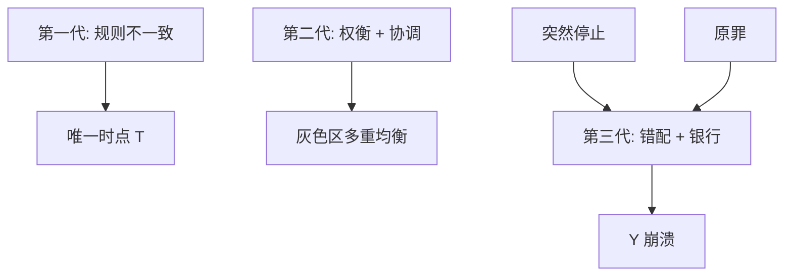

# 三代危机模型

第一代是基本面算术；第二代是多重均衡与政策权衡；第三代是资产负债表与金融加速器。同一场贬值，三套机制可以叠，不要用一代否证另一代。

<footer>—— Obstfeld, Models of Currency Crises with Self-Fulfilling Features, EER 1996；Chang and Velasco；Krugman 1999 资产负债表</footer>

[上一课](/econ/currency-crisis-models)把第一代 $T$ 钉死。本课缺口是谱系：为何储备仍多也会倒（第二代），为何贬值变成产出崩溃（第三代）。资本管制下一课是政策工具。本课分代，接到[原罪](/econ/original-sin)与[突然停止](/econ/sudden-stop)，不写成编年史。

## 问题

第一代：政策规则与钉住逻辑不一致，时点唯一。第二代（Obstfeld）：政府有反应函数，守钉住的成本随失业、利率上升；投机加息提高成本，可以有两个均衡——大家信守则守、信破则破。基本面在「灰色区」时，太阳黑子或协调决定。第三代：外币债、银行期限错配，贬值摧毁净值，信贷收缩验证危机（Krugman 1999；Chang–Velasco 国际流动性）。缺口是：1992 年英镑、1997 年亚洲、1998 年俄罗斯不能用同一条储备曲线讲完。

灰色区：基本面足够好则唯一守住，足够差则唯一崩溃，中间才有多重均衡。第二代不是「任意恐慌」，是区间里的协调。

## 方法

对照三列：驱动、时点、产出。第一代产出可以不大动（货币改锚）。第二代：防御加息本身制造衰退，政府放弃。第三代：净值通道使 $Y$ 崩溃，贬值的教科书支出转换被盖住。政策：第一代改财政货币规则；第二代要承诺装置（货币局、美元化、或提高退出成本）；第三代要审慎、币种匹配、国际最后贷款人——后课互换线。

与分担：危机是保险该赔付时资本流出，符号反了。第二代的「预言自我实现」是协调失败，不是 Backus–Smith 的慢谜。

## 机制

机制分层。第一代：库存耗尽。第二代：最优停时与战略互补（别人跑，我更该跑，政府更难守）。第三代：抵押约束，$E$ 进净值，火线出售放大——主干[火线出售](/econ/fire-sales)在开放下加币种。三套可以叠：财政软（一）、防御代价高（二）、银行外币债（三）。

欧洲 1992：英国基本面不是拉美财政崩溃，更像第二代。亚洲 1997：储备表面上够，公司与银行错配，第三代。第一代仍适用于明确用铸币税补赤字的钉住。

Morris–Shin 全球博弈给第二代加噪声，可以选出唯一均衡，但仍对基本面极敏感。本课标存在，不推噪声代数。

## 边界

本课不把某次危机「定性为第几代」当作研究完成。不写投机者操作手册。下一课资本管制：可以推迟第一代的 $T$、提高第二代攻击成本、在第三代时当紧急闸。欧债后课是货币同盟内的第三代变体（无独立 $E$）。不要用三代取消三角：每一代都是三角被压时的一种破裂形式。

后课默认：一代基本面时点、二代灰色区协调、三代净值加速器。政策工具不同。突然停止与原罪是第三代的宏观零件。管制下一课。

## 小结

- 第一代：不一致规则，唯一 $T$。
- 第二代：守住成本内生，灰色区多重均衡。
- 第三代：币种与期限错配，贬值验证信贷崩溃。
- 可叠加；用一代否证另一代是类别错误。
- 出处：Obstfeld, *EER* 1996；Chang and Velasco；Krugman 1999。
