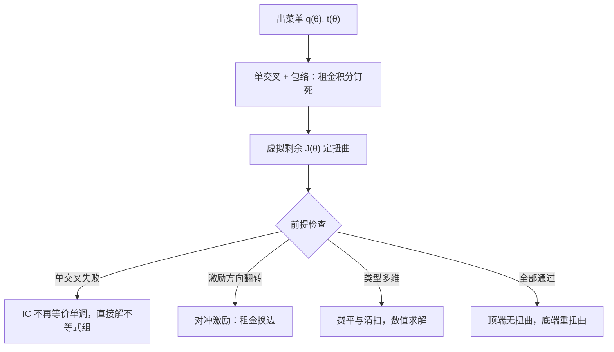
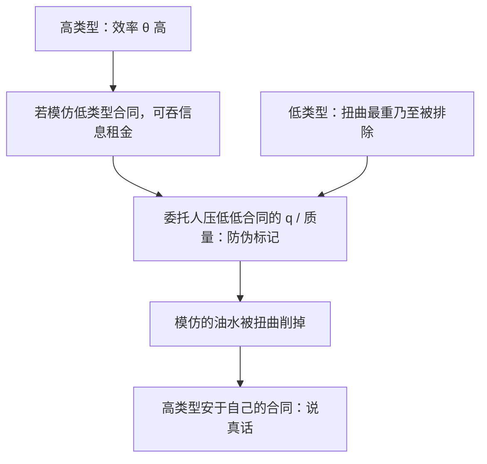

# 逆向选择的深化

信息租金是让高效率者说真话的价格；压低低效率者的产量，是付这笔账的钱。

<footer>—— 据 Mirrlees, Review of Economic Studies, 1971；Mussa and Rosen, Quarterly Journal of Economics, 1978 整理</footer>

[上一课](/econ/ct-moral-hazard-deep)把隐藏行动的合同形状钉在一阶方法与两步实施上。本课换符号：类型签约前已定，不知情者出菜单让类型对号。[筛选与信息租金](/econ/screening-rent)给了两类型直觉——低类型数量扭曲、高类型不扭曲、租金留给高类型；[Rothschild–Stiglitz 崩溃](/econ/rs-unraveling)警告竞争下均衡可以不存在。本课把两类型直觉升级成连续类型的一般机器，再检查机器在竞争、多维与激励方向翻转处的断点。

## 问题

两类型直觉缺三件事。第一，连续类型的解怎么写：哪条 IC 绑定、租金落在哪一段、扭曲沿类型如何分布，需要一个不逐对比对的算法。第二，扭曲的位置由什么决定：直觉只说「扭曲低类型」，连续世界里「低」到什么程度、向哪个方向扭曲，得由类型分布的形状给出。第三，机器的前提清单：单交叉、类型一维、激励方向单一——每一项在应用里都可能断，断点处老结论会安静失效，这才是最危险的错。

术语翻译：「信息租金」就是让强类型不说谎的封口费——委托人必须给高效率类型留一块额外好处，他才不肯假装低效率去蹭便宜合同；真正昂贵的还不止这笔租金，而是为堵住说谎所做的产量扭曲。

### 包络把搜索删掉

一维类型 $\theta\in[\underline\theta,\bar\theta]$，配置 $q(\theta)$，支付 $t(\theta)$。单交叉下，IC 等价于 $q$ 非降，且代理人效用沿包络 $U(\theta)=U(\underline\theta)+\int_{\underline\theta}^{\theta}q(s)\,ds$ 演化：租金被积分钉死，只剩底线 $U(\underline\theta)$ 一个自由量。委托人分部积分后，目标里的租金项折进虚拟剩余 $J(\theta)=\theta-\frac{1-F(\theta)}{f(\theta)}$——与[迈尔森虚拟价值](/econ/myerson-virtual-value)同一构造，拍卖是它的卖方特例。正则区间内 $q$ 由 $J(\theta)=\text{边际成本}$ 决定，低于完全信息水平；顶端 $J(\bar\theta)=\bar\theta$ 无扭曲，底端扭曲最重乃至排除。[最优所得税](/econ/mirrlees-optimal-tax)是同一台机器换福利权重运转，连顶端税率与 Pareto 尾的关系都同构。

顶端无扭曲不是仁慈，是最便宜的防伪：高类型只要模仿低合同就能吞掉租金，任何给顶端的扭曲都要用更高的租金去赎。把全部扭曲推到底端，是租金—效率权衡的角点解。

## 方法

机器上街前过三道检查。其一，单交叉在不在：偏好只交叉一次，包络才等价于 IC；保险里风险与财富两维交叉，税收里技能与劳动供给弹性交叉，都可能破坏。其二，激励方向：当类型同时移动保留效用的方向——比如成本参数也影响外部机会——可能出现反向激励，租金留给低类型、扭曲从中间断开，Lewis 与 Sappington 在 1989 年把它命名为对冲激励。其三，维数：两维以上类型，IC 是偏微分不等式组，单调性不再刻画可实施集，Rochet 与 Choné 在 1998 年给出的解法是熨平与清扫，一般没有闭式，数值是常态。

为什么重要：单交叉一旦不成立，包络条件就不再等价于激励相容，「积分钉死租金」的整套算法会安静失效——不会报错，而是继续给你一个错误的解。保险里风险与财富两维交叉正是典型翻车点。

## 机制

机制是同一个：合同必须可验证地不可模仿，扭曲就是防伪标记。Mussa 与 Rosen 在 1978 年把它写成品级歧视——垄断者给低端产品压质量，不是成本考虑，而是防止高支付意愿者滑进低价合同；「自毁芯片」式的产品线分层是这条定理的日常形态。金融市场同一台戏：[优序融资](/econ/pecking-order)里 Myers 与 Majluf 让外部股权因为逆向选择折价，内部资金与安全债排在前面，融资顺序本身就是市场自发的筛选菜单。

数字实例：类型均匀分布在 $[0,1]$ 时，$\frac{1-F(\theta)}{f(\theta)}=1-\theta$，虚拟剩余 $J(\theta)=2\theta-1$；于是只有 $\theta\gt 1/2$ 的类型被服务，产量还一律向下压——均匀分布把「排除与扭曲」的算术摆到了明面上。

竞争侧的断点在[RS 崩溃](/econ/rs-unraveling)里已经见过：混同必被撇脂，分离可能被挖角，均衡可以不存在。修补的口径是把「别人会怎么反应」写进均衡定义：Wilson 在 1977 年让合同作者预见到后续进入，Riley 在 1979 年把反应路径钉进均衡概念。修补之后筛选手印仍在——低风险者拿高免赔额合同补贴自己，高风险者被挤到贵而全的合同上；监管若一刀切禁掉类型定价，等于拆掉分离机制，市场向混同和退出滑落。

## 边界

双边都有私人信息时，[Myerson–Satterthwaite](/econ/myerson-satterthwaite) 已经钉死：IC、参与、预算平衡与事后有效不可兼得，本课不重证。动态版是另一条裂缝——今天的配置泄露类型，明天的菜单会报复，合同因此想装傻，那是下一课的棘轮。耗散对比与 PBE 精炼的武器库，[信号发送](/econ/spence-signaling)与[混同分离](/econ/pooling-separating)已备，不再展开。

## 小结

- 单交叉加包络把连续筛选收成：$q$ 单调、租金积分钉死、只剩底线一个常数。
- 扭曲沿虚拟剩余 $J(\theta)$ 分布：顶端无扭曲，底端最重，同构于最优税与最优拍卖。
- 单交叉失败、激励方向翻转、多维类型是机器的三个断点，分别要不等式组、对冲激励与数值熨平。
- 质量歧视与优序融资是同一防伪逻辑在产品与融资上的形态。
- 竞争筛选的存在性靠预期反应与反应均衡修补，类型定价被禁会推向混同。
- 出处：Mirrlees, *RES* 1971；Rothschild and Stiglitz, *QJE* 1976；Mussa and Rosen, *QJE* 1978；Wilson, *JET* 1977；Riley, *REStud* 1979；Rochet and Choné, *Econometrica* 1998。
