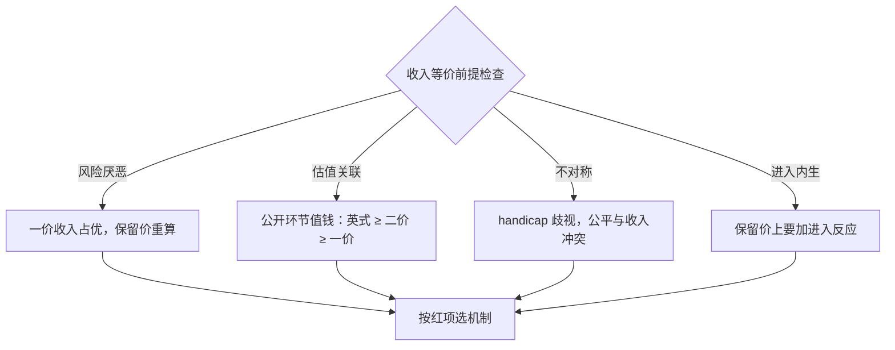
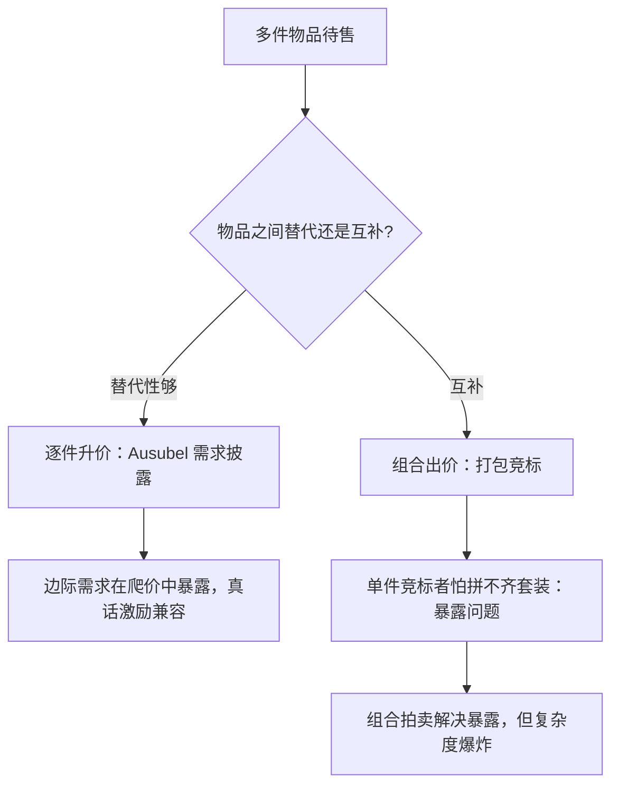

# 拍卖理论的深化

收入等价说标准拍卖一样赚钱；它的每一个前提，背后都是一个真实存在的市场。

<footer>—— 据 Milgrom and Weber, Econometrica, 1982；Maskin and Riley, Review of Economic Studies, 2000 整理</footer>

[上一课](/econ/ct-multilateral-mechanism)把人数与合谋写进机制，本课回到最成熟的应用场：拍卖。基础课已把 IPV 风险中性的基准写满——[一价遮挡](/econ/ipv-first-price)、[二价真话](/econ/second-price-vickrey)、[收入等价](/econ/revenue-equivalence)、[保留价](/econ/auction-reserve)、[虚拟价值](/econ/myerson-virtual-value)，并各自开了口：[共同价值](/econ/winner-curse)与[全支付](/econ/all-pay-auction)。本课把收入等价的四个前提逐个拧开，看哪个方向的现实把哪种拍卖推上舞台，再补上多物品、进入与合谋。

## 问题

收入等价不是定理的终点，是一张检查清单：风险中性、私人价值独立、竞标者对称、人数外生，外加预算不约束、无合谋。基准课的「都一样赚钱」只在清单全绿时成立；真实拍卖市场几乎总有一项是红的。石油租约里估值相关联，采购里成本结构不对称，破产资产竞买人兜里钱不一样多，频谱拍卖里进入本身是决策。把红的项与对应的修正对上号，才谈得上选机制——否则只是在错基准旁边做装饰性的保留价。

### 四个前提，四个市场

风险厌恶：一价拍卖里输赢风险由竞标者自担，怕输的人抬价避险，一价期望收入超过二价，卖方该选一价；同时风险厌恶削弱高保留价的抽租力——[保留价](/econ/auction-reserve)的最优解假定风险中性，这里要重算。关联：估值互相牵连时，信息有正的租金价值，公开环节让退出行为泄露信息，Milgrom 与 Weber 在 1982 年的关联原理给出排序：英式不低于二价、二价不低于一价——[赢家诅咒](/econ/winner-curse)课已给直觉，这里钉排序本身。非对称：强弱竞标者同场，弱者的存在让强者压价、收入反而受损，Maskin 与 Riley 在 2000 年的处理是歧视性的保留与 handicap——公平与收入在这里正面冲突。

术语翻译：「handicap」就是给强弱同场时「让子」——对弱竞标者降低入场门槛，或给强者单独设更高的保留条件，人为把两类拉开，防止弱者的存在白白压低强者的出价、拖累总收入。

关联原理的工程含义：把关联信息搬进公开环节通常更赚钱，但公开同时也方便合谋的信号传递——收入理论的两个方向压在同一个按钮上，选不选公开要看对手方的合作能力。

## 方法

设计问题有统一写法：直接机制给每个报告定配置概率 $q_i(b)$ 与支付 $t_i(b)$，IC 与 IR 为约束，目标为期望收入；包络把支付从搜索里删掉（[可实施性与包络](/econ/implementability-envelope)已备），收入等价只是包络的推论，Myerson 的虚拟价值是拧开「优化收入」旋钮后的解。进入内生时，保留价的算式要加上进入反应：高保留价吓退边际竞标者，减员可能吞掉抽租收益——[拍卖的结构估计](/econ/auction-structural-estimation)已把参与内生列为反演前提，设计与估计在这里对上同一本账。

## 机制

多物品把基准的裂缝放大。同质多件、逐件向上叫，竞标者对边际件的需求在价格爬升中露出，Ausubel 在 2004 年的升价机制把这件披露做成激励兼容；异质多件想一次配齐则要组合出价——同报多件打包，二价推广就是[VCG](/econ/vcg-pivot)的拍卖特例，但暴露问题随之而来：单件竞标者可能为拼不齐的套装付出高价，组合拍卖因此存在，也因此在复杂度上爆炸。合谋侧与[卡特尔](/econ/collusion-cartel)的重复博弈口径接上：竞标集团内部靠分配机制维持纪律，让标与轮流压价有策略签名，在数据里可检验——[结构估计深入](/econ/se-auction-deep)已把合谋报价当作数据问题。

数字实例：两件配套设备单独估价各 10 万、打包值 30 万。某竞标者分开出价：若两件各以 12 万落槌、他只抢到一件，就为半套付出了 12 万——高于单件价值的 10 万，多付的 2 万就是「暴露问题」的账。

Vickrey 在 1961 年的原文里就有多件雏形；此后四十年是把「真话占优」从单件搬进高维配置空间的历史，每搬一次都要重答一遍替代性够不够。

## 边界

本课不重推收入等价与虚拟价值的推导，也不展开[全支付与消耗战](/econ/all-pay-auction)的混合策略细节；动态拍卖与库存约束是另一门课的份量。结构估计侧的前提检查——风险厌恶、不可观测异质、内生进入、共同价值——已在[拍卖的结构估计](/econ/auction-structural-estimation)与[深化](/econ/se-auction-deep)写满，引用不重写。均衡概念的口径不同，结论会翻——这是上一课多边机制的警告在拍卖场的回声。下一课把货币拿掉，看配置还剩什么语言。

常见误区：初学者容易把「收入等价」读成任何拍卖都一样赚钱。它只在风险中性、私人价值独立、对称、人数外生这几项全绿时有效；现实中几乎总有一项破裂，选机制前要逐项对清单，而不是直接套结论。

## 小结

- 收入等价的四前提各对应一个真实市场：风险厌恶、关联、不对称、内生进入。
- 风险厌恶抬一价收入、削保留价抽租；关联让公开环节值钱；不对称要 handicap。
- 多物品在替代性够时升价披露可行，组合拍卖解决暴露问题但付出复杂度。
- 合谋有策略签名，让标与轮流在出价数据里可检验，不能当竞争反演。
- 选机制先查清单：红项决定修正方向，装饰性保留价救不了错基准。
- 出处：Vickrey, *J. Finance* 1961；Myerson, *Math. Oper. Res.* 1981；Milgrom and Weber, *Econometrica* 1982；Maskin and Riley, *REStud* 2000；Ausubel, *AER* 2004。
