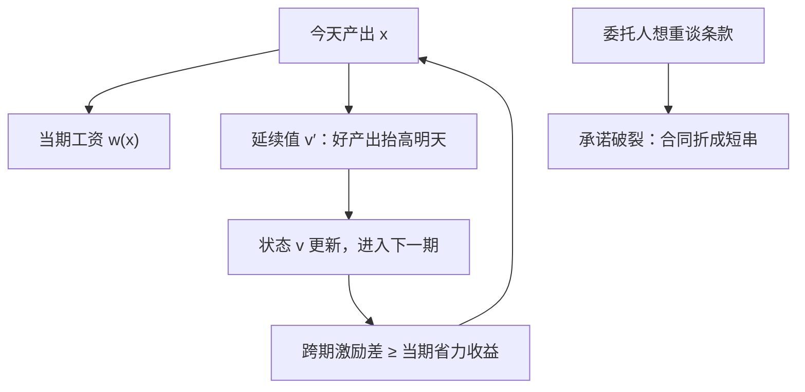

# 动态合同

长期关系的全部要点是：今天的产出改变明天的租金；合同设计就是选择这条映射。

<footer>—— 据 Spear and Srivastava, Review of Economic Studies, 1987；Laffont and Tirole, Review of Economic Studies, 1988 整理</footer>

[上一课](/econ/ct-adverse-selection-deep)把连续类型的筛选机器装好，但合同仍是一次性的。现实里的保险、债务、规制合同都在时间中续写：今天的产出既是可验证的历史，也是明天重谈条款的筹码。本课把时间写进合同，处理三个一次性模型里不存在的问题：声誉能否替代显性激励、承诺的缺失怎样制造棘轮、再谈判怎样把长期合同拆短。

## 问题

把前两课的规划原样重复 $T$ 期并不够——难点不在重复，而在两条新约束。第一，未来支付的效率取决于过去的产出：好年景应当换来更宽松的明天，这条映射本身就是合同的内容，需要新的状态变量把它记下来。第二，委托人今天签的条款，明天会想改：看到代理人高成本后，重定目标是委托人的短期理性；预见到这一点，代理人今天就会藏拙。静态菜单是同时宣布的，不存在这个问题；时间一打开，承诺从背景假设变成设计对象。

### 延续值作为状态

递归化是标准解法。把委托人向代理人承诺的延续效用 $v$ 当作状态变量，合同在每期给两样东西：当期工资，与下一期的 $v'$。Spear 与 Srivastava 在 1987 年证明，无限期重复道德风险的最优合同可以压成两条件：承诺保持 $v=\mathbb{E}[u(w)+\delta v']$，与跨期的激励差当期结清。好产出不再只涨奖金，而是抬高 $v'$——把一部分回报存进未来，委托人用未来的租金买今天的努力，比一次性现金便宜，因为代理人厌恶风险而未来平滑。历史的全部作用都收进 $v$：记住 $v$，就不用记住完整的产出序列。

效率工资的保证金没有法律形态：工人无法预缴一笔押金，失业威胁只能靠贴现兑现。延续值就是把它写成状态——保证金可以欠着，但不能不记账；账一断，纪律就断。

## 方法

承诺强度分三档处理。完全承诺下，递归合同如上，当期信号权重仍由[充足统计](/econ/holmstrom-informativeness)管，动态只改回报的期限结构。完全不可承诺但行动可观察时，退到[重复博弈与无名氏定理](/econ/folk-theorem)的世界：惩罚必须自身是均衡，贴现要压过偏离增益；Radner 在 1981 年补上有限期——近似最优的 $\varepsilon$ 均衡把这条直觉延伸到有终点的合同。介于两者之间的是隐藏行动加声誉：质量溢价流做抵押，削质的短期节约对不上溢价的现值，声誉才立得住，[质量与声誉](/econ/quality-reputation-choosing)那本抵押账原样适用。

## 机制

动态逆向选择的新病是棘轮。规制者无法承诺不使用今天的成本实现：今年干得漂亮，明年的目标就按漂亮定，超额租金被抽走；预见到这条映射，高效率者第一年就装穷，动态筛选比静态筛选更堵。Laffont 与 Tirole 在 1988 年把这一点写全——信息泄露本身是租金的敌人，分离越快，未来抽租越狠，隐藏的动机越强。这与[承诺装置](/econ/commitment-devices)同构：锁的是下一期的自己或对手的短期理性。

隐性激励是动态合同的另一个极端：完全不要显性合同。[职业关注](/econ/career-concerns)课已写，市场用产出更新能力估计，早期推断最灵敏所以隐性激励最强；读进本课框架，是零显性激励、全额延续值的角点解——市场本身就是那本 $v$ 账。债务合同则展示期限权衡：[滚动与期限](/econ/debt-maturity-rollover)在纪律与再融资风险间取舍，[债务积压](/econ/debt-overhang)是未来租金被截走后的投资萎缩，活期存款是以[挤兑](/econ/deposit-insurance)为坏均衡的动态合同。递归方法正是把它们统一处理的语法。

## 边界

最大的裂缝在再谈判。Hart 与 Moore 在 1988 年证明，若双方事前预期到事后必然重谈，长期合同的最优条款会被谈判逐段拆掉，承诺的收益蒸发——[不完全合同](/econ/incomplete-contracts)课引过这一结果，本课程里它是动态合同的硬边界：没有承诺装置，写的越长失效越快。多委托人与合谋的时间积累留给下一课；有限记忆下的简化合同是仍在推进的文献。

## 小结

- 动态合同的核心状态是延续值 $v$：承诺保持与跨期激励两条件压成递归。
- 好产出抬高明天而非今天，是用未来租金买当期努力，风险成本更低。
- 承诺不可得时，棘轮让代理人藏拙，信息泄露毁掉动态筛选。
- 无名氏定理、$\varepsilon$ 均衡与声誉溢价是无承诺三档的对应工具。
- 再谈判预期会把长期合同拆成短串，承诺装置因此是设计品而非假设。
- 出处：Radner, *Econometrica* 1981；Holmström, *RES* 1999；Spear and Srivastava, *REStud* 1987；Laffont and Tirole, *REStud* 1988；Hart and Moore, *Econometrica* 1988。
