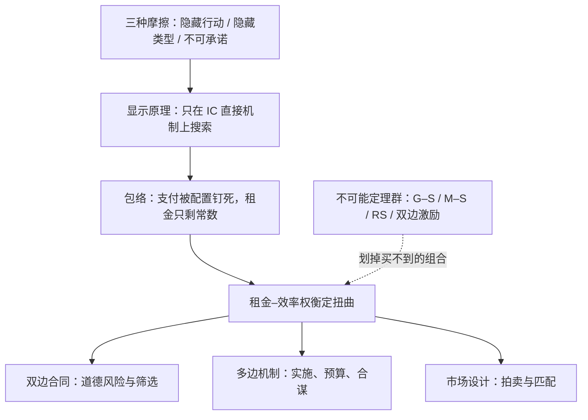
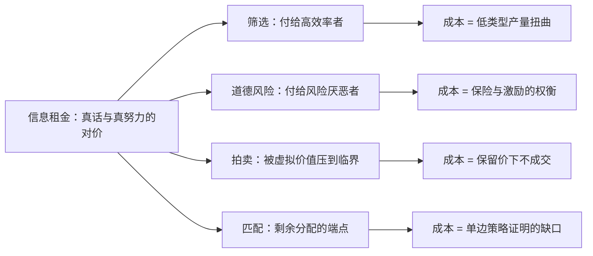

# 合同与机制收束

机制设计的全部产出是一张约束表：谁在什么时候知道什么、能对什么承诺；剩下的是求解。

<footer>—— 据 Holmström, Bell Journal of Economics, 1979；Myerson, Mathematics of Operations Research, 1981；Maskin, Review of Economic Studies, 1999 整理</footer>

[上一课](/econ/ct-matching-deep)把清台所与稳定市场写完，本课程到此收束。回看路线：合同单元从[道德风险的深化](/econ/ct-moral-hazard-deep)走到[逆向选择的深化](/econ/ct-adverse-selection-deep)再到[动态合同](/econ/ct-dynamic-contracts)，在双边关系里把激励的几何写尽；机制单元从[多边机制设计](/econ/ct-multilateral-mechanism)经[拍卖理论的深化](/econ/ct-auction-theory-deep)到[匹配市场的深化](/econ/ct-matching-deep)，把人数与规则本身变成设计对象。收束课不引入新模型，只把六个模型折回一张地图，标出边界与端口。

## 问题

六个模型有一个共同的骨架：一方知道或能做的比别人多，而承诺要靠条款实现。骨架长出三个摩擦——隐藏行动、隐藏类型、无法承诺；机制设计把它们写成同一组约束：IC 保证说真话或真努力可自我执行，IR 保证参与，再加预算、货币、偏好域这些场地条件。收束的问题因此是会计问题：三种摩擦的解各自付出什么成本、这些成本在哪些课里换过名字、哪些定理宣布某些组合根本买不到。不收这张账，每课的技巧是孤立的；收了它，新问题来了才知道该开哪个抽屉。

术语翻译：IC（激励相容）就是「让对方算完账后自愿说真话/干真活」的手段来做「不需要监督」的事；IR（参与约束）就是「保底不亏」来做「对方愿意进门」的事。每个机制都先过这两关：IR 决定人来不来，IC 决定来了后演不演。

## 方法

读图有一套固定顺序：先写约束表——谁先动、谁知道什么、能承诺什么；再查禁航区——不可能定理群；最后挑均衡概念。禁航区是地图上的既定地形，不是脚注：[Gibbard–Satterthwaite](/econ/gibbard-satterthwaite) 划掉无货币的占优策略实施，[Myerson–Satterthwaite](/econ/myerson-satterthwaite) 划掉双边交易的效率加预算平衡，[RS 崩溃](/econ/rs-unraveling)划掉竞争筛选的存在性保证，[策略证明](/econ/matching-strategy-proof)划掉匹配的双边诚实。每条定理标出「哪里必须放弃什么」，于是设计成为在禁航区之间选航道——退均衡概念、加货币、限偏好域、放大市场，四个动作解释了本课程出现的每一个机制。

## 机制

### 一笔租金的四种形态

贯穿全部课程的是信息租金的会计。筛选里，租金付给高效率者求他说真话，成本写成低类型的产量扭曲；道德风险里，租金付给风险厌恶者的风险承担，成本写成保险与激励的权衡；拍卖里，租金被虚拟价值压到临界，成本写成保留价下的不成交；匹配里，租金换成配对剩余的分配端点，成本写成单边策略证明的缺口。四处同名不同形，但包络方法把它们压成同一步运算——支付由配置钉死，搜索空间塌掉，这是本课程最重要的技术遗产。

验证一遍就会看见骨架的普适：最优税的顶端零税率、最优拍卖的虚拟保留价、筛选的顶端无扭曲，是同一条虚拟边际式 $J(\theta)=\theta-\frac{1-F}{f}$ 在福利、拍卖、产品线三个市场里的三次显影。

数字实例：设报价 $\theta=10$，类型分布均匀于 $[0,10]$，则 $F(\theta)=1$、$f=0.1$，虚拟价值 $J=10-\frac{1-1}{0.1}=10$，报价多少都愿意成交；若 $\theta=1$，则 $J=1-\frac{0.9}{0.1}=-8$，低于零，卖方宁可不卖。保留价、顶端零扭曲都从这一个减法里长出来。

对外有两个端口。实证端口：结构估计把 IC 均衡变成反事实机器，[拍卖的结构估计](/econ/auction-structural-estimation)到[深化](/econ/se-auction-deep)是样例——先检查均衡前提，再让模型回答反事实。应用端口：[最优所得税](/econ/mirrlees-optimal-tax)、[效率工资](/econ/efficiency-wage)、[存款保险](/econ/deposit-insurance)分别是筛选、道德风险、动态合同在各市场的常驻形态；它们不是「例子」，是同一台机器换数据运转。

## 边界

地图本身有三块未绘区域。稳健性：多数结论依赖共同先验与偏好精确已知，对信息结构稳健的机制设计与对行为违例的容忍是活跃前沿。行为：现实人不像 IC 假设那样最优化，[承诺装置](/econ/commitment-devices)一类证据提示激励设计要为误差留边，本课程按理性人收束。计算：包络与格结构删搜索，但多维类型与组合拍卖的可实施集仍然算不动，理论可行与工程可算之间隔着数值。这三块共同说明：本课程交付的是约束表与求解语法，不是一份能直接施工的图纸。

术语翻译：共同先验就是「所有人共享同一份对世界概率的手册」——大家看法不同只因为拿到的信息不同，而不是因为算概率的思路不同。它让「我知道你知道我知道」能一层层算下去；一旦现实里大家用不同的手册，机制的均衡就可能在地图上标不到的位置。

后课默认：遇到任何「谁先动、谁知道什么、能承诺什么」的问题，先写约束表、查禁航区、再挑均衡概念——顺序不能反。

## 小结

- 三摩擦一骨架：隐藏行动、隐藏类型、不可承诺，统一写成 IC 与 IR 上的优化。
- 信息租金是贯穿会计：扭曲、风险溢价、保留价、分配端点是它的四种形态。
- 包络与格结构是本课程的核心技术：支付被钉死，搜索空间塌掉。
- 不可能定理群是禁航区，四个补救动作解释全部机制的选择。
- 对外端口是结构估计与各市场应用；未绘区域是稳健、行为与计算。
- 出处：Holmström, *Bell* 1979；Myerson, *Math. Oper. Res.* 1981；Maskin, *REStud* 1999；Hatfield and Milgrom, *REStud* 2005 及本课程各课所引原始文献。
