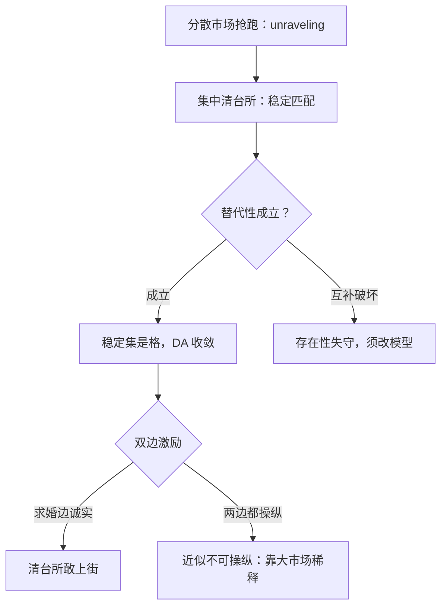

# 匹配市场的深化

稳定不是描述性统计，是市场不散架的工程规范；清台所是它的执行机构。

<footer>—— 据 Roth, Journal of Political Economy, 1984；Roth and Sotomayor, Two-Sided Matching, 1990 整理</footer>

[上一课](/econ/ct-auction-theory-deep)把拍卖的四前提拧开，本课换到货币缺席的配置：匹配。[Gale–Shapley](/econ/gale-shapley)、[策略证明](/econ/matching-strategy-proof)、[多对一](/econ/many-to-one-matching)与[学校选择](/econ/school-choice)已把 DA 的机制性质写满，宏观一侧的匹配流量归 [DMP](/econ/search-matching-dmp)。本课做三件事：把「稳定」读成对时机竞争的防御、把合同与互补性写进匹配、以及量出从定理到清台所的工程距离。

## 问题

匹配市场的病不在配错人，在配得不是时候。医学院毕业生提前两年被医院锁定，录取名额在成绩公布前签掉；时机竞争一路前移，直到双方都在信息最少的时刻成交——这就是 unraveling，[柠檬课序](/econ/unraveling-lemons)里好车逐级退出是它的价值版，这里是时点版。分散市场的每个局部都想抢跑，抢跑的均衡对所有人都更差。第二个缺口在理论侧：DA 的存在性定理在偏好满足替代性时成立——一家医院把第二名换成第三名后，对原有候选人的兴趣不该下降；互补性（两人必须组队、设备与人配套）会毁掉它。稳定的边界在哪，要用更一般的语言重写。

### 从拒绝链到不动点

时代回应：集中清台所是对 unraveling 的制度解。Roth 在 1984 年把美国医聘的清台所写成实证——NRMP 之所以活下来，恰因它产出的匹配是稳定的：没有一对医院与学生会同时偏好对方胜过现有配对，抢跑因此无利可图，时机竞争被钉住。清台所赢的不是别的算法，是「早签约」这个均衡；稳定性是让参与者愿意放弃抢跑的充分理由。

NRMP 的历次改版是自然实验：规则换向学生求婚、换处理 couples 配对，市场参与率与抢跑市场的复活与否跟着变——定理的工程版本「稳定防抢跑」被反复在场外检验。

## 方法

不动点语言把边界写清。Shapley 与 Scarf 在 1974 年的交换经济里证明：房屋市场（每人持一屋、偏好仅此而已）的核非空，顶点交易循环（TTC）给出核中的配置——[学校选择](/econ/school-choice)用过它，谱系上它是核的构造。Kelso 与 Crawford 在 1982 年把 DA 存在性背后的条件提炼成替代性：医院对候选人的需求满足 gross substitutes 时，拒绝链收敛，稳定匹配集存在。Hatfield 与 Milgrom 在 2005 年把拍卖与匹配收进同一张图纸：申请、录取、签合同，稳定匹配是稳定合同集的特例，替代性下集合构成完整格，DA 收敛到格的一端——[可实施性与包络](/econ/implementability-envelope)用单调结构删搜索，这里用格结构钉存在性，是同一手法在两个方向的运用。

## 机制

激励的账在[策略证明](/econ/matching-strategy-proof)课已对了一半：DA 对求婚边占优策略诚实，对另一边不行，稳定与双边策略证明不可兼得。深一层的机制是大市场稀释：单个医院操纵名额或排序能改善配对的剖面，在参与者众多、偏好分散的市场里可操纵的剖面占比变小——这是清台所敢在大规模市场上街的理由，也是它最难写进定理的部分。工程侧的约束同样真实：couples 配对破坏替代性，[农村医院定理](/econ/many-to-one-matching)锁死名额操纵的下界，缺席与容量谎报要在数据里监控；Roth 与 Peranson 在 1999 年的重设计，就是把这些约束一条条折进算法的现场记录。

替代性是技术条件，不是美学判断：couples 想一起工作、科室要求团队成建制，都是互补。清台所的现实版本在这些地方放弃定理、退回启发式加模拟测试——工程与理论的分工在这里最诚实。

## 边界

货币一旦进入，问题滑回拍卖与谈判，本课的稳定语言要让位给效率与收入；单边匹配的搜寻摩擦归 [DMP](/econ/search-matching-dmp)，那里问的是流量与失业，不是清台所的算法。偏好不完全信息、动态重匹配与合同的再谈判，是仍在打开的分支。口径：稳定是防御性规范，不是福利判据——求婚方最优与接收方最优都在稳定集里，选哪端是分配问题，机制的语言能描述它，不能替市场做价值判断。至此本课程的机制单元走完：下一课收束全程。

## 小结

- 稳定的工程含义是防 unraveling：清台所用无利可图的抢跑换时机秩序。
- TTC 是房屋核的构造；替代性决定 DA 稳定集的存在，互补性毁它。
- 匹配与合同统一在替代性下的格结构上，拍卖是特例。
- 双边策略证明不可兼得，大市场用近似不可操纵补工程信心。
- 稳定是防御规范不是福利判据，分配端点由求婚方向选择。
- 出处：Gale and Shapley, *AMM* 1962；Shapley and Scarf, *JET* 1974；Kelso and Crawford, *Econometrica* 1982；Roth, *JPE* 1984；Roth and Peranson, *AER* 1999；Hatfield and Milgrom, *REStud* 2005。
