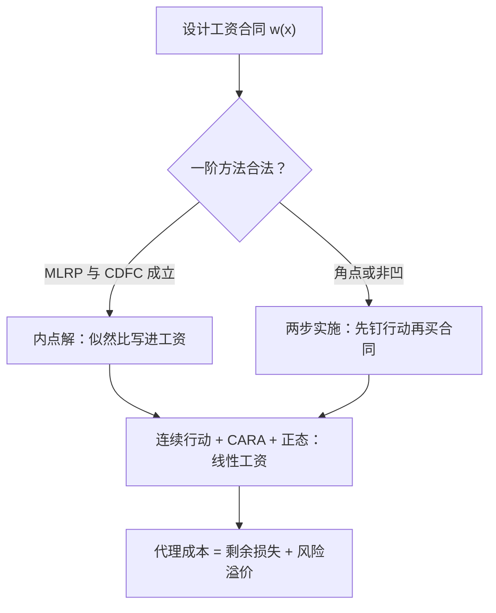

# 道德风险的深化

若代理人是风险中性且无财富约束，把剩余全部卖给他就是唯一需要的合同；本课从追问这个解为什么买不到开始。

<footer>—— 据 Holmström, Bell Journal of Economics, 1979；Grossman and Hart, Econometrica, 1983 整理</footer>

[上一课](/econ/bm-map)把银行与中介的深化收束：挤兑是可跑的债，资本是监督的押金，影子银行是工序的外移——全是合同问题的银行特例。本课程从银行转向一般的合同与机制设计，第一站回到隐藏行动：[道德风险](/econ/moral-hazard)给了风险—激励权衡的直觉，[委托–代理](/econ/principal-agent)把 IC–IR 写成规划，[充足统计](/econ/holmstrom-informativeness)与[有限责任](/econ/limited-liability-mh)各切了一刀。本课把刀口对齐：一阶方法何时合法、工资形状由什么钉住、实践里的线性合同为什么反而赢。

## 问题

基础课留下三个缺口。其一，连续行动下把激励相容约束换成一阶条件，解出来的是「似然比写进工资」，但一阶条件只保证局部最优，全局 IC 不一定跟着满足，按它算出的合同可能实施不了目标努力。其二，充足统计与相对绩效说了哪些信号该进合同，没说工资该是什么形状——为什么保险用免赔额加共保、高管期权偏凸、中间层的奖金几乎线性。其三，没有有限责任时第一最佳能被极端罚金逼近，现实合同从不这么写；约束卡在哪一层，决定后面全部设计空间。

### 一阶方法的合法条件

把 IC 换成一阶条件，要单调似然比与凸的分布函数条件护航：前者保证奖励高结果等价于奖励高努力，后者保证代理人目标在行动上凹，局部最优即全局。两组条件由 Rogerson 在 1985 年补齐，此前按一阶方法算出的合同可能根本无人按设定执行。条件不齐时解退回角点：[有限责任课](/econ/limited-liability-mh)已见过，单调性下最优工资变成债式结构。

有限责任一撤，把最坏结果上的支付推向负无穷，代理人被恐惧钉在第一最佳努力上，信息成本趋近于零；真实约束不在效用函数里，而在财富与法庭上。

## 方法

条件不齐时的正规做法是 Grossman–Hart 1983 的两步实施。先固定目标行动，求「诱出这个行动所需的最廉价合同」——给定行动的成本最小化，不需要一阶条件；再把每个行动的成本与期望产出放在一起比，选净值最大的行动。这个翻转把「写合同」变成「给每个行动标价」，一阶方法失效与否只是标价曲线光滑与否的副产品。

## 机制

工资形状由三件事瓜分：风险分担要平滑，有限责任要下界，激励要对准似然比陡峭的区间。Holmström 与 Milgrom 在 1987 年给出一组互相咬合的假设——行动连续、代理人 CARA、噪声正态、合同只看加总绩效——最优解是线性工资 $\alpha+\beta x$：斜率 $\beta$ 随努力的边际产出上升，随风险的方差与行动成本曲率下降。线性的真正优势是聚合：多任务叠加、长任务流上，线性合同对分布的具体形状不敏感。现实合同几乎不写非线性：谈判双方无力核实那个足以支撑曲线的 $F(x\mid a)$。

Jensen 与 Meckling 在 1976 年把同一套逻辑做成账目：代理成本 = 监督支出 + 担保支出 + 剩余损失。道德风险从定理变成资产负债表上的科目，才有公司金融里用融资结构购买激励的整套分析。

道德风险也接回公司边界：股东与经理、债权人与股东之间的合同本身就是激励工具，债务的还本付息是逼出现金、削掉乱花的承诺装置，与[优序融资](/econ/pecking-order)的信息成本账并行；任务多维时[可测性不对称](/econ/multitask-holmstrom)会改写一切，一维规划不可直接搬。

## 边界

本课仍是一次性、单代理人、行动一维。隐性激励属于[职业关注](/econ/career-concerns)，市场推断可以替代显性合同；团队与合谋留给多边机制课。最大的缺口是时间：今天的产出明天还能用——合同会续写、条款会重谈，充足统计的静态权重不再最优——这是下一课动态合同的入口。

## 小结

- 一阶方法要 MLRP 与凸分布条件护航，否则解出的是不可实施的合同。
- 条件不齐用两步实施：先给每个行动标价，再挑净值最大的行动。
- 风险分担、有限责任、似然比共同定工资形状；CARA 加正态下线性最优且抗聚合。
- 有限责任撤掉的极限里第一最佳靠极端罚金逼近，现实卡在财富与法庭。
- 代理成本三件套把道德风险做成可测科目，接通公司金融。
- 出处：Holmström, *Bell* 1979；Grossman and Hart, *Econometrica* 1983；Rogerson, *JET* 1985；Holmström and Milgrom, *Econometrica* 1987；Jensen and Meckling, *JFE* 1976。
