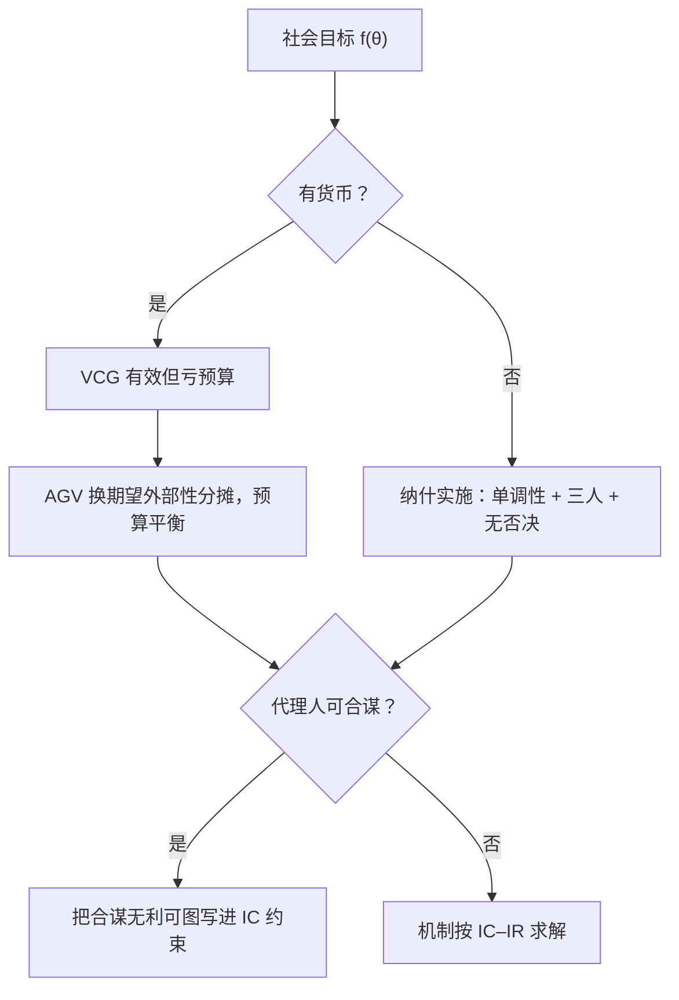
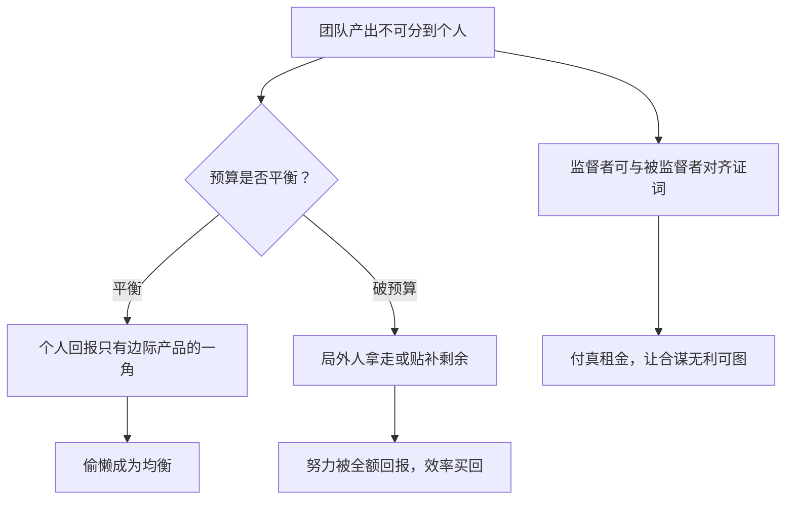

# 多边机制设计

好机制让每一条不被期望的结局都有人愿意拆台；实施理论把「好规则」重定义成自我执行的法庭。

<footer>—— 据 Maskin, Review of Economic Studies, 1999（1977 稿）整理</footer>

[上一课](/econ/ct-dynamic-contracts)把时间写进合同，本课把人数写进机制。双边合同之上是团队、联盟与投票：产出不可分到个人、偏好要加总、代理人之间可以串通。工具箱已在基础课配齐——[显示原理](/econ/revelation-principle)把设计归约到 IC 直接机制，[VCG](/econ/vcg-pivot) 有效但亏预算，[AGV](/econ/agv-mechanism) 平衡预算却只保贝叶斯激励，[Gibbard–Satterthwaite](/econ/gibbard-satterthwaite) 宣判无货币时占优策略实施几乎只剩独裁。本课处理工具箱之间的三道缝：不靠货币怎么实施、预算平衡与有效的死结、合谋与俘获。

## 问题

三道缝各有一个缺口。第一，公共选择大多没有货币：投票、委员会、宪政规则，VCG 的转移写不出来；占优策略被 G–S 判了死刑后，能否退一档，只要求均衡结果是社会的目标函数？第二，预算平衡与效率的死结：[双边不可能](/econ/myerson-satterthwaite)已证，多人时 AGV 用期望外部性转移绕开，但绕开的代价是什么、为什么转移必须依赖他人的报告，需要说清而不是背结论。第三，人数是双刃剑：团队生产让免费搭车与合谋同时成为可能——监督者本身也是代理人，链条每一环都要激励。

直觉类比：纳什实施就是造一台「想错都难」的机器——不管大家怎么博弈，凡是停下来不动的局面，落点都恰好是社会想要的那一个。 Maskin 的条件（单调性、三人、无否决）回答的是「这样的机器什么时候造得出来」。

### 纳什实施

不靠货币的实施退到均衡概念上。机制 $g$ 纳什实施目标 $f$，要求每个偏好剖面下 $g$ 的均衡结果集恰好等于 $\{f(\theta)\}$：不期望的结局必须有人有严格动机偏离。Maskin 在 1999 年（1977 稿）给出刻画：单调性是必要条件——若 $f(\theta)=a$ 而 $a$ 在另一剖面 $\theta'$ 下排序没有变差，则 $f(\theta')=a$；加上无否决与三人以上，单调性也充分。单调性弱到多数经济环境都满足，真正卡住的是三人条件与构造的工程性：证明定理用的整数博弈离可上街的规则很远。

整数博弈式构造是存在性证明，不是施工图：任何人报出异常大的整数就触发循环惩罚。它的价值在告诉你空间里有解，真实机制则在邻近处找不需要的那种报复。

## 方法

预算死结用会计讲清。VCG 的转移付给「他人报告的外部性」，有效率但净支出为正；要平衡预算，就得让每个人收到的钱来自别人的缴费——AGV 把枢轴税换成期望外部性的对称分摊，预算平衡了，激励却从占优退到贝叶斯。共同的结构是：抽信息租金的钱必须在人群内部流转，谁的转移独立于他人报告，谁就把租金缺口留给设计者。这是[公共品自愿供给](/econ/public-goods-free-rider)失败的设计学翻面：免费搭车是均衡，收钱机制必须自己养自己。

## 机制

合谋把「多边」从资源变成问题。Holmström 在 1982 年指出团队生产的死结：预算平衡的分成让个人边际回报只有边际产品的一角，偷懒是均衡；要破预算（局外人拿走或贴补剩余）才买得回效率，与[公地悲剧](/econ/common-pool)的会计同源。合谋侧，Tirole 在 1986 年把层级写成信息串通的管道：监督者的证词也是一份报告，可以私下与被监督者对齐；让子联盟无利可图（合谋无利可图约束）要付出真租金。Laffont 与 Tirole 在 1991 年把同一逻辑推进到俘获：规制者被产业收买时，利益集团政治是层级激励失败的宏观形态。

监督链条的每环都要 IC，这是多边与单边的本质差：单边模型里委托人是机制本身、不用被激励；层级一深，委托人分裂成会合谋的代理人串，设计变量从合同矩阵变成组织结构。

数字实例：三人团队多干一单位力气能多产出 1 元，平分成三份后自己只拿 0.33 元，另外 0.67 元白送队友——于是人人选择少干。若引入局外人拿走剩余再定额发工资，多干一单位自己实收 1 元，效率才回来：这就是「要破预算才买得回努力」的算术。

## 边界

纳什实施假定偏好是共同知识，均衡概念只挡单点偏离；对信息结构稳健的实施、对精炼（子博弈完美、可强实施）的要求，都会收紧结论。两人世界无否决不成立，单调性不足够，G–S 的阴影仍在。AGV 需要共同先验，没有先验时贝叶斯机制写不出来——这与[贝叶斯纳什](/econ/bayesian-nash)的先验负担同根。多数票、[中位选民](/econ/median-voter)与[阿罗定理](/econ/arrow-impossibility)的加总困难当作既定地形，不再重证。下一个应用场是拍卖与匹配：多边机制的正面战场。

常见误区：初学者容易以为 VCG「亏预算」只是记账上的小瑕疵，贴点钱无所谓。实际上缺口随人数增长且必须有人持续垫付，机制会在财政上不可持续；AGV 把这笔账摊给参与者自己养自己，代价是激励从「怎么报都一样」退到「赌别人的类型」。

## 小结

- 无货币的实施退到纳什均衡集：单调性必要，三人加无否决时充分。
- 预算平衡与效率的张力由租金会计定：转移必须依赖他人报告，AGV 是其对称解。
- 团队生产在预算平衡与破预算之间二选一，免费搭车与公地同一笔账。
- 合谋与俘获把监督者变成代理人，层级本身成为设计变量。
- 实施定理是存在性证明，工程上街要另付稳健与精炼的代价。
- 出处：d'Aspremont and Gérard-Varet, *JPubE* 1979；Holmström, *Bell* 1982；Maskin, *REStud* 1999；Tirole, *JLEO* 1986；Laffont and Tirole, *QJE* 1991。
