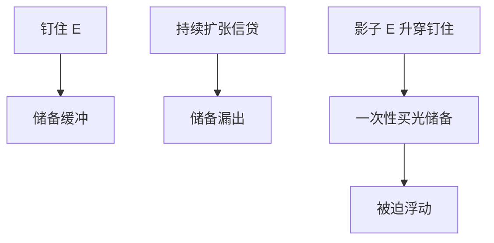

# 货币危机模型

钉住与扩张性国内信贷不能共存：储备有限，影子浮动汇率一旦穿过钉住，投机者一次买完剩下的储备，危机是时间的函数，不是情绪的函数。

<footer>—— Krugman, A Model of Balance-of-Payments Crises, JMCB 1979；Flood and Garber 1984</footer>

[上一课](/econ/international-risk-sharing)写日常分担失败。本课缺口是坏状态：钉住崩溃。三代模型下一课把第一代放进谱系；本课先钉 Krugman 第一代的机制，接到主干[突然停止](/econ/sudden-stop)与三角，不重画 IS–LM。

## 问题

固定 $E$、资本开放、国内信贷持续扩张（为财政赤字融资）。储备随信贷漏出。若永远钉住，储备终将负——不可能。Krugman：存在崩溃时点 $T$，使得影子汇率（储备耗尽后的浮动汇率）在 $T$ 等于钉住；此前无攻击，此时投机者一次买光剩余储备。缺口不是「投资者恐慌」，而是套利：延迟攻击会留下跳升的资本利得，提前攻击会亏。危机日期由基本面路径唯一（在第一代）。

影子汇率：若今天就浮动、货币路径仍按信贷规则走，$E$ 会在哪。Salant–Henderson 的黄金投机是祖先：政府以固定价卖有限库存。

## 方法

货币需求 $M/E=L(i,Y)$，钉住时 $E$ 固定，$M$ 由储备加国内信贷。信贷按常数增长。浮动后 $E$ 随 $M$ 走。平滑粘贴：崩溃瞬间 $E$ 不跳（否则未利用套利）。解出 $T$。与三角：钉住 + 开放资本 ⇒ 货币不独立；硬要独立信贷，放弃的是钉住，形式是危机。

与原罪：第一代可以在无错配下发生，对象是储备。原罪把贬值的净值成本加上，改变政府是否愿守——那是第三代味道，下一课。

## 机制

机制是有限库存加固定价格。与商品稳定储备同构。投机者不是非理性：他们在无利差时等待，在影子价格穿过时攻击。政策含义：要么停掉信贷扩张（财政 / 货币改革），要么提前浮动，要么资本管制（后课）拉长漏出时间。宣布「有足够储备」若信贷规则不变，只推迟 $T$。

与 UIP：第一代常在完美预见下写，没有 Fama 谜。加上不确定，攻击可以有随机时点，仍由基本面驱动，不是纯太阳黑子——太阳黑子是第二代。

Flood–Garber 把 Krugman 写成线性货币模型，便于课堂解 $T$。经验：拉丁美洲 1980 年代更像第一代；1992 年 ERM、1997 亚洲更要后两代。

## 边界

本课不把所有危机写成储备算术。经常账户可持续、银行、或有负债可以在储备仍多时崩溃——第二、三代。下一课专门分代。不要用本课写做空某货币的操作。量化栏外汇微观不是 $T$ 的公式。

后课默认：第一代危机是不一致政策下的时机套利，影子汇率穿过钉住。三角被违反时，危机是形式之一。多重均衡与金融加速器留给三代课。

## 小结

- 钉住 + 持续信贷扩张 ⇒ 储备有限，必破。
- 崩溃时点由影子汇率等于钉住决定；投机是套利。
- 改革规则或提前浮动，而不是口头「储备充足」。
- 无错配也可以有第一代危机。
- 出处：Krugman, *JMCB* 1979；Flood and Garber 1984；Salant–Henderson。
