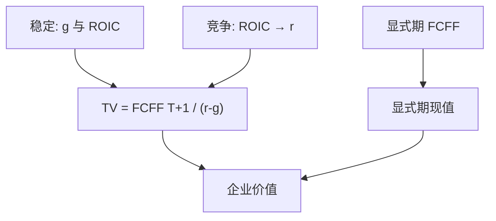

# DCF 与终值

    
显式预测期之后的价值往往占企业折现的大半；终值不是把最后一年现金流随便除以一个「永续增长率」，而是对竞争均衡下再投资与回报率的假设。

    <footer>—— 据 Gordon, The Investment, Financing, and Valuation of the Corporation, 1962；Damodaran, Damodaran on Valuation；Koller, Goedhart and Wessels, Valuation 整理</footer>

[上一课](/econ/fcf-forecasting)把显式期 FCFF 的口径钉住。本课缺口是显式期结束以后：Gordon 增长、退出乘数、以及终值对 ROIC 与增长是否内部一致。不重写营运资本科目，不把可比乘数课提前写成主体。

## 问题

有限期 DCF 必须在第 $T$ 年停手。之后若假设 FCFF 以常数 $g$ 永续，终值是 $FCFF_{T+1}/(r-g)$。$g$ 不能长期超过经济名义增长，否则企业大过经济；$r$ 是稳定期 WACC 或 $r_U$。更紧的约束是会计：增长要靠再投资，$g=b\times\mathrm{ROIC}$，留存率 $b$ 与超额回报不能同时任意。若稳定期仍假设 ROIC 远高于 WACC 且 $g$ 很高，终值把所有尚未发生的垄断租金一次贴现进来——这是资本预算里最大的一个数，也是最容易被调关的数。

缺口因此不是「会不会用 Gordon 公式」，而是：终值占 $V$ 的比重通常过半，它编码的是竞争何时吃掉超额利润，而不是对 Excel 最后一行的装饰。

退出乘数（第 $T$ 年 EV/EBIT 等）是终值的另一种写法，与下节可比同源。它把假设藏在倍数里；Gordon 把假设藏在 $g$ 与 ROIC。两者应对齐，不能一个乐观一个保守来对冲责任。

## 方法

先选稳定期何时开始：超额增长、利润率扩张、资本支出远高于折旧，都不能算稳定。稳定期 FCFF = NOPAT $\times(1-g/\mathrm{ROIC})$。ROIC 向 WACC 靠拢是竞争默认；持续超额 ROIC 必须有可辩护的壁垒，并在边界里声明。$g$ 用名义，与名义折现率匹配。

敏感性：终值对 $g$ 与 $r-g$ 极度敏感。资本预算应报告终值占比、以及 ROIC=$r$ 时的终值（零 NPV 增长，增长不创造价值）。后一种是 Koller 等人强调的纪律：增长在 ROIC=$WACC$ 时不增加价值，只改变规模。

APV 世界：无杠杆终值用 $r_U$ 与无杠杆 $g$；税盾若债务永远按比率再平衡，可并进 WACC 终值，不要无杠杆终值加完税盾再按 WACC 折一遍。

## 机制

机制是增长与再投资的会计恒等式加上竞争。多增长一单位，必须垫付资本；垫付的资本若只赚回机会成本，NPV 不增。把终值写成「利润永续、再投资忽略」，等于假设无限的零成本产能——与上一课的净经营资产约束直接冲突。宏观课序里的总量增长上限，在这里变成单个企业 $g$ 的天花板；不是把 DSGE 校准搬进模型，而是禁止企业永续跑赢名义 GDP 很多。

时机：实物期权说显式期内可以等待；终值把等待之后「已经在稳态经营」的价值一次性写下。不要用一个很大的 $g$ 去代替尚未执行的期权——期权应在显式期用决策树或后课实物期权估值。

### 终值不是「再加一个协同」

并购材料常在 DCF 之外另加战略终值。那是重复计算，除非显式期现金流故意不含协同。终值只延续同一口径的 FCFF 规则。

Gordon（1962）的股利增长模型是股权口径的近亲；企业口径换成 FCFF 与 WACC。公式同构，口径不能混：不要用股利增长公式去折 FCFF。

## 边界

不要把本课写成乘数估值全文：退出倍数的截面比较是下一课。也不要发明一个「终值折现率」与 WACC 不同却无理论——稳定期风险若下降，应声明 beta 下降，而不是随便减 200 个基点。通胀下一课再拆名义与实际；本课只要求 $g$ 与 $r$ 同为名义或同为实际。

后课默认：终值由稳定期 $g$、ROIC、$r$ 内部一致给出；占比必须报告；ROIC=$r$ 是增长无价值的参照。下一课：同一价值也可以用可比倍数读出，作为 DCF 的对照，不是替代接受规则。

## 小结

- 终值往往占 DCF 大半，编码竞争均衡下的 $g$ 与 ROIC，不是随意的永续除法。
- $g=b\times\mathrm{ROIC}$；ROIC=$r$ 时增长不创造价值。
- 退出倍数与 Gordon 应对齐；不要给终值另开一套协同。
- 出处：Gordon 1962；Damodaran；Koller, Goedhart and Wessels。
