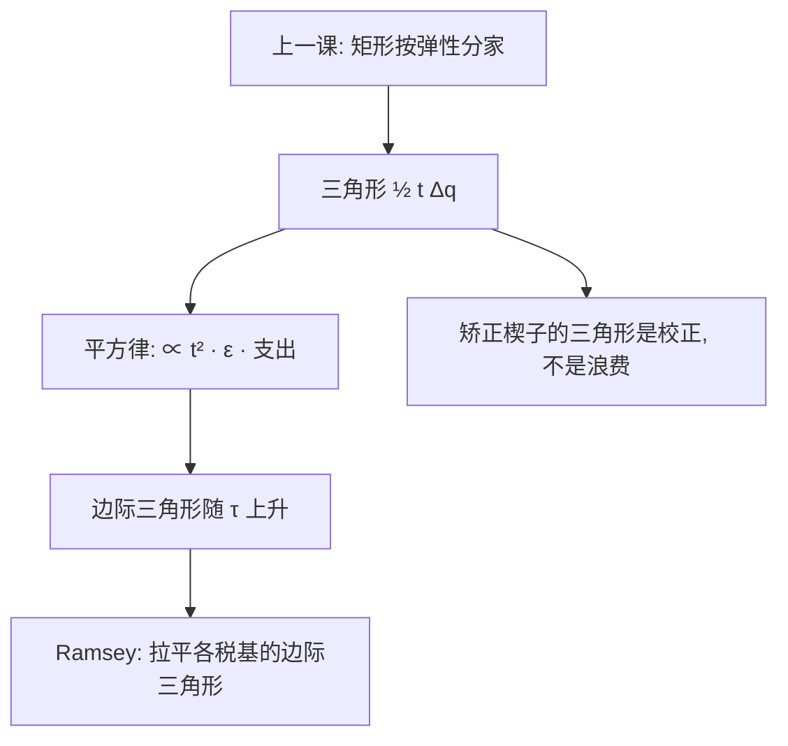

# 无谓损失的度量

税率翻倍，收入大约翻倍，被挤掉的互利大约翻两番——平方律是税制设计里最便宜的一条定理，也最常被忘记。

<footer>—— 据 Harberger, The Measurement of Waste, AER 1964；Ramsey, A Contribution to the Theory of Taxation, EJ 1927 整理</footer>

[上一课](/econ/tax-incidence-statutory)把楔子的矩形按弹性分了家：归宿是分配，落在谁身上另有答案。矩形之外还有三角形——被税挤掉的互利交易，买方、卖方、国库谁也不曾拿到。主干[无谓损失](/econ/deadweight-loss)已把矩形与三角形分开；本课做度量：三角形怎么从弹性算出来、为什么随税率平方增长、边际与平均差多远，并接回 [Ramsey 最优商品税](/econ/ramsey-optimal-commodity-tax)的一阶条件——Ramsey 规则就是把这些边际三角形拉平。

## 问题

从量税 $t$ 使数量收缩 $\Delta q$，局部近似下

$$
\mathrm{DWL}\approx \tfrac12\,t\,\Delta q
\;\approx\;
\tfrac12\,\Bigl(\tfrac{t}{p}\Bigr)^{2}\,
\frac{\varepsilon_D\varepsilon_S}{\varepsilon_D+\varepsilon_S}\,p q .
$$

缺口是把这条式子当成计算而非口号：税率从 10% 提到 20%，收入翻倍，三角形翻两番；「多征一元的效率成本是多少」与「这一税种平均多贵」是两个问题——前者随税率上升，后者是它的平均。Ramsey 问题的原形正是边际版：在多个税基上筹固定收入，把每一处的边际三角形对边际收入拉平。

### 平方律的算术

代入数字。需求弹性 $\varepsilon_D=1$、供给充分时，$\tau=10\%$ 的税，三角形约为税前支出的 $0.5\%$，约为税收收入的 $5\%$；$\tau=20\%$ 时约为税收收入的 $10\%$——绝对损失翻两番，收入只翻一番。两个 $10\%$ 的窄税几乎总比一个 $20\%$ 的税便宜：这是「宽基低税率」的全部效率算术，也是增值税把碎片优惠合并成单一税率的理由。

## 方法

Harberger 1964 的口径：在税后均衡点用可观测弹性估三角形，把各市场的小三角形加总，作为第一最佳附近的二次近似。这给出一台可操作的仪器：每讨论一次税改，先问楔子动多少、税基弹性多大，再按平方律报价。边际版：在 $\tau$ 处多筹一元，新增三角形约为 $\tau\,\Delta q$ 对新增收入的比，$\tau$ 越大越贵——[再分配与效率代价](/econ/redistribution-efficiency)的「边际公共资金」在此有了度量口径。与 Ramsey 的分工：给定单一税基，按逆弹性分布楔子；给定多个税基，利用平方律把每个楔子都压低——两句话不矛盾，是同一二阶近似在不同约束下的投影。

## 机制

为什么是平方：两个线性效应相乘——每单位交易的楔子更高，同时被挤掉的单位更多。弹性同时出现在两处，无弹性税基「数量不太动」，三角形自然小，这与归宿课「无弹性端多担矩形」同时成立、互不冲突：矩形是转移，三角形是消失的互利。已有的扭曲会改账：市场上已有别的楔子时，单独缩小一个三角形可能放大别处的，加总只在第一最佳附近成立——[次优](/econ/theory-of-second-best)的回声，Ramsey 课的边界在此重申。还有一类例外：矫正外部性的楔子挤掉的是负剩余活动，它的「三角形」是校正收益，不是浪费——下一课的主角。

行政与稽查成本不在三角形里：宽基低税省下的三角形，可能被申报复杂度吃回去。平方律只算价格扭曲这一漏，报告税改时要与合规成本分列。

## 边界

收入效应大时 Marshall 三角不等于补偿变分，大税要换 EV/CV 口径；交叉价格与替代矩阵让「逐市场三角形」失真；储蓄、资本收益的三角形在跨期模型里另写，本课不展开。把 DWL 线性外推成「税率乘税率」以外的比例、或把两种楔子画进同一张福利账，是本课禁止的两类错。后课默认：先问楔子是不是矫正性的，再决定三角形记浪费还是记收益。

## 小结

- DWL ≈ ½ t Δq；代入弹性得随 $t^2$ 增长的平方律。
- 小税的伤害是二阶的：宽基低税率的效率算术全部来自平方律。
- 边际三角形随税率上升，边际公共资金由此有度量口径。
- Ramsey 规则 = 各税基的边际三角形对边际收入拉平，逆弹性是其特解。
- 矫正性楔子的三角形记收益，为碳定价留口。
- 出处：Ramsey 1927；Harberger, AER 1964；主干无谓损失课。
