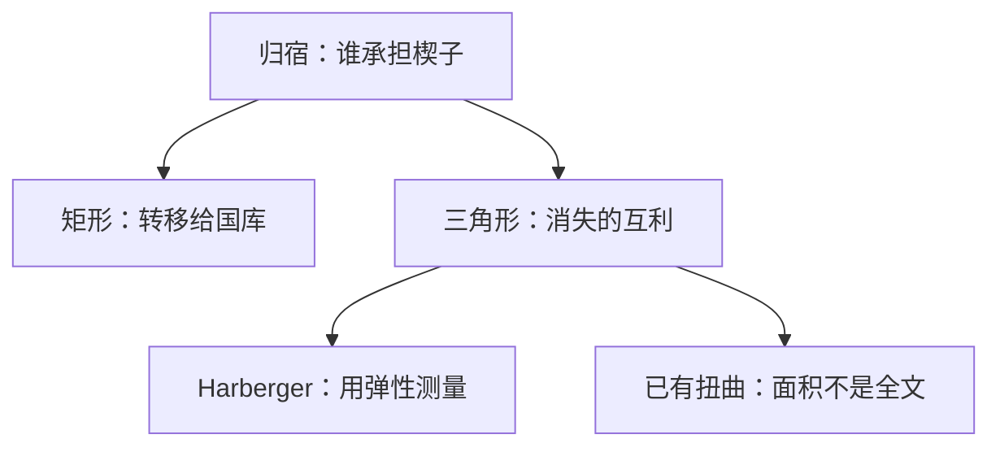

# 无谓损失

被税收挤掉的那些边际交易，其社会价值高于社会成本；损失的剩余不落在买方、卖方或国库任何一方。

<footer>—— 据 Marshall, Principles of Economics；Harberger, The Measurement of Waste, American Economic Review, 1964 整理</footer>

[上一课](/econ/tax-incidence)把楔子 $t$ 按弹性分摊到 $p_b$ 与 $p_s$，并声明超额负担另账。缺口是效率：交易量下降消灭的那块剩余，不是归宿再问一遍「谁承担 $t$」。本课钉 Marshall 剩余与 Harberger 三角形，不重写弹性公式。

## 问题

税前竞争点上，边际交易的价值等于成本。从量税插入后 $q$ 下降，被挤掉的那些单位，买方评价仍高于卖方成本，但过不了楔子。买方剩余损失加卖方剩余损失，减去国库收到的 $t\cdot q$，剩下一块正的无谓损失（DWL）。局部、无收入效应、小税时

$$
\mathrm{DWL}\approx \tfrac12 t\,\Delta q=\tfrac12 t^2\frac{\varepsilon_D\varepsilon_S}{\varepsilon_D+\varepsilon_S}\frac{q}{p}.
$$

面积随 $t^2$ 走：小税伤害是二阶的，大税不是。归宿分割矩形，不改变三角形——负担落在哪一侧是分配，三角形是效率。

### 无谓损失不是税收收入

国库的矩形是转移，可以用来提供[公共品](/econ/public-goods)或做总额返还。三角形是消失的互利，返还也找不回来。把「税很重」说成 DWL，若只是转移大、数量几乎不动（无弹性），效率损失其实小——那正是逆弹性直觉的来源，下一课 Ramsey 会用。

图形：需求以下、供给以上、税后数量以右的三角。Harberger 强调可观测：用税后点的弹性与税率估面积，不必先画出整条曲线。这是应用福利的会计，不是新的均衡定义。

## 方法

局部：Marshall 剩余。严格一点用等价变分或补偿变分；无收入效应或拟线性时三者重合。工具就是上面的三角形（或梯形，若曲线不是直线）。

一般均衡：一种税改所有相对价格，浪费是各市场超额负担之和，交叉项由替代矩阵决定。Harberger 的测量把「一块一块三角形」加总，作为第一最佳附近的二次型。已有其他扭曲时，这块面积不是福利变化的全部——那是[次优](/econ/theory-of-second-best)。

## 机制

为什么会有三角形：数量沿错误的相对价格走。每一单位被挤掉的交易，社会少掉的剩余是该单位上「评价减成本」的积分，税不进入这笔积分——税只是把私人计算推离社会计算。弹性越大，$\Delta q$ 越大，同样的 $t$ 消灭更多交易。这与归宿的「无弹性者承担价格」同时成立：无弹性者多承担矩形，但三角形仍由双方弹性共同决定 $\Delta q$。

[垄断](/econ/monopoly-lerner)的 DWL 是另一根楔子（加成），会计同形，来源不同。庇古税挤掉的是有害活动，相对无税市场的「三角形」是校正，不是浪费。商品税的三角形才是本课的无谓损失。两种楔子不要画在同一张福利账上。

### 测量是二次型，不是道德

Harberger 1964、1971 把应用福利收成可加的小三角形，假设边际上用消费者剩余、一美元一票。人际权重、收入效应、Gorman 加总不成立时，面积会骗人。本课要的是会计身份：转移加浪费加剩余变化为零（局部）。公平判断另要社会福利函数。

资本税的无谓损失可以落在投资、劳动供给或跨期消费上，不落在「公司」这个法定纳税人上——这与上一课 Harberger 归宿模型是同一一般均衡通道，只是本课问面积，上问落点。

## 边界

收入效应大时，Marshall 三角不是等价变分。配额、价格管制的 DWL 同形，但矩形可能变成寻租而不是国库。次优里，单独缩小一个三角形可能放大别处的三角形。

后课默认：讨论税先分清矩形（归宿、转移）与三角形（DWL）；小税伤害二阶；已有扭曲时不能把三角当福利变化全文。

## 小结

- 归宿分摊矩形；无谓损失是挤掉交易后消失的剩余。
- 小税的 DWL 约 $\tfrac12 t\Delta q$，随 $t^2$ 走。
- Harberger 用弹性测量浪费；一般均衡要加交叉市场。
- 庇古校正与商品税浪费不是同一块三角。
- 出处：Marshall, *Principles*；Harberger, *AER*, 1964；*JEL*, 1971。
