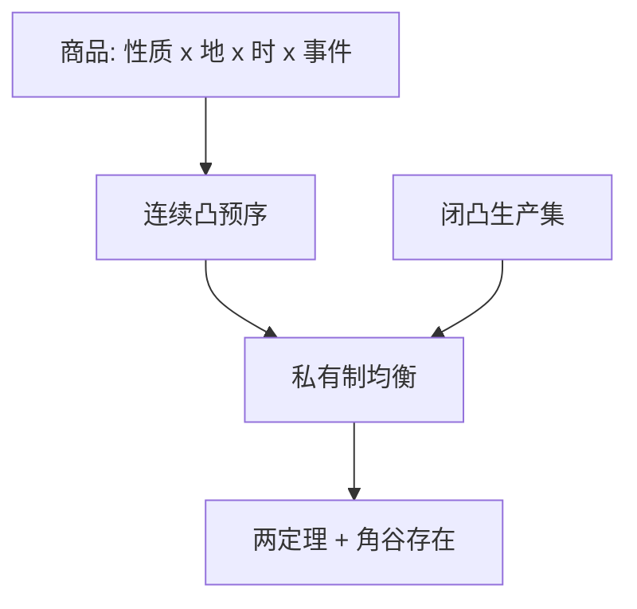

# Debreu 价值理论

本书的目的，是对竞争经济均衡做一次公理化分析。

<footer>—— Debreu, Theory of Value: An Axiomatic Analysis of Economic Equilibrium, Cowles Monograph 17, 1959</footer>

附录对照。[上一篇](/econ/arrow-debreu-paper)钉的是 Arrow 证券对或有商品的降维。本篇对照 **Debreu 1959 原书**：把商品空间、偏好、生产、均衡与福利收成一套可引用的公理，而不是课堂版的盒与超平面口诀。主干[福利两定理](/econ/welfare-theorems)与[存在性](/econ/ge-existence)已经取用结论；这里看原书怎样把日期、地点、状态写进同一商品向量。

## 问题

1954 年论文证明存在，但商品仍是抽象的 $\mathbb{R}^L$。缺口是统一语言：同一套符号要同时覆盖跨期、空间与不确定，而不另起「宏观」或「金融」章节。Debreu 的解决是把商品定义为物理性质、地点、日期与事件的组合。价格是该空间上的线性函数。一旦接受这一定义，不确定与时间不再是新理论，只是 $L$ 变大。

原书明确走布尔巴基式的公理路线：先列消费集、偏好的连续性与凸性、生产集的闭凸与不可逆，再陈述均衡与帕累托，最后用角谷。它不是经济史，也不给算法。

Cowles 专著 17。九章从商品与价格写到不确定。存在性用角谷，不用布劳威尔对付对应。私有制经济（private ownership）把利润按股份分配，均衡定义里利润必须被分完。

## 方法

商品空间是有限维欧氏空间。消费集闭、凸、下有界；偏好用完备、传递、连续、凸的预序（不必先写效用函数；效用是表示，不是原语——对照主干[效用表示](/econ/utility-representation)）。生产集含 $0$、闭凸、不能免费生产。均衡是价格、消费与生产计划，使需求在预算上最优、生产利润最大、市场出清。福利两定理在局部非饱和与凸性下陈述；第二定理用分离超平面，转移是总额的。

不确定一章把事件树写进商品下标，正是上一篇 Arrow 证券的商品侧。书中不讨论证券的动态交易策略，也不讨论不完全市场。

## 机制

机制是线性价格在凸性上的支撑。凸偏好使「更好的集合」可被超平面分开，价格于是既是出清信号又是福利支撑。公理化的代价是：凡凸性失败（不可分、规模报酬递增），存在与第二定理一起停。原书把失败留在假设里，不提供非凸存在的一般定理。

与 Arrow 1953/1964 的分工：Debreu 把状态写进商品；Arrow 说明可用证券结算购买力。两篇对照才构成「或有商品经济」的课堂缩写。主干若只引 1954 存在性，会漏掉商品定义本身。

### 效用是表示，不是原始对象

书的章节顺序禁止先写 $\max u(x)$：先有商品空间上的偏好公理，连续效用是定理。主干第一课[偏好](/econ/preference-choice)的禁令出自这里。货币在书中没有特殊地位；[货币层次](/econ/money-as-medium)必须另找摩擦。柠檬、信号、银行全部在公理之外。读附录是为了看见主干从哪一组假设出发，不是把 1959 年专论插入微观课序中间。

Cowles Foundation Monograph 17, Wiley / Yale, 1959。与 1954 年 Econometrica 短文不是同一文献。

## 边界

原书有限维、有限代理人、完全市场。无限维商品（连续时间消费）、测度空间上的代理人、太阳黑子，都是后继文献。不要把《价值理论》读成已经包含 [CAPM](/econ/capm-theory) 或 [SDF](/econ/stochastic-discount-factor)——那些要再加偏好与证券结构。也不要在附录复述盒的图画：那是主干埃奇沃思课的教具。

下一篇附录离开完全信息的竞争，对照 Akerlof 1970 的柠檬市场原文。

Mas-Colell, Whinston and Green 是教学展开；Debreu 是公理核。不要在附录复述斯勒茨基或厂商供给——那些是主干已经写过的推导。

效用是表示定理，不是第 1 章的原始对象。主干偏好课禁止先写 $\max u(x)$，出处在这本书。

货币、银行、柠檬不在书中。那些课程必须另加摩擦，不是 Debreu 的未完成章节。

有限维、有限代理人、完全市场是主场域。无限维与测度空间上的代理人是后继。

1954 年论文与 1959 年书不要混引成同一文献：一篇存在性短文，一本公理专论。

## 小结

- 附录对照 Debreu 1959：竞争均衡的公理化，商品含时、地、状态。
- 存在与两定理是书中定理，不是口诀；凸性是支撑价格的关键。
- 与 Arrow 证券文分工：商品定义 vs 证券实施。
- 出处：Debreu, *Theory of Value*, 1959。
