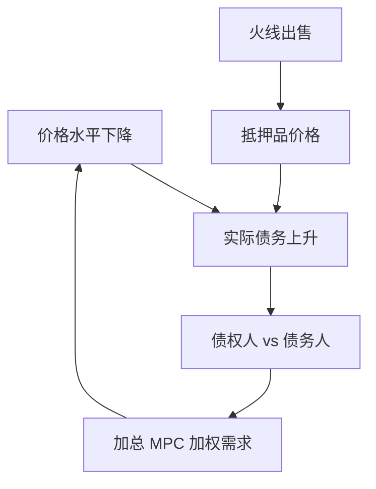

# 债务通缩

价格水平下降提高名义债的实际负担；债务人是高支出倾向的一方时，通缩是再分配衰退，不是货币中性。

<footer>—— Fisher, The Debt-Deflation Theory of Great Depressions, Econometrica 1933；Tobin 对再分配总需求</footer>

[上一课](/econ/collateral-house-prices)的房价是资产价格。本课缺口是**一般价格水平**进入名义合同：Fisher 债务通缩。不重写 LTV 代数，不把 1933 写成思想史展览。

## 问题

货币中性：价格与名义债同比例，实际合同不变。合同若未指数化，通缩使财富从债务人转向债权人。Fisher：被迫出售、破产、货币流通下降，螺旋。Tobin：若债务人 MPC 更高，再分配降低总需求。缺口是把家庭债务与 KM/GK 的实际净值，接到名义刚性合同与菲利普斯——通缩不再只是 NK 的「需求不足的症状」，而是额外的放大。

Fisher, *Econometrica* 1933。Bernanke 对大萧条金融观点。Eggertsson–Krugman 下一课把同一再分配写成现代 ZLB 模型。Doepke and Schneider 的名义头寸谁持有。

## 方法

名义债 $B$，价格 $P$，实际负担 $B/P$。冲击：需求下降使 $P$ 降（粘性未完全调整或预期通缩）。再分配进入 HANK 的 MPC 加权。抵押：实际房价 $q$ 与 $B/P$ 同时动。识别：未预期通胀对名义财富的效应（Auclert 的渠道）是债务通缩的一阶邻居。金本位、固定汇率是历史装置，放大通缩输入。

与预期：若通缩被预见，事前利率会补偿；未预期才再分配。债务通缩理论强调合同签订后的价格意外。

## 机制

机制是名义刚性合同加异质 MPC。完全指数化或一日内再谈判则通道关。银行：名义债的债务人若是银行，GK 净值被通缩打——日本与危机后的银行资本故事。主权：本币名义债被通胀稀释，外币债相反（后课原罪已在其它课，本单元后部主权再钉）。

政策：避免通缩的名义锚（上一单元锚定）有金融稳定价值，不只是菲利普斯。

大萧条经验是 Bernanke 与 Eichengreen 的领地。本课要机制，不重写全部年表——危机史后课再给模式。

## 边界

本课不主张永远通胀稀释债务。未预期通胀有其它成本（菜单、不公、解钉）。下一课把借款人约束与 ZLB 写成现代解析模型。不交易 CPI 期货。

后课默认：通缩经名义债再分配放大衰退，当债务人 MPC 更高或受约束。下一课：Eggertsson–Krugman 的去杠杆。

## 小结

- Fisher：通缩提高名义债实际负担，强迫去杠杆与需求下降。
- 关键是未预期价格与 MPC/约束不对称。
- 名义锚因此有金融稳定含义。
- 出处：Fisher, *Econometrica* 1933。
