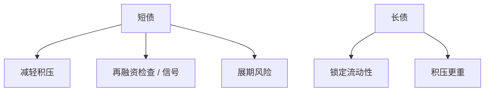

# 债务期限与展期

    
短债减轻债务积压，却把企业暴露在展期市场冻结上：能过桥时便宜，不能过桥时，流动性危机先于清偿力危机到来。

    <footer>—— Diamond, Debt Maturity Structure and Liquidity Risk, Quarterly Journal of Economics 1991；He and Xiong, Journal of Finance 2012；对照 Myers, JFE 1977</footer>

[上一课](/econ/miller-equilibrium)把税盾改成有效税差，期限仍未进入。Leland 的永久债没有展期。[债务积压](/econ/debt-overhang)已提示短债可减轻对增长期权的税。本课缺口是期限权衡：信息与流动性使短债有纪律也有展期风险。不重做 Miller 客户，不把宏观的批发融资挤兑写成银行监管课。

## 问题

Myers：短债在增长期权执行前到期，债权人可拒绝展期来分享上行或强迫再谈判，积压减轻。Flannery（1986）、Diamond（1991）：短债还是信号——好类型愿意频繁再融资，接受展期检查。代价是流动性风险：即使资产可偿，展期市场关闭则被迫清算。He–Xiong（2012）把展期与信用风险互动：短债密集到期时，股权的最优违约边界上升，像跑向违约。缺口是：动态资本结构不只选 $D$，还选到期日分布。

Brunnermeier–Oehmke 的期限棘轮：后发债权人有激励把期限缩得更短，抢在前面退出，整体期限被推向过短。协调失败是后课空壳债权人的近亲。

## 方法

权衡三项：积压/信息收益（短），发行成本（频繁展期要付），流动性与展期危机（短）。好类型、有声誉、银行关系强的企业更能用短债。资产期限匹配是粗糙启发式：不动产配长债，减少被迫卖资产；增长期权多的企业反而可能用短债减积压——匹配不是定理。

资本预算：项目寿命与融资期限错配时，WACC 里的 $r_D$ 在展期情景下不是常数。APV 应加「展期失败」副作用，或把短债当流动性期权的空头。

与动态权衡带：期限是另一维政策。可以短债频繁、本金稳定，也可以长债少调整。Leland 扩展（Leland–Toft 等）把有限期限与内生违约放在一起，本课只取：期限改变 $V_B$ 与利差。

## 机制

机制是控制权的时钟。每次展期，债权人重新定价，相当于把 Leland 的边界拿出来检查一次。信息到达则短债有价值；市场冻结则检查本身变成挤兑。宏观课序的银行挤兑、回购与货币市场基金，在企业侧就是商业票据与债券到期墙。本栏写企业，不重写央行资产负债表。

与择时：经理在宽信用窗口拉长债锁定，在紧缩时被墙撞到。这是债务市场的 Baker–Wurgler，不是股权 M/B。

### 不要把「匹配期限」当成风险管理的完成

匹配降低利息重置风险，不消除清偿力风险，也不自动最优。浮动利率长债可以匹配利率暴露却仍有信用展期。对冲课再写利率互换；本课对象是本金到期墙。

Diamond 1991：评级中间的企业最可能用短债发信号；极差的被排斥在长债市场之外只好用短债——观测上短债既是强者也是弱者，不是单调质量。

## 边界

不要把本课写成银行 LCR 的企业版清单。下一课契约：条款可以模拟短债的检查（财务门槛）而不把本金全部放在明年到期。银行债对公开债改变谁来执行检查。

后课默认：期限在积压与展期之间权衡；短债改变违约边界。资本预算对到期墙要做情景，不能只输入一个 $r_D$。

宏观课序在前给出总量流动性；本课是企业到期结构的接口。

## 小结

- 短债减积压、加纪律，也加展期危机；长债相反。
- 期限棘轮可以把整体结构推向过短。
- 匹配启发式不是最优定理；APV 要为展期失败留副作用。
- 出处：Diamond, *QJE* 1991；He and Xiong, *JF* 2012；Myers, *JFE* 1977。
