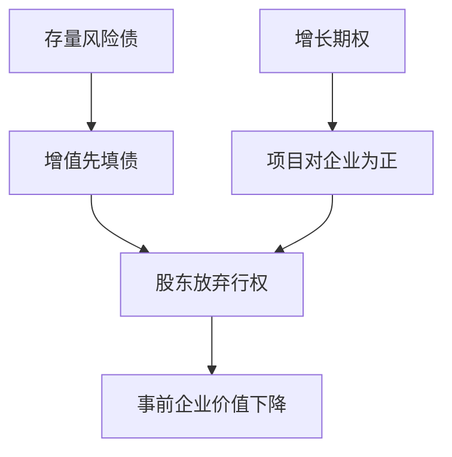

# 债务积压

杠杆高到新投资的收益先填债权人的缺口时，股东会放弃正 NPV 项目；借债容量因此被自己的存量债卡住。

<footer>—— Myers, Determinants of Corporate Borrowing, Journal of Financial Economics, 1977</footer>

[上一课](/econ/bankruptcy-direct-indirect)把权衡右边拆成直接程序费用与间接经营激励，并点名 Myers 的投资不足。本课缺口是把那一条写成机制：存量风险债如何对增量项目征税。不重估律师费，不把优序提前。

## 问题

间接成本若只是「客户走了」，还缺少一张企业内部的决策图。Myers（1977）给出：企业是增长期权的组合。已有的风险债对期权的执行拥有优先索取。股东（或代表股东的经理）选择是否投入新股权去行使期权；若行权后的增值大部分落到债的安全上，股东的净现值为负，即使项目对整个企业是正 NPV。这就是债务积压。

缺口因此不是再证明直接成本小，而是：权衡里「事前间接」的一条具体技术——投资不足——如何从优先级里长出来。资产替代（赌大的）是下一课的相反扭曲；本课先钉放弃好项目。

积压：存量债像对增量投资的税。税率为债权人从该项目里拿走的份额。无风险债或可在行权前重新谈判到第一最佳时，税率为零。

## 方法

把企业价值写成在位资产加增长期权。在位债面值足够高时，坏状态下在位资产不够偿债，期权的行权等于为债权人打工。股东的行权条件严于社会的 NPV 条件。事前，债的定价已经把积压写进利率，于是最优杠杆低于「只有税盾和律师费」的那个 $D^\ast$。

重新谈判、缩短期限、约定保护性条款、或发行可转债，都是减轻积压的合同补丁。本课只标明：积压来自优先级，不是来自「经理懒」。下一课的风险转移是同一优先级下的另一方向。

### 财务困境不是经济困境

项目可以在全股权下该做。积压说的是资本结构让它不该做。上一课 Andrade–Kaplan 的过滤器在此落地：财务杠杆单独改变投资规则。不要把衰退里没人要的产品叫成 Myers 积压。

## 机制

机制是剩余索取与控制权在行权时刻的错位。股东有限责任，上行归己、下行丢给债；但**行权要先掏新钱**时，有限责任帮不上忙——新钱是股权的，收益却被债截走。于是股权像被征税的看涨期权，税收来自存量债。债权人若能强迫行权，积压减轻，却要有控制权；那是后课治理，本课只从投资规则引入。

与火线出售的对照：火线出售是资产市场的买家约束；积压是企业内部的行权激励。两者都可以在杠杆高时同时出现：缺新股权不去投资，已有资产被迫贱卖。

Myers 1977 的对象是公司债与增长期权，不是主权债重组的全部政治。主权债务积压是同构比喻，机制课仍用企业优先级来写清。

## 边界

不要用「有债就会投资不足」覆盖所有杠杆：安全债、短期债、或投资由内部现金流完成时，积压弱。也不要把柠檬发股折价算进本课——那是优序，再后一课。下一课 [风险转移](/econ/risk-shifting)把同一看涨期权翻过来：不放弃项目，而是把项目变得更险。

后课默认：存量风险债可以对增长期权征税，正 NPV 可以被股东拒绝。权衡右边的间接项至少包含这一条。

直接破产成本仍往往太小；积压是事前就会发生的间接项，不必等到立案。

缩短期限让债在期权到期前滚动，债权人可以拒绝展期来强迫再谈判，积压减轻，滚动危机加重——后课流动性会再写。本课只要：期限是积压的约束，不是把 Myers 删掉。

主权债、银行资本不足的「少放贷」，与企业增长期权同构，对象从项目换成信贷供给。机制仍是优先级对增量的税。

## 小结

- 债务积压：增量投资的收益被存量债截走，股东放弃正 NPV。
- 优先级制造对行权的税；安全债或有效重组可以关掉这条税。
- 这是间接困境成本的投资不足技术，不是律师费。
- 下一课把同一看涨期权翻过来：不放弃项目，而是把项目变得更险。
- 期限缩短减轻积压，但把滚动危机留给流动性课。
- 出处：Myers, *JFE* 1977。
