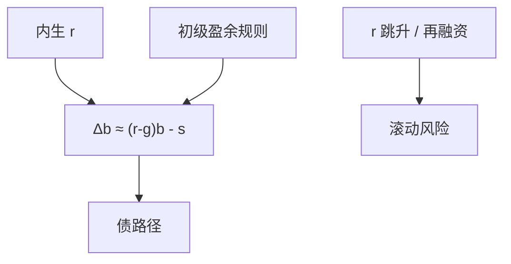

# 债务可持续与 r − g

一次总付世界里，债务比率的运动由 $(r-g)$ 与初级赤字决定；这是会计，不是免费午餐的证明。

<footer>—— 公共债务会计；Blanchard, Public Debt and Low Interest Rates, AER 2019；对照 Bohn 的可持续检验</footer>

[上一课](/econ/arellano-sovereign)的新兴市场被违约期权钉住。发达经济多年低 $r$、少违约，争论换成 **$r-g$**。本课缺口是把会计接到已有的内生 $r$（Aiyagari、GK、全球周期），而不是口号。不重校准阿根廷利差。

## 问题

$\Delta b_t \approx (r_t-g_t)b_{t-1}-s_t$， $s$ 为初级盈余/GDP。若 $r\lt g$，即使 $s=0$，比率也可降。Blanchard：低利率下公共债的财政成本与挤出可能小于过去教科书。但 $r$ 含期限溢价与违约/通胀风险，不是外生安全利率；一旦债高，$r$ 可升（Arellano 的连续）。缺口是：可持续是会计加反应函数，不是 $r\lt g$ 的历史平均值本身。

Blanchard, *AER* 2019。Bohn, *QJE* 1998：盈余对债的反应。Reis 对 $r-g$ 的讨论。私人 $r\gt g$ 与公共 $r-g$ 不是同一 $r$（上一单元 Piketty 课已警告）。

数字实例：设债比 $b=100\%$ GDP。若 $r-g=-1\%$、初级盈余 $s=0$，则 $\Delta b\approx -1\%$——什么都不做，债比每年自己降 1 个点；换成 $r-g=+2\%$，同样 $s=0$，债比每年自己涨 2 个点。正负一换，政策含义天翻地覆，这就是为什么「盯 $r-g$」先于「盯赤字」。

## 方法

会计：名义与实际、外币与本币要分。滚动：平均期限决定对利率跳升的暴露。Bohn：可持续需要 $s$ 对 $b$ 的正反应（在一定条件下）。模型：把政府预算接进 NK 或 HANK，货币规则与财政规则谁钉住价格水平——下一课主导。低 $r$ 的来源：储蓄过剩、安全资产需求、增长下降，各有不同的反事实。

```mermaid
flowchart TD
  ACC["Δb ≈ (r-g)b - s"] --> PATH["债路径"]
  R["内生 r"] --> ACC
  S["初级盈余规则"] --> ACC
  JUMP["r 跳升 / 再融资"] --> RISK["滚动风险"]
```

与 HANK：公债是流动性资产，供给 $b$ 改贫流动性份额与 $r$；可持续与稳定器互相缠。

## 机制

机制是滚动。短债把 $r$ 的实现立刻送进会计；长债把重估送进债权人净值（GK、全球周期）。$r\lt g$ 的样本若来自被压抑的安全利率，财政扩张本身可以结束它。通胀：名义 $r$ 与增长名义 $g$ 的差含稀释，那是铸币税，不是增长礼物——主导课展开。

Piketty 的私人 $r\gt g$ 抬私人财富；公共 $r\lt g$ 降公共债比率：可并存，因为风险与流动性不同。不要用同一个字母取消两课。

本课不预测某国债上限的百分点。 Reinhart–Rogoff 的门槛争论是经验，不是本课的会计。

直觉类比：短债像浮动利率房贷，央行一加息下月月供就涨；长债像固定利率房贷，旧票息锁到到期。代价是转手那天：市场利率高了，你手里的旧债权价格下跌——负担没有消失，只是从政府的利息账搬进债权人的净值账（GK 通道）。平均期限决定的是「疼在流量还是疼在存量」。

```mermaid
flowchart TD
  RUP["市场利率 r 跳升"] --> SHORT["短债为主：到期即重定价"]
  SHORT --> IMM["当年就进 Δb：利息负担立刻加重"]
  RUP --> LONG["长债为主：旧票息暂时锁住"]
  LONG --> DIL["负担经重估落到存量债价格"]
  DIL --> W["债权人净值缩水"]
  IMM --> Q["债比能否稳住，看 s 是否作出反应"]
  W --> Q
```

## 边界

本课不写最优债的 Ramsey 全套。违约仍是新兴市场的硬约束。下一课：会计还要问是财政还是货币在钉价格。银行危机史用另一套事实。

后课默认：$r-g$ 是会计；可持续要 $s$ 的反应与内生 $r$。下一课：财政主导 vs 货币主导。

常见误区：初学者容易把「历史上 $r\lt g$」读成「借债免费、可持续有保障」。实际上 $r$ 是内生的：债一高、通胀预期一起，$r$ 自己会动；靠安全资产需求压出来的低 $r$，也可能被财政扩张本身终结。会计式 $r-g$ 永远成立，但拿历史平均值当许可证，就是把条件当成了结论。

## 小结

- 债比率会计由 $r-g$ 与初级盈余驱动。
- $r\lt g$ 的历史不是外生许可证；$r$ 随债与体制变。
- 公共 $r$ 与私人财富的 $r$ 不是同一个对象。
- 出处：Blanchard, *AER* 2019；Bohn, *QJE* 1998。
