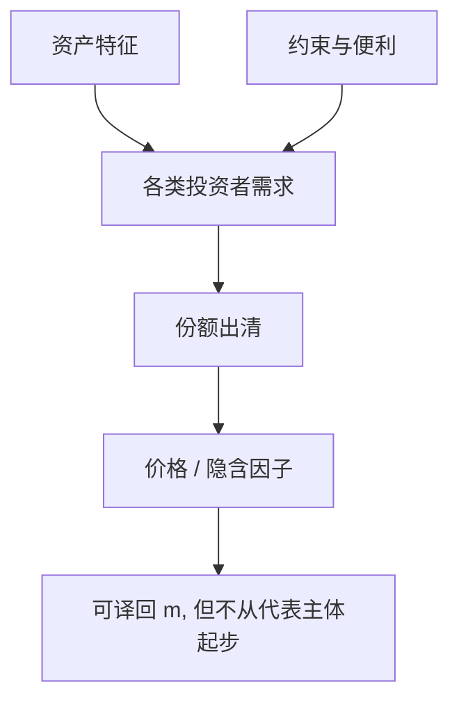

# 需求系统资产定价

价格出清的是各类投资者的份额需求；弹性有限时，供给与份额变动直接进入价格，不必先经过一个代表性核。

<footer>—— Koijen and Yogo, A Demand System Approach to Asset Pricing, Journal of Political Economy, 2019</footer>

[上一课](/econ/safe-asset-convenience)把便利写成服务流，家庭仍可被加总进一个带影子价格的 $m$。本课缺口是**放弃代表性需求**：机构、家庭、外资各有自己的份额方程，特征（市值、票息、评级、便利）进入需求，市场出清把特征的价格（因子）解出来。不估计 Koijen–Yogo 的系数，不把需求系统写成因子回归赛马。

## 问题

CAPM / Lucas / 中介模型都先指定谁优化、再加总。需求系统反过来：在资产截面上写

$$
\text{份额}_{i,j}= \text{特征}_{j}\cdot\text{弹性}_{i}+\text{潜在需求},
$$

出清 $\sum_i\text{份额}_{i,j}=1$。弹性有限意味着资产不是完美替代——与 LOP 不冲突，因为不同资产的特征不同，不是同一 $x$。缺口是：时变溢价、便利、约束，都可以表现为某类投资者弹性有限、份额被迫调。供给（发行、回购、国债存量）直接移动价格。代表性 $m$ 仍可以存在于后台，但不是操作上的加总起点。

这与 [到限价簿](/econ/to-limit-order-book) 的切点：需求系统仍是均衡份额，没有队列。它回答「谁在持有」，不回答「单子怎么排」。

Koijen and Yogo, *JPE* 127(4), 2019。特征需求来自产业组织的 logit 需求在资产上的移植。识别靠工具（例如基准指数纳入的外生部分），那是计量，本课只留结构。

## 方法

把投资者分类。每类对特征的弹性不同：养老金或保险可能对久期与评级极敏感（监管、负债），对便利与保证金敏感的是经销商。出清把特征的影子价格变成「因子」。中介约束紧 = 经销商弹性变或潜在需求降；便利升 = 国债特征的系数变。需求系统是上一课序摩擦的**加总语言**，不是否定 SDF：若弹性来自均值方差，回头仍可译成 $m$；若弹性来自制度，译出来的 $m$ 含约束乘子。

不要把「特征」写成 Fama–French 的排序。那里特征是为了投影平均收益；这里特征进入需求，价格是均衡产出。精神上更接近特征定价的一般均衡，而不是横截面检验手册。

## 机制

机制是有限替代加份额冲击。某类投资者被迫卖（赎回、监管、指数剔除），弹性有限的买方要求价格跌才吸收。跌多少由需求弹性决定，不由 $u'(c)$ 直接决定——除非那一类恰好是代表性消费者。安全资产存量冲击是一类供给移动；中介去杠杆是一类需求移动。信息：若某类是知情者，份额里含 GS 采集；需求系统可以容纳，但默认版本常常是特征加噪声，把信息藏进残差。本课点明即可，不重做 REE。

有限弹性是对「无限套利资本」的拒绝，与 Shleifer–Vishny 同方向，但这里不必行为偏差：制度分割足够。

## 边界

本课序「摩擦与中介」在此结束。下一单元换数学装置：连续时间、伊藤、Merton 组合。需求系统不依赖连续时间；连续时间组合也不依赖机构份额。两课序在「谁的一阶条件决定 $m$」上相切：Merton 先写单人最优，再加总；需求系统先写加总需求。读连续时间时，默认无摩擦单人；要把约束加回去，回看本课序。

后课默认：有限弹性的份额需求使供给与机构流动进入价格。SDF 仍可翻译，但操作上不必从代表性 $c$ 起步。不是 LOB，不是 CAPM 实证表。

## 小结

- 需求系统：各类份额对特征的弹性有限，出清决定价格。
- 约束、便利、供给冲击表现为需求或特征移动。
- 可译成带乘子的 $m$，加总起点不是代表性消费。
- 出处：Koijen and Yogo, *JPE* 2019。
