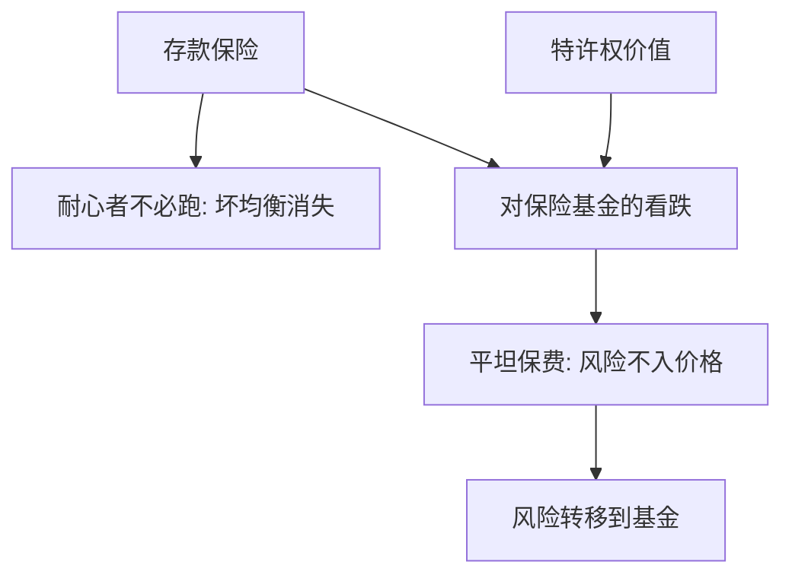

# 存款保险

保险可以删掉挤兑均衡；同一张保单也把资产风险从存款人转到保险基金。

<footer>—— Diamond and Dybvig, Journal of Political Economy 1983，保险与暂停兑付；Keeley, Deposit Insurance, Risk, and Market Power in Banking, American Economic Review 1990</footer>

[上一课](/econ/fire-sales)（火线出售）。传染已经说明：删掉单家坏均衡，不等于删掉银行间通道上的损失。本课缺口是保险本身：它如何停挤兑，以及停掉之后激励移到哪里。不重写 Diamond–Dybvig 的双均衡证明，不重画 Allen–Gale 的网络。

## 问题

1983 年正文已经把活期存款写成保险合同，附录式的政策含义是：政府保险或暂停兑付可以去掉坏均衡——耐心者不必排队，因为 $t=2$ 的支付被保住。若这句话完整，保险是纯福利改进。缺口是另一面：保的是面值，不是资产质量。存款人不再给银行的风险定价，股东持有一个对保险基金的看跌期权。竞争若再削掉特许权价值，期权会被更用力地行使。

Keeley（1990）把这收成可观察的替换：特许权价值高时，银行珍惜牌照，少用保险期权；放松进入、利差变薄之后，同一保险下风险上升。缺口不是「要不要保险」，而是：停挤兑与风险转移必须写成同一张保单的两面。

暂停兑付删坏均衡，但不把信用风险转给财政；保险把信用风险转走。Diamond–Dybvig 的标题把保险与流动性写成一件家具，没有把看跌期权写进效用函数。

## 方法

先取 1983 年的政策实验。保险保证耐心者在 $t=2$ 仍按合同受偿（或急躁者按 $r_1$ 受偿），于是加入挤兑队列不再是最优反应。暂停兑付在急躁者份额被满足后关门，同样保护剩余资产。两者都改博弈，都不给银行送股本——模型里还没有[资本](/econ/basel-capital)。

再把资产选择加回去。若保险保费与风险无关（平坦保费），股东的收益对上行开放、对下行截断。这是[道德风险](/econ/moral-hazard)在被保险负债上的版本：隐藏行动是把贷款换成更肥尾的项目。特许权价值——未来租金的现值——是抵押品：它提高失败的私人成本，部分抵消期权。Keeley 的比较静态是：市场势力下降 ⇒ 特许权下降 ⇒ 同一保险下资产风险上升。

风险调整保费、共同保险、覆盖上限，都是把期权费部分写回存款人或股东。本课只钉逻辑，不列某国保险基金的费率表。

## 机制

机制是信念与激励的分工。保险改变耐心者对 $t=2$ 的信念，战略互补被切断，挤兑与由挤兑导入的[传染](/econ/bank-contagion)在被覆盖的负债上减弱。同一切断使市场纪律减弱：未被覆盖的批发债权仍会跑，被覆盖的零售不再给风险定价。于是风险被赶到保险边界之内的资产与负债结构上。

银行间存款往往不在零售保险里。保险可以稳住房间里的挤兑，同时把损失留给未保险的互存——传染课的边并未被自动删掉。这不是保险「失败」，是覆盖集与网络不是同一张图。

### 平坦保费就是看跌期权的价格为零

若保费不随资产风险或杠杆变动，看跌的价格被错标。股东的最优是增加期权的标的波动，直到特许权或监管资本挡住。资本监管后置，正是因为保险已经先改了激励。不要把后课的巴塞尔提前写成保险的替代：一个删坏均衡，一个写亏损顺序。

覆盖上限把大额债权人留在市场纪律里，也把批发挤兑留在系统里。保险从来不是「所有负债都按面值保」；边界划在哪里，决定哪一种跑仍会发生。

## 边界

不要把保险写成「政府给银行资本」。资本是可核销的损失吸收；保险是对特定负债的或有支付。也不要把 Keeley 读成「竞争有害」：竞争削特许权，是在**已有平坦保险**的前提下放大期权；没有保险时，竞争约束的是另一套定价。

本课不写最后贷款人的抵押规则，不写太大而不能倒。窗口针对流动性，保险针对面值信念；对股东的隐担保是再下一层，会把看跌从保险基金扩到全体债权人。那一层在 [TBTF](/econ/too-big-to-fail)。

后课默认：保险停挤兑，代价是风险从存款人转到基金；平坦保费加低特许权使转移最大。未保险的银行间债权仍可传染。下一课回到准备金与内生货币，不再把保险当货币创造。

暂停与保险都能删坏均衡，信用风险的归宿不同。覆盖集不是网络图。

不要用「道德风险」取消 1983 年的保险结论。两句话必须同时保留。

## 小结

- 保险或暂停可以删掉 Diamond–Dybvig 坏均衡，不是给银行送股本。
- 平坦保费把资产风险写成对基金的看跌；特许权价值是部分抵押。
- 覆盖集与银行间网络不一致时，传染通道仍在。
- 出处：Diamond and Dybvig, *JPE* 1983；Keeley, *AER* 1990。
