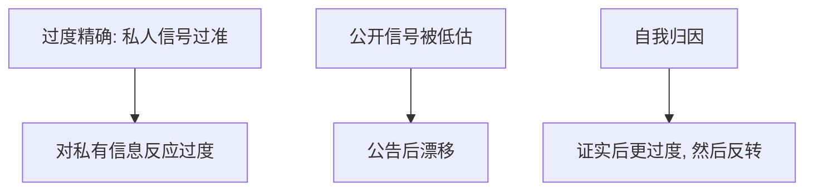

# DHS 过度自信模型

私人信号被当成过准，公开信号被低估；赢了归功自己，于是短期动量与长期反转不必借助体制切换。

<footer>—— Daniel, Hirshleifer and Subrahmanyam, Investor Psychology and Security Market Under- and Overreactions, Journal of Finance, 1998</footer>

[上一课](/econ/bsv-sentiment-model)用保守与代表性。本课缺口是另一微观零件：[过度自信](/econ/overconfidence)加自我归因。同一组事实（不足与过度），不同的信息结构。不重写 BSV 的隐马尔可夫。

## 问题

投资者收到私人信号，高估其精度，价格对私有信息反应过度。随后的公开信息（盈余）被相对低估，价格慢慢纠正——公开信息路径上表现为反应不足（漂移）。若公开结果证实私人信号，自我归因进一步提高过度自信，过度再放大，之后更长的反转。Daniel、Hirshleifer 与 Subrahmanyam（1998）把这条写进均衡。缺口是对照 BSV：不是体制误设，是精度误设。

继续持有自己买入的股票、忽略公开空头证据，是同一机制的组合面。换手来自过度精确，已在 Odean 出现。

## 方法

两期或三期，风险资产，行为主体对私人信号方差低估。价格由他们的条件期望决定（或加有限套利）。比较静态：信息不对称越强、越难被公开信号取代的股票，过度越严重。预测与 BSV 部分重叠（动量然后反转），但横截面强调估值不确定性、分析师分歧、换手——与过度自信更贴。

## 机制

机制是精度而非体制。贝叶斯若用错的 $\sigma_{\varepsilon}$，后验均值走得太远。公开信号的最优权重被压低，直到累积到足够强。自我归因让 $\sigma_{\varepsilon}$ 的误设内生恶化。套利限制同样需要，否则理性者按正确精度交易会压回价格——SV 仍在后台。

与家庭参与：过度自信可以提高参与（人以为自己能选股），同时伤害净收益。本课市场模型用的是代表性行为主体，不是家庭调查。

私人信号的精度被高估，等于把似然比放大，后验走得比贝叶斯远——对私有信息过度。公开盈余若被当成相对更噪，权重不足，价格在公告后继续朝私有信息所指的方向走，看起来像对公开信息反应不足。自我归因让精度误设随证实而恶化，长期必须纠正时就反转。横截面上，估值不确定、分析师分歧大的股票更符合精度故事，盈余路径更符合 BSV，本课不赛马。

## 边界

DHS 与 BSV 不是赛马课。经验上常用横截面区分：分析师覆盖、换手、估值不确定更支持 DHS；盈余序列路径更支持 BSV。两者都可以在套利限制下存活。本课不估计。也不把做市商的信息优势写成过度自信。

后课默认：Hong–Stein 第三条路不靠错误精度，而靠信息在人群中慢慢扩散。

精度误设：私有信号过准则过度，公开信号被当成更噪则漂移。自我归因让误设随证实恶化。

与 BSV 事实重叠、横截面线索不同：分歧与换手更贴 DHS。

DHS 与 BSV 并列，不在本课赛马；横截面线索才分叉。

## 小结

- DHS：过度精确造成对私有信息过度，对公开信息不足。
- 自我归因使过度自信不被证伪，放大动量后的反转。
- 与 BSV 分工：精度对体制；事实重叠，横截面线索不同。
- 不重写自我归因的微观定义。
- 套利限制仍在后台，否则正确精度会压回价格。
- 出处：Daniel, Hirshleifer and Subrahmanyam, *JF* 1998。
