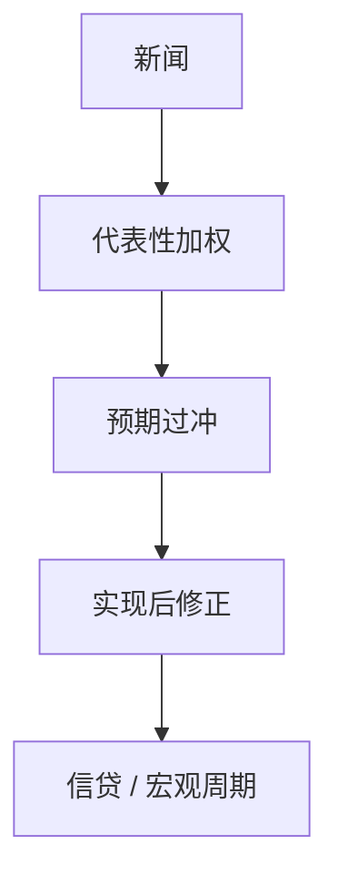

# 诊断性预期

代表性启发使人按「多像」来加权状态：新闻之后，条件分布被过度代表，预期过度反应，随后均值回复。

<footer>—— Bordalo, Gennaioli and Shleifer, Diagnostic Expectations and Credit Cycles, JFinance 2018；Kahneman and Tversky 的代表性</footer>

[上一课](/econ/rational-inattention)的误差是最优噪声。本课缺口是**有方向的偏差**：诊断性预期。不重写 Shannon 容量，不把行为金融的全部偏差清单搬进来。

## 问题

粘性信息与疏忽偏向反应不足。信贷与股市常有反应过度与崩溃。Bordalo–Gennaioli–Shleifer：把 Kahneman–Tversky 的代表性写成对真实条件分布的扭曲：

$$
\mathbb{E}^\theta[x_{t+1}\mid I_t]\propto \mathbb{E}[x_{t+1}\mid I_t]\left(\frac{p(I_t\mid\text{典型})}{p(I_t)}\right)^\theta.
$$

好消息使「好状态」显得更代表，预报过冲，下一期修正。缺口是给宏观与信贷周期一条过度反应装置，与学习的外推相关但微观基础不同。

Bordalo, Gennaioli and Shleifer, *Journal of Finance* 2018。BGS 对宏观诊断性预期的后续。Gennaioli and Shleifer, *A Crisis of Beliefs*。本课不写限价簿上的行为做市。

## 方法

在 NK 或信贷模型里把 $\mathbb{E}$ 换成诊断性 $\mathbb{E}^\theta$。脉冲：冲击后预期过冲，实现不及预期，出现反转。调查：预期修正对实现的回归系数可大于 RE（Coibion–Gorodnichenko 的反应不足是另一侧；诊断性瞄准过冲的序列）。信贷：对违约率的诊断性预报制造利差过窄再突然变宽。

与适应性学习：学习也可以外推，但是渐近可到 RE；诊断性在 $\theta\gt 0$ 时系统偏离贝叶斯，即使参数已知。

## 机制

机制是似然比扭曲，不是容量不够。因此「更重要的变量」也会被过度代表，不会因为重要而变准——与疏忽相反。政策沟通：生动的情景可能加大 $\theta$ 方向的权重，稳定沟通需要避免代表性叙事——后课管理。HANK：若高 MPC 家庭诊断性外推收入，间接效应过冲更强。

诊断性不是唯一的过度反应模型（外推信念、自然预期 Fuster–Laibson–Mendel）。本课用 BGS 作为本课序的钉子。

## 边界

本课不把所有资产定价异象归因于 $\theta$。不估计实验室的代表性参数当宏观唯一校准。新闻冲击（下一课）可以是基本面的提前信息，不必是偏差。不确定性冲击是方差，不是代表性。

后课默认：反应过度可用诊断性 $\mathbb{E}^\theta$；与疏忽的反应不足是不同参数。下一课：即使信念是 RE，提前到来的消息也会先动后验。

## 小结

- 诊断性预期：代表性启发扭曲条件分布，新闻后过冲再回复。
- 与最优噪声、与学习外推分列。
- 信贷利差与宏观预期修正是自然靶。
- 出处：Bordalo, Gennaioli and Shleifer, *JF* 2018。
