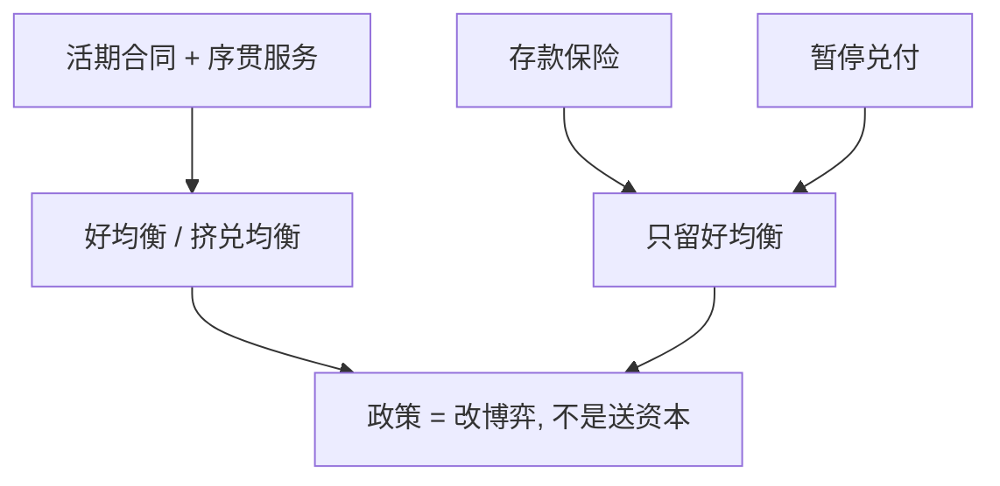

# Diamond–Dybvig 原文

活期存款提供流动性保险；同一合同在序贯服务下容许挤兑。存款保险可以去掉坏均衡。

<footer>—— Diamond and Dybvig, Bank Runs, Deposit Insurance, and Liquidity, Journal of Political Economy 1983</footer>

[上一课](/econ/woodford-interest)（Woodford 利息与价格）。附录对照。主干[Diamond–Dybvig 挤兑](/econ/diamond-dybvig)已取三期技术、双均衡与保险。本篇对照 **1983 原文**多出来的问题设定：为什么政府保险或暂停兑付被写成与银行合同配套的政策，而不是另起一套货币理论；以及原文对「挤兑由什么触发」说了什么、没说什么。不重推 $r_1$ 的最优保险公式。

## 问题

Gurley–Shaw 式的中介故事不能区分「好的流动性转换」与「脆弱」。Diamond 与 Dybvig 要一张可计算的活期合同：在不可验证的个人流动性冲击下实施风险分担，并证明同一张合同是挤兑博弈。原文标题把三件事并列——挤兑、存款保险、流动性——因为政策不是外挂：保险或暂停兑付的作用是删掉坏均衡，使保险合同能够被使用。

与 [Woodford](/econ/woodford-interest) 的对照：利息与价格假定银行部门已在，讨论的是利率规则；本文假定没有法定货币操作，讨论的是存款合同本身。两篇附录不要互相翻译成对方的模型。

原文第三节用太阳黑子选择均衡；挤兑不必有资产质量消息。暂停兑付（suspension of convertibility）与存款保险是并列的去坏均衡工具。模型没有央行资产负债表，没有准备金账户。

## 方法

三期、一种长期技术、$t=1$ 清算有成本。代理人类型在 $t=1$ 私有。银行是互惠的活期安排，不是追求特许权价值的股权企业。序贯服务约束被明确写成：兑付按到达次序，不能把 $t=1$ 的总需求当作可观察的总量再按比例分配。均衡是纳什：耐心者是否提款取决于对他人提款的信念。

政策实验在同一博弈上做。保险保证耐心者在 $t=2$ 仍按合同受偿，于是坏均衡不再是最优反应。暂停兑付在达到急躁者份额后停止支付，同样保护剩余资产。原文讨论税收融资的保险，不讨论资本充足——资本是主干[巴塞尔](/econ/basel-capital)的后起语言。

## 机制

原文机制与主干相同，附录只强调两处常被课堂删掉的限定。第一，银行可以是被动的资产池，脆弱性来自负债合同，不来自经理的隐藏行动——与[道德风险](/econ/moral-hazard)分流。第二，均衡选择可以与基本面无关；后来文献把坏消息写成触发器，是对原文的补充，不是原文的唯一故事。保险的代价（税收扭曲、被原文点到的激励）未展开成完整的道德风险模型。

### 与主干挤兑课的分工

主干[Diamond–Dybvig 挤兑](/econ/diamond-dybvig)已取双均衡与序贯服务。本篇对照 *JPE* 91(3) 1983：激励相容、加总确定性、标题里的保险与流动性是同一件家具。真实三期，无准备金、无 Woodford 利率规则、无巴塞尔。批发融资与 LCR 是类比，不是这篇的定理。读完可回主干挤兑与中介课；不要把附录十篇当成连续主干的第十单元，也不接在[到限价簿](/econ/to-limit-order-book)之后。

Diamond and Dybvig, *Journal of Political Economy* 91(3), 1983, 401–419。不要发明 arXiv 编号。

## 边界

不要把 1983 写成货币乘数或最后贷款人操作手册。Bagehot 的窗口在主干[最后贷款人](/econ/lender-of-last-resort)；原文几乎没有央行。也不要把「太阳黑子挤兑」说成作者否认基本面挤兑——他们选择最干净的环境来证明合同本身足够。全球博弈（Morris–Shin、Rochet–Vives）是后二十年的精炼，不在这篇 *JPE* 里。

宏观与货币附录到此结束。主干若只读挤兑课，已经够用机制；读原文是为了对保险与暂停在博弈里的对称位置，以及模型刻意不含的货币。

激励相容要求耐心者不假装急躁。加总确定性使好均衡的资源约束是确定的。比例随机、基本面触发，是后继文献。

序贯服务是制度选择。同步按比例结算可以设计掉坏均衡；原文选择不设计掉，正因为活期接近序贯。

不要把 2008 年批发融资写成 1983 年的定理。转换功能可以换负债合同，文献不是同一篇。

本篇结束附录链。量化栏从 [LOB](/quant/lob-structure) 起，不从本篇起。

## 小结

- 附录对照 Diamond–Dybvig 1983：保险与暂停是删掉坏均衡的工具，与合同配套。
- 银行可以是被动资产池；挤兑不必有坏资产消息。
- 无准备金、无利率规则；不要译成 Woodford 或巴塞尔。
- 出处：Diamond and Dybvig, *JPE* 1983。
