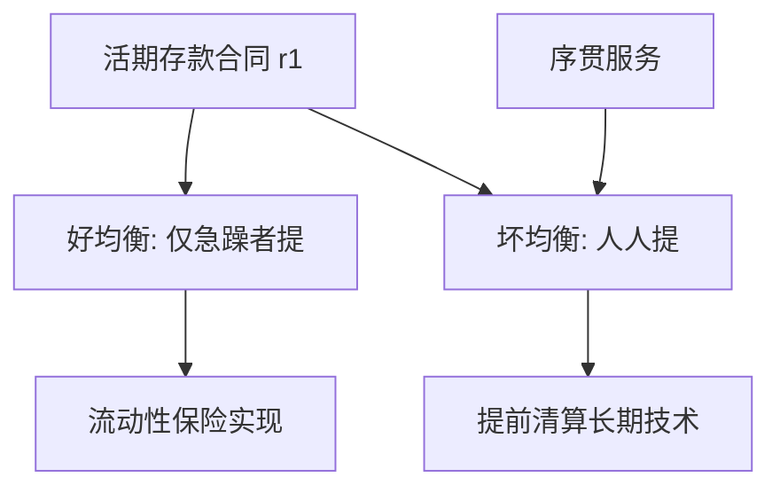

# Diamond–Dybvig 挤兑

活期存款把流动性保险写成可执行的合同；同一合同在序贯兑付下也可以是挤兑。

<footer>—— Diamond and Dybvig, Bank Runs, Deposit Insurance, and Liquidity, Journal of Political Economy 1983</footer>

定位：[金融中介的功能](/econ/why-intermediaries)。Gurley–Shaw 已经把银行钉成流动性转换器；本课缺口是把「转换」收成一个可算的存款合同，并证明它同时允许好均衡与挤兑。不从货币史或恐慌故事起笔。附录原文对照见 [Diamond–Dybvig 原文](/econ/diamond-dybvig-paper)，主干只取机制。

## 问题

上一课的流动性转换若只写成「短借长贷」，还没有说明：为什么不让每个家庭自己持有那项长技术、需要时再卖出。答案必须是：个人面对的流动性冲击不可保于市场上，而银行可以用活期存款做**风险分担**。可一旦存款可随时按约定额度提取，保险合同自己会制造第二均衡——人人提款，长期技术被清算，后到的人什么都拿不到。

Diamond 与 Dybvig（1983）的设定是三期。$t=0$ 投资一项不可逆技术，在 $t=2$ 成熟；若在 $t=1$ 中断，只能拿回较低的清算值。代理人在 $t=1$ 才知道自己是急躁（只在 $t=1$ 消费）还是耐心（可等到 $t=2$）。冲击私有，不可在 $t=0$ 用[或有要求权](/econ/state-contingent)直接写进证券——因为状态是个人的，不是可验证的公共状态。缺口因此是：有没有一种存款合同，在没有挤兑时实现最优保险，同时必须面对挤兑。

技术在 $t=1$ 的清算值小于 1，成熟值大于 1。这不是「银行经营不善」，而是流动性本身有成本。挤兑可以发生在资产质量并未恶化之时。

## 方法

银行在 $t=0$ 吸收存款、投资该技术，并承诺一套活期合同：在 $t=1$ 提款得到 $r_1$，留下的人在 $t=2$ 按剩余资产分配。$r_1$ 选在急躁者的最优保险水平上，通常 $r_1>1$ 的清算份额，从而耐心者补贴急躁者——这正是相对于自给自足的收益。

关键约束是**序贯服务**：银行按到达次序兑付，不知道也不等待「今天一共有多少人要提」。耐心者看到别人排长队时，最优反应可能是也去排。于是存在两个纯策略纳什均衡。好均衡：只有急躁者在 $t=1$ 提，耐心者等到 $t=2$，保险实现。坏均衡：所有人在 $t=1$ 提，资产被清算光，后到者得零——这就是挤兑。坏均衡可以由与基本面无关的太阳黑子触发。

存款保险或暂停兑付可以去掉坏均衡：若耐心者相信自己在 $t=2$ 仍能拿到合同所允，就不必加入队列。1983 年的政策含义写在标题里：保险与流动性是同一件家具的两面。

## 机制

机制不是「谣言让人变傻」，而是合同与信息结构。活期存款把保险写进可在 $t=1$ 执行的权利；序贯服务使执行变成先到先得的配给。先到者拿走的是面值，不是按比例的清算份额，于是外部效应出现：我的提取降低你能拿到的剩余。耐心者的提款决策于是取决于对他人提款的信念，信念可以自实现。

这与[柠檬市场](/econ/akerlof-lemons)不同：资产质量可以完全透明，挤兑仍然发生。也与[道德风险](/econ/moral-hazard)不同：银行可以没有隐藏行动。Diamond–Dybvig 的银行可以是被动的资产池；脆弱性来自负债合同，不来自经理卸责。后课的[最后贷款人](/econ/lender-of-last-resort)要处理的，正是这种与偿付能力可分离的流动性崩溃。

### 保险合同为什么必须是活期

若合同改成「$t=1$ 只按急躁者的真实比例结算」，最优保险仍可写，但那要求类型可验证或银行能等到全部申报。私有冲击下，活期加序贯是把保险做成无需验证的权利：你来取，就按 $r_1$ 付。权利一旦无条件，排队就有价值。暂停兑付等于临时取消这权利；存款保险等于用财政或保险基金对 $r_1$ 与 $t=2$ 支付作保。两者都改变博弈，而不是给银行「更多准备金」——模型里还没有准备金。

加总确定性（急躁者比例已知）使好均衡的资源约束是确定的。后来的文献让比例随机，挤兑可以有基本面触发；主干不把那一层提前。太阳黑子在这里的资格是：合同允许坏均衡，选择可以与技术无关。

## 边界

模型是真实的三期一般均衡，没有法定货币、没有准备金账户。因此它解释挤兑与保险，不解释货币如何被「创造」——那是[内生货币](/econ/reserve-endogenous-money)的缺口。也不要把太阳黑子挤兑读成唯一故事：后来的文献引入资产基本面恶化作为挤兑的触发；主干在此只钉「合同允许坏均衡」。

序贯服务是建模选择。若银行能按比例暂停、或能观测总需求再结算，坏均衡可以被设计掉。现实中的 ATM、日内结算接近序贯；破产程序里的冻结接近暂停。政策工具的对照放到附录原文课，本课只保留：保险合同与挤兑合同是同一张存款单。

也不要把批发融资挤兑、货币市场基金赎回直接写成 1983 年的定理。那些是同一转换功能换了一张负债合同；机制同构，文献不是同一篇。附录 [Diamond–Dybvig 原文](/econ/diamond-dybvig-paper) 对照页码与激励相容，不在主干再抄一遍证明。

## 小结

- 活期存款在不可验证的个人流动性冲击下实施保险。
- 序贯服务使同一合同具有挤兑均衡；挤兑不必有资产恶化。
- 存款保险或暂停兑付的作用是删掉坏均衡，不是给银行送资本。
- 真实模型，尚未引入准备金与法定货币。
- 出处：Diamond and Dybvig, *JPE* 1983。
