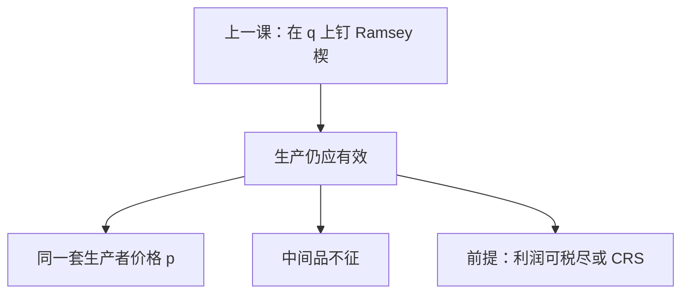

# Diamond–Mirrlees 生产效率

即便只能用商品税筹收入，只要纯利润能被税尽、生产集凸，社会仍应站在生产可能性边界上——扭曲留给最终消费，不要写进中间品。

<footer>—— Diamond and Mirrlees, Optimal Taxation and Public Production, American Economic Review, 1971</footer>

[上一课](/econ/ramsey-commodity-tax)（拉姆齐商品税）。总额税锁死时，商品税使补偿需求大致等比例收缩，并在流程图里点过「生产效率：中间品不征」。本课不重写逆弹性。缺口是把那一句做成定理：次优筹款为什么**不**该在生产侧再钉一道楔子，厂商之间为何仍应对同一套生产者价格。

## 问题

Ramsey 已经在消费者价格 $q$ 上选楔子 $t=q-p$。若再对中间投入征税，或让两家厂商面对不同的要素价，经济会掉到生产可能性边界以内：同样的初级要素能得到的最终束变少。Diamond–Mirrlees 说：在凸技术、能对纯利润 100% 征税（或 CRS 使利润为零）时，最优仍要生产有效——存在一套生产者价格 $p$，所有厂商利润最大，总供给在边界上。缺口不是再推 Ramsey 的 $1/\varepsilon$，而是：**次优不意味着「每条切条件都放弃」；生产效率这一条通常还留着。**

中间品税把同一商品在厂商之间的 MRS/MRT 拆开，像在生产盒里离开契约曲线。最终商品税只拆开消费者与生产者，生产盒内部仍相切。

### 生产有效不是第一优

第一优要消费者 MRS 也对齐到同一 $p$，且总额税筹 $R$。这里消费者面对 $q\neq p$，消费无效率仍在。生产有效只说：不要在已经要筹 $R$ 之外，再浪费可转化的产出。与[次优](/econ/theory-of-second-best)不矛盾：锁死的是总额税，不是「必须乱征中间品」。

定理要利润能被拿走。否则对一个有纯利润的行业征中间税，可能是对经济利润的代用税，生产效率可以故意放弃。CRS 或 100% 利润税把这条后门关上。

## 方法

计划者选消费者价、公共生产、税收，约束是要素可行性与政府预算。生产有效的证明是：若总净产出在 $Y$ 内部，可以沿某个方向多拿出最终消费品，用来放松消费者的税收扭曲或直接提高福利，与最优矛盾。故最优总计划必在边界，可用 $p$ 支撑（凸性）。于是中间品不应被单独征税：它们的生产者价格应与国际价格或公共生产的影子价一致。

小型开放经济：边境价就是 $p$，关税当 Ramsey 税只应落在最终消费上，中间投入免关税——同一逻辑。公共生产按同一 $p$ 算影子成本，否则公共部门会在边界以内选点。

本课不引入技能类型与非线性所得税。那是下一课：把扭曲集中到劳动–消费边际。

## 机制

为什么边界上更好：生产内部一点意味着存在帕累托改进的实物变换，不改变已经锁死的总额税约束，只是多出最终货。次优的拉格朗日不应在这种免费改进上停住。共同 $p$ 的机制是支撑：凸 $Y$ 的边界点有超平面，所有私人厂面对它就会选出加总为该点的净产出。

中间品不征的机制是：中间品税等于在厂商之间设不同的 $p$，支撑失败。最终税发生在消费者门口，不进入 $Y$ 内部的相对价格。

增值税的进项抵扣，正是为了让中间流转不改变生产者相对价格。名义上对每环课税、再抵扣，等价于只对最终消费课，生产效率保住。零售税若漏掉中间，或关税打在投入上，楔子写进 $Y$，与本课相反。

Diamond–Mirrlees 分两篇：I 是生产效率，II 是税收规则（与 Ramsey 衔接）。中间品免税是 I 的政策翻译，不是对「增值税不可取」的判决——增值税若对最终消费课、中间抵扣，正是为了靠近生产效率。

## 边界

家庭之间若面对不同生产者价格，等于把楔子写进生产盒。

非凸、规模报酬递增的公共生产，支撑 $p$ 可能不存在，效率要改成「公共部门按影子价生产」。利润无法税尽时，资本税、中间税可能是次优代用。家庭生产、不可观察的投入，使「中间」与「最终」分不清。小型开放经济把世界价格当 $p$，关税政策同一刀。下一课把观察限制换成技能，用非线性所得税替代一部分商品税。

后课默认：Ramsey 楔子打在最终消费上；生产侧保持共同 $p$，中间品不征，除非利润税工具缺失或非凸。

本课不把次优理解成「生产也可以随便扭」。

## 小结

- 次优筹款仍要求总生产在边界上。
- 所有厂商面对同一生产者价格；中间品不应单独成税基。
- 前提是凸技术且纯利润可被拿走。
- 下一课：把剩下的扭曲写成非线性所得税。
- 出处：Diamond and Mirrlees, *AER*, 1971。
