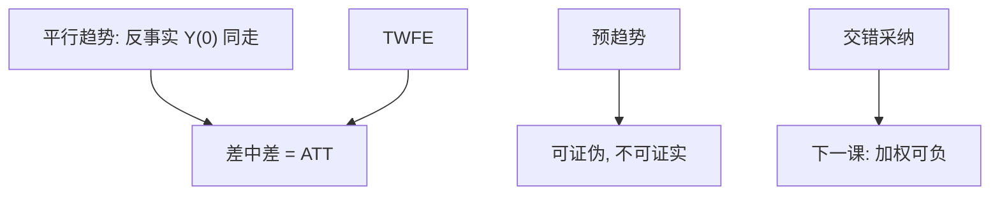

# 双重差分

处理组与对照组的差分还含组间基线差；时间上的差分还含共同趋势。再差一次，剩下的是处理——若平行趋势成立。

<footer>—— 据 Ashenfelter 培训项目；Card and Krueger, Minimum Wages and Employment: A Case Study of the Fast-Food Industry in New Jersey and Pennsylvania, AER 1994</footer>

[上一课](/econ/gmm-econ)把矩条件与最优权重收完。本课换设计：政策在部分群体、部分时间发生，用双重差分（DiD）识别 ATT。交错采纳的加权病下一课再拆；本课先钉两期两组与平行趋势。

## 问题

州 $A$ 在 $t=1$ 提高最低工资，州 $B$ 不变。单差「$A$ 前后」含一切时间冲击；单差「$A$ 对 $B$」含一切州特质。Card–Krueger 的逻辑是：若没有政策时两边就业的**变化**相同（平行趋势），则

$$
\mathrm{ATT}=\bigl(\mathbb{E}[Y_{A1}]-\mathbb{E}[Y_{A0}]\bigr)-\bigl(\mathbb{E}[Y_{B1}]-\mathbb{E}[Y_{B0}]\bigr).
$$

缺口不是再估一个弹性发表数，而是：平行趋势是对反事实 $Y(0)$ 的陈述，预趋势可以证伪它，不能证实它。回归写法 $Y_{it}=\alpha_i+\lambda_t+\beta D_{it}+u_{it}$ 在两期两组等于上述差中差；多期仍要平行趋势，且立刻撞上交错加权——留给下一课。

Ashenfelter 低谷：培训前处理组暂时变差，于是「培训效果」含均值回复。预趋势检验要看的是政策前，不是把政策后的均值回复叫效应。

## 方法

两期：饱和回归与细胞均值等价。多期、同时处理：双向固定效应（TWFE）在同质效应下仍是 DiD。控制：可加的组效应、时间效应；不可把处理当中介的坏控制放进来。标准误：州层面政策要在州上聚类——Bertrand、Duflo 与 Mullainathan（2004）表明忽略序列相关会让 DiD 的 $t$ 膨胀。

事件研究图：政策前系数应在零附近（给定精度），政策后给动态 ATT。这是设计的展示，不是新的识别理论。

## 机制

机制是用对照组的时间变化当处理组反事实。潜在结果：$Y_{it}(0)=\alpha_i+\lambda_t+\varepsilon_{it}$ 可加，于是平行。处理效应若也是可加常数，$\beta$ 即 ATT。效应随时间变，事件研究估动态；效应随组变且采纳交错，TWFE 可能把已经处理的组当成对照——下一课 Goodman-Bacon。

与 IV：有时政策工具化处理强度（Bartik、资格规则），DiD 与 IV 会叠。本课纯设计是「谁在何时被处理」可观测，$D_{it}$ 本身当回归元，外生来自平行趋势而不是排除约束。

合成控制下一课序后段用加权对照构造反事实，适合「一个处理单位、没有自然对照」。DiD 适合多单位、共同时间冲击可减。

## 边界

本课不把 Card–Krueger 的就业符号当成最低工资辩论的终审。不处理交错 DiD 的负权重。溢出（处理州顾客跑到对照州）破坏 SUTVA。量化栏的事件研究围绕公告日与价格，对象是资产回报，不在此重写。下一课专门拆 TWFE 在多期交错下估的是什么。

后课默认：两期两组 DiD = 平行趋势下的 ATT；预趋势是证伪工具。多期交错不要默认 TWFE 等于「平均 DiD」。

## 小结

- 差中差减掉组间水平与共同时间；留下处理，若平行趋势真。
- 预趋势可证伪、不可证实；Ashenfelter 低谷是均值回复。
- 政策在群层发生则群层聚类（Bertrand–Duflo–Mullainathan）。
- 交错采纳的 TWFE 加权问题下一课。
- 出处：Card and Krueger, *AER* 1994；Ashenfelter 培训；Bertrand, Duflo and Mullainathan, *QJE* 2004。
