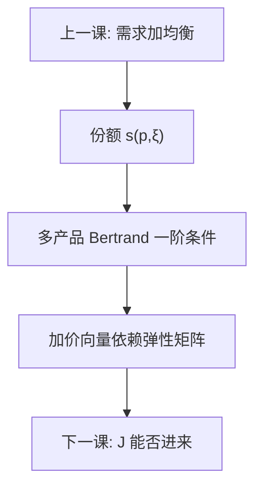

# 差异化产品定价

品种不是完美替代，需求是一整块弹性矩阵；Bertrand–Nash 的加价由自价格与交叉价格弹性共同决定，单品种勒纳只是对角上的特例。

<footer>—— Berry, Levinsohn and Pakes, Econometrica 1995；Nevo, Measuring Market Power in the Ready-to-Eat Cereal Industry, RAND 2001；对照 Tirole 第 7 章差异化</footer>

[上一课](/econ/scp-neio)把 SCP 的减式换成「先估需求、再解均衡」。本课缺口是定价方程本身：多产品厂商面对 $s(p)$，一阶条件如何把成本映成价格。微观[垄断与勒纳](/econ/monopoly-lerner)给出单产品 $L=1/|\varepsilon|$；这里 $J$ 个品种、可能多产品所有权，加价是向量。后课进入与沉没成本会让 $J$ 变成内生；本课先把 $J$ 当作给定。

## 问题

品种 $j$ 的利润含 $(p_j-c_j)s_j(p)$，还可能含同一集团其他品种的交叉项。对 $p_j$ 求导，最优加价满足：自价格效应拉低销量，交叉效应把销量导向自家其他品种。矩阵写法是 $(p-c)$ 等于份额与替代矩阵的函数，而不是「每个品牌各自 $1/|\varepsilon_{jj}|$」。缺口不是再解释什么叫差异化，而是：**没有整块 $\partial s/\partial p$，合并与多产品定价都算不出数。**

logit 把交叉弹性绑在份额上，替代模式过强：两个高端车的交叉可以和「高端对低端」同型。嵌套 logit 按组放松；随机系数（BLP）让偏好异质决定谁和谁更近。后课合并模拟要的正是这种「近替代涨价更狠」。

### 差异化不是品牌溢价的口号

广告、商标可以进入 $\xi_j$，但定价机制是替代矩阵，不是「品牌所以能贵」。纵向差异里质量排序一致，横向差异里理想品种不同——两者都会进 $s(p)$，本课用同一套一阶条件罩住，不把 Mussa–Rosen 菜单重写一遍。把加价全部叫成「品牌」，会把成本移动与需求移动混在残差里，IV 无从下手。

Nevo 2001 用麦片市场演示：用 BLP 弹性反推边际成本，再谈势力。点估计依赖 IV 与随机系数设定，本课要的是方程形状，不是某一行业的百分数。

## 方法

需求：从离散选择 $u_{ij}=x_j\beta_i-\alpha_i p_j+\xi_j+\varepsilon_{ij}$ 积出份额。供给：Bertrand–Nash，所有权矩阵 $\mathcal{H}$ 标记哪些品种被同一决策者定价。一阶条件把 $(p-c)$ 与 $\mathcal{H}$、$\partial s/\partial p$ 连起来。估计：份额与价格联立，$\xi$ 与 $p$ 相关，用特征的函数、成本冲击或其他市场的价格作 IV——与[GMM](/econ/gmm-econ) 同一套矩语言。边际成本常参数化成 $c_j=w_j\gamma+\omega_j$，供后课反事实使用。

不要用单方程「价格对份额回归」当需求。那是减式，读不出交叉弹性。

## 机制

横向差异把市场切成局部：两种麦片若被同一群 $\beta_i$ 喜欢，交叉弹性大，独立定价时互相压价；一旦进入同一 $\mathcal{H}$，压价的外部性被内部化，两边都涨。这就是后课合并模拟的微观机制，本课先把内部化写进 FOC。logit 误差的 IIA 让「任何两种商品的交叉相对份额成比例」，局部竞争被抹平——随机系数就是为了把局部再画回来。

成本冲击移动供给，特征移动需求。没有这种分离，加价和 $\xi$ 分不开。NEIO 相对 SCP 的可计算性，全靠这一步。

Tirole 的差异化定价是理论 FOC；BLP 是把 FOC 接到市场份额数据。两层都要：没有理论，估计没有均衡约束；没有随机系数，替代模式往往假。

## 边界

本课不估计积分、不调收缩映射的数值细节，那些在补充课 BLP 需求估计。不写反倾销税率表，不把量化栏的事件窗收益当加价。进入、产品重新定位会改变 $J$ 与 $x_j$，静态定价把它们当给定——下一课拆这口假定。纵向约束会改变零售价与批发价的分工，再下一课。

后课默认：差异化市场的势力对象是弹性矩阵与所有权，而不是 $HHI$。写加价时用多产品 FOC；logit 只当对照，不当前提。

## 小结

- 多产品加价由整块 $\partial s/\partial p$ 与所有权决定。
- 单品种勒纳是对角特例，不是差异化市场的公式。
- IIA logit 抹平局部替代；嵌套与随机系数用来收回来。
- 价格与 $\xi$ 联立，需求要用 IV / GMM，不能减式回归。
- 出处：Berry, Levinsohn and Pakes 1995；Nevo, *RAND* 2001；Tirole。
