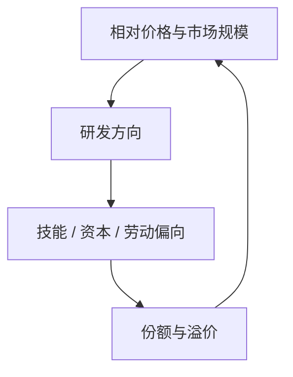

# 有偏技术进步

技术不必是一个标量 $A$；研发朝哪一种要素、哪一种技能偏，本身由相对价格与市场规模决定。

<footer>—— Acemoglu, Directed Technical Change, Review of Economic Studies 2002；对照技能偏向的经验讨论</footer>

[上一课](/econ/ak-variety-schumpeter)把内生 $g$ 分成 AK、种类与创造性破坏，对象仍是**一个**有效 $A$ 如何被生产。本课的缺口是：创新可以有方向。劳动增进、资本增进、技能偏向，不是同一条残差。Acemoglu 把方向写成研发部门对相对利润的反应。制度下一课才问谁有激励去研发；本课先把「偏」从标量里拆出来。

## 问题

索洛把技术进步写成劳动增进型 $A$，好让稳态存在。内生增长课把 $\dot{A}$ 交给研发，仍常是一个 $A$。经验上技能溢价、资本份额、自动化可以各走各的。缺口不是再选 AK 还是熊彼特，而是：相对要素价格与市场大小如何**引导**研发朝哪种要素。弱要素可以因「贵」而吸引节约它的创新，也可以因市场太小而没人理——符号取决于替代弹性。

Hicks 已有引致创新的直觉。Acemoglu 的贡献是把价格效应与市场规模效应写进研发的相对利润，使偏可以内生反转。

## 方法

两种要素（或技能）各有一条研发线。相对专利或相对 $A$ 的增长，取决于相对利润：价格效应——哪种要素更贵，节约它更赚钱；市场规模效应——哪种要素用得多，改进它的市场更大。替代弹性大于一时，丰裕要素的市场足够大，技术进步朝它偏；小于一时，稀缺要素的价格效应主导。技能偏向：高等教育扩张可以**提高**技能溢价，若技术朝高技能偏得足够快。

上一课的种类与质量阶梯仍然可用：偏的是「改进哪一类中间品或哪一级质量」，不是另起一套增长引擎。本课不估计跨国技能溢价回归。

### 标量 $A$ 抹掉的比较静态

加总 TFP 上升，可以是劳动节约（同样产出更少人），也可以是技能互补（高技能更值钱）。政策若只补贴「研发总量」，不声明偏向，可能加速替代刚想保护的那种劳动。错配课会说明楔子也表现为 $A$；本课的 $A$ 向量仍是技术方向，不是管制。

### 任务不是另一种标量 $A$

把生产拆成任务后，自动化是资本或算法接手某些任务，而不是所有劳动的 $A$ 一起升。偏向发生在任务边界上，加总份额可以非单调。

本课不展开任务核算。只要记住：要素偏向与任务替代是同一方向问题的两种写法，都不能退回一个 $g$。

## 机制

相对供给冲击（移民、教育扩张、资本深化）改变相对价格，从而改变哪条研发线更赚。短期溢价由供给弹性定；长期溢价还取决于技术是否跟着偏。这与索洛外生 $g$ 的差别是：长期要素份额可以内生漂，不必钉在生产函数的指数上。熊彼特式取代可以是「新机器取代旧技能」——创造性破坏有了要素对象。

统一增长与制度会把方向接到人口与产权：谁拥有哪一种要素，谁推动哪一种创新。本课只关闭增长主干里「$A$ 是标量」这一句。发展核算里的剩余 $A$ 仍然看不出偏向；要看技能溢价、资本份额与任务数据。

要素份额若被写成 Cobb–Douglas 常数，有偏技术没有可见的落点。CES 或任务框架才让劳动增进与资本增进分叉。索洛为了稳态才把技术写成劳动增进；那是生长路径的技巧，不是经验上技术只增进人。把一切自动化都叫「TFP 上升」，会漏掉谁的边际产品被改写。

自动化是资本或任务偏向的当代说法。本课不把某一行业的机器人密度写成定律，只保留：方向是均衡对象，不是外生残差。

## 边界

本课不把有偏技术写成股市风格因子，也不做 CIP 检验。量化栏的因子模型不是这里的要素偏向。制度、殖民与地理的因果识别下一课才进；没有产权，研发利润那一项没有着落。

技能溢价的经验争论（教育扩张是否压低溢价、技术是否反向偏）不是本课要裁定的回归。主干只要：相对供给可以内生地拉技术方向，长期溢价不必按短期供给弹性去外推。把「提高教育」当成压技能溢价的充分政策，已经假定技术方向不变——上一课的种类与熊彼特也没有这个资格。

后课默认：谈到内生技术，要问朝哪一种要素偏，不能只报一个 $g$。下一课：同样的研发激励，为何有的地方被制度关掉。

## 小结

- AK/种类/熊彼特仍把技术当一条 $A$；本课把方向内生化。
- 价格效应与市场规模效应共同引导研发。
- 替代弹性决定丰裕要素是吸引创新还是被节约。
- 加总残差看不出偏向；份额与溢价才看见。
- 出处：Acemoglu, *RES* 2002；技能偏向的相对价格逻辑同一传统。
