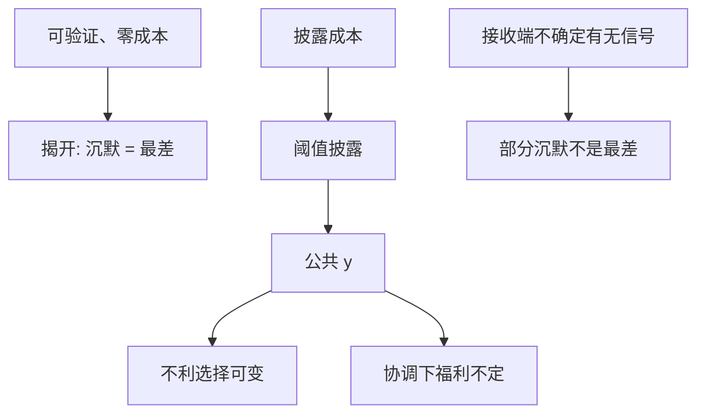

# 披露理论

能被验证的好消息会被说出来；沉默在均衡里被读成坏消息，直到全部揭开——除非披露本身有成本或有接收端的摩擦。

<footer>—— Grossman, The Informational Role of Warranties and Private Disclosure about Product Quality, Journal of Law and Economics, 1981；Milgrom, Good News and Bad News, Bell Journal, 1981</footer>

[上一课](/econ/asymmetric-info-liquidity)里信息通过交易泄漏，价差是保险费。本课缺口是**主动开口**：持有可验证信号的人，要不要把它变成 Morris–Shin 意义上的公共 $y$。不重写报价的贝叶斯，不把披露写成监管清单。

## 问题

卖方（或经理）看见质量或 $\theta$，买方只见披露与否。若披露可验证、成本为零，好类型有激励说出自己，以区别于较差类型；买方把沉默解释为「还不够好」，于是次好者也说——逆向归纳把除最差以外全部揭开。Grossman（1981）、Milgrom（1981）的揭开（unraveling）是柠檬市场的对偶：Akerlof 里质量不可验证，坏货驱逐好货；这里可验证，好货驱逐沉默。

缺口是：为何现实不是完全披露。成本（准备、专有信息泄漏给对手）、接收端不确定（Dye：买方不知道你有没有信号）、或验证只能到区间，都会在中间截断。Verrecchia 把披露成本写成阈值：只有 $\theta$ 高过阈值才开口，价格对沉默打一个条件期望的折。

与上一课程有限注意力对照：揭开假定接收端读得懂。注意力预算会阻断逆向归纳——沉默不再充分统计「最差」，因为也可能是「没被读到」。

## 方法

验证披露：消息一旦说出即被相信。均衡是阈值或完全揭开。把披露接到资产定价：公开 $y$ 改变后验，也改变不利选择（知情交易者的信息优势下降，价差可收）。但 Morris–Shin 警告：若定价含协调，多一条公共 $y$ 不必改进福利。本课把两股力并列，不让其中一句吞掉另一句。

策略性补充：只披露好的可验证部分、把坏的留在交易泄漏里。此时价差与公告并存——公告不是信息的全部通道。GS 采集仍在后台：披露改变的是公共与私有的分界，不是采集成本本身。

不要把强制披露写成「所以价格更有效」的实证结论。强制把阈值推低，改变的是谁开口；有效仍相对信息集，且联合着 [SDF](/econ/stochastic-discount-factor) 的风险调整。

## 机制

揭开的机制是信念的逆向归纳，与信号博弈的直觉准则同族：好类型有便宜的分离动作（说出可验证的好），沉默无法被好类型使用。成本破坏便宜：中等类型觉得开口的专有成本高于分离收益，池定在沉默。买方理性地给沉默一个截断分布的均值，不是给零。

与柠檬的关系：不可验证时开口无用，市场靠价格推测平均质量，可以关闭。可验证时开口太有用，市场几乎不让你闭嘴。中间地带——半可验证、有成本、有注意力——才是工作理论。

Jovanovic、Verrecchia 的自愿披露，Dye 的「投资者不知道经理有没有消息」，是截断而不是否定揭开。强制披露的理论价值，是在这些摩擦上移动阈值。

## 边界

本课不写会计准则条文，不估计公告窗口。下一课把开口外包：评级、分析师、审计，作为生产 $y$ 的中介。企业自己的阈值与中介的激励是两套委托。

也不要把披露当成限价簿上的「展示冰山」。展示是协议选择；披露是关于 $\theta$ 的可验证陈述。切点仍在 [到限价簿](/econ/to-limit-order-book)。

后课默认：可验证零成本则揭开；成本与接收摩擦给出阈值。公共 $y$ 改变不利选择，福利还要过 Morris–Shin 那一关。

## 小结

- 可验证、零成本：逆向归纳揭开，沉默等于最差。
- 成本或「不知有无信号」截断披露，沉默对应一个条件期望。
- 公告与交易泄漏是两条通道，不是互斥。
- 出处：Grossman, *JLE* 1981；Milgrom, *Bell* 1981；Verrecchia；Dye。
