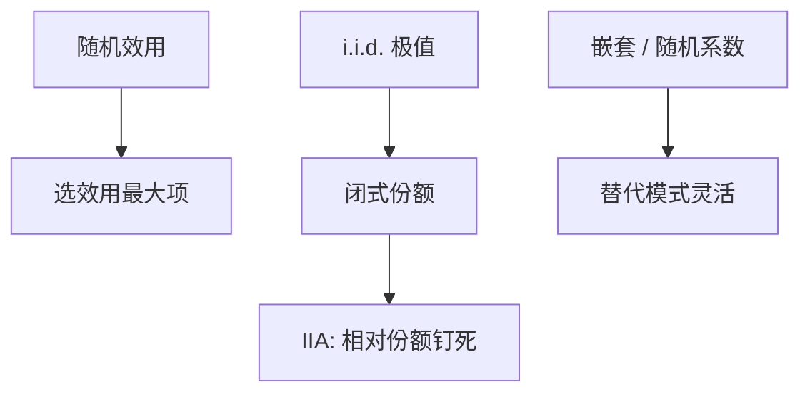

# 离散选择 logit / probit

选项是离散的，观测到的是谁被选中；把选择写成效用比较加极值误差，份额就变成 logit，弹性才有从效用参数到反事实份额的通道。

<footer>—— McFadden, Conditional Logit Analysis of Qualitative Choice Behavior, 1974；Train, Discrete Choice Methods with Simulation</footer>

[上一课](/econ/structural-vs-reduced)划分了支撑内设计与支撑外结构。本课给出最小结构：离散选择。BLP 下一课把 logit 放进差异产品与价格内生；本课先钉条件 logit / probit 的识别与 IIA。

## 问题

通勤方式、买哪一品牌、是否劳动参与：$Y\in\{1,\ldots,J\}$。线性概率模型可以估，但概率可出 $[0,1]$，交叉弹性没有效用基础。McFadden：随机效用 $u_{ij}=x_{ij}\beta+\varepsilon_{ij}$，$\varepsilon$ 若 i.i.d. 第一类极值，则

$$
P_{ij}=\frac{\exp(x_{ij}\beta)}{\sum_k\exp(x_{ik}\beta)}.
$$

缺口不是再讲劳动供给从哪来，而是：这套概率从效用来，反事实（关一条公交线、涨一种票价）是改 $x$ 再算份额——结构的第一次落地。Probit 用正态 $\varepsilon$，无闭式，要积分；二元时两者相似，多元 probit 允许相关误差，计算重。

IIA：任意两选项的概率比不依赖第三选项。红蓝公交悖论：加一辆涂成红色的车，logit 从蓝车偷来的份额与从汽车偷来的成比例，往往不像话。嵌套 logit、随机系数下一课 BLP 正是冲这个来。

## 方法

条件 logit 的似然是观测选择的 $\sum\log P_{i,y_i}$。识别：只识别效用差，水平不定；一个选项的常数要归一。只随人变的 $z_i$ 必须与选项交互才能进模型。内生价格：$x$ 含 $p$ 且 $p$ 与 $\varepsilon$ 相关（未观测质量），logit 的 $\beta_p$ 有偏——下一课 BLP 的矩。本课先假设 $x$ 外生，把装置钉清。

劳动参与二元 probit 与[选择](/econ/labor-participation)理论课对接：这里估的是参与方程，不重写家庭劳动–闲暇的一阶条件全文。

## 机制

机制是比较。确定性效用差越大，选择概率越极端。极值误差给出 logit 的厚尾；正态给出更薄的尾。福利：logsum（期望最大效用）是 McFadden 的消费者剩余，反事实关选项等于从 logsum 里拿掉一项。这是结构福利，不是 DiD 的 ATT。IIA 失败时 logsum 的替代模式错，福利跟着错。

与潜在结果：离散选择给的是每人对每个 $j$ 的潜在效用，观测只看见 argmax。ATE 语言要定义处理（例如关选项 $j$）再积分概率差。两者可对译，logit 额外给出未选选项的反事实份额。

Train 的模拟：混合 logit 用随机系数对 IIA 松绑，似然无闭式，用 GHK 或混合频率模拟。计算是方法，识别仍靠效用差的变异。

## 边界

本课不估 BLP 的供给边。不把 logit 当所有离散决策的真误差。动态离散选择（Rust 引擎、Hotz–Miller）是另一课量级，本课只标：一旦有续值，静态 logit 把续值吞进误差，政策反事实会错。下一课价格内生与市场均衡。

后课默认：外生 $x$ 下条件 logit 给出份额与 logsum；IIA 是实质性限制。内生价格与差异产品市场交给 BLP。不要用线性概率的系数当结构弹性去改从未出现的选项集。

## 小结

- 随机效用 + 极值误差 ⇒ 条件 logit 份额。
- 只识别效用差；IIA 限制替代模式。
- 反事实改 $x$ 或选项集，再算份额与 logsum。
- 内生价格本课不处理，留给 BLP。
- 出处：McFadden 1974；Train, *Discrete Choice Methods with Simulation*。
