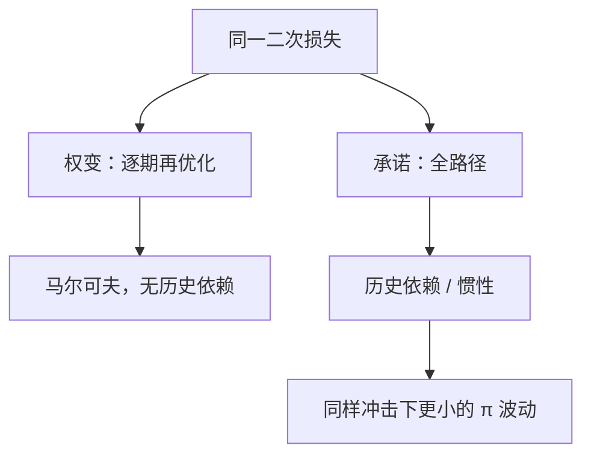

# 权变对承诺

同一条二次损失，权变每期重解，承诺绑住整条路径；通胀与缺口的轨迹因此不同，并不是目标函数换了。

<footer>—— Kydland and Prescott, JPE 1977；Barro and Gordon 的通胀偏差；Woodford 在 NK 里的承诺解</footer>

[上一课](/econ/time-inconsistency)已经证明：事先最优的低通胀，事后常想用意外换缺口；理性预期下权变均衡是高 $\pi$、无就业收益。本课的缺口不是再讲一遍诱惑，而是：在已经学过的 NK 损失下，把**权变路径**和**承诺路径**并排写出来——历史依赖、惯性、对成本推动的反应为何不同。神圣巧合是下一课：即便承诺了，稳 $\pi$ 是否自动稳缺口。

## 问题

把央行目标写成通胀缺口与产出缺口的二次损失，贴现因子与公众相同。约束是动态 IS + NKPC。承诺：在 $t=0$ 选出 $\{i_t\}$ 的全路径（或等价的目标规则），受预期一致性约束。权变：每一期把过去当沉没，对给定的 $\mathbb{E}\pi$ 再解一次。Kydland–Prescott 说两条一般不重合；本课要看 NK 里不重合表现在哪里。Barro–Gordon 的通胀偏差是无权变约束时的稳态项；前瞻 NKPC 还额外要求：今天的 $\pi$ 进入昨天的定价，承诺因此更值钱。

上一课已经把诱惑与通胀偏差钉死。本课不再从「要不要意外通胀」起笔，只比较**同一损失**下两条可计算路径：有没有对过去成本推动的补偿、利率有没有惯性、牺牲比是否改善。没有这条对照，泰勒规则的惯性项没有福利理由，下限上的「更低更久」也没有承诺语言。

「权变」不是乱来。它是每期最优控制，目标函数可以完全是社会福利。差的是约束集：承诺把未来自己的手绑住，从而改变今天的预期。

## 方法

权变解是马尔可夫：政策只是当前冲击与当前缺口的函数，没有对过去「通胀欠账」的补偿。成本推动出现时，权变让 $\pi$ 与 $\tilde{y}$ 分担，下一期仿佛冲击从未发生。承诺解（Woodford 的无时间视角）让政策对过去的成本推动仍有反应：曾经偏高的 $\pi$ 要求一段偏低的 $\pi$ 来补，于是利率有惯性，$\mathbb{E}\pi$ 在冲击到来时就更低，当前权衡改善。

泰勒原理约束的是确定性；本课约束的是**哪一条**确定路径。$\phi_\pi\gt 1$ 的简单规则可以逼近承诺，但系数一般含惯性，不是每期重估的最优控制。

### 稳态偏差与稳定化偏差

Barro–Gordon 给出正的平均通胀（若目标含推产出超过自然率）。即使去掉这项，成本推动下权变仍过度稳定当前缺口、让 $\pi$ 多跳——因为未来的补偿未被计入。承诺同时处理两块。Rogoff 保守央行改变的是权变均衡的权重，是制度近似，不是把损失改写成另一套偏好然后假装已承诺。

## 机制

NKPC 前瞻：$\mathbb{E}\pi_{t+1}$ 进入 $\pi_t$。承诺压低整条未来 $\pi$，直接改善今天的权衡；权变无法许诺「明天补回来」，公众只信马尔可夫反应，今天的牺牲比更差。动态 IS 同样前瞻：承诺的「更低更久」改变 $\mathbb{E}\tilde{y}_{t+1}$，当前需求一并移动。时间不一致在符号上也可以反过来：零下限上，事后想要紧缩，事先需要把宽松绑住——同一逻辑，工具换成路径。

卢卡斯批判叠合：把权变当成「最优」，估出来的 Phillips 对准的是高 $\pi$ 均衡，不是纸上的 $\pi^*$。泰勒原理保证确定性；本课保证的是在已确定的系统里走哪一条。$\phi_\pi\gt 1$ 的简单规则若不含历史依赖，更接近权变；加上对过去缺口的补偿，才向承诺靠近。独立央行、通胀目标是制度近似，把再优化的成本写进人事与立法，而不是改写二次损失的代数。

资本税、专利废除是同一结构，上一课已点过。本课对象是名义锚与缺口，因为工具已经是 $i$。

## 边界

本课不校准损失权重，不把沟通措辞当承诺技术的全部——前瞻指引在下限课展开。财政主导可以另起高通胀，不必经过 Phillips 诱惑。也不要把公司金融的资本结构承诺写进来。Kydland–Prescott 原文的专利与洪水保险说明：离开货币，同一结构仍在；本课对象已经换成 $i$ 与 NKPC，不把那些例子再推一遍。

信誉均衡用重复博弈的触发策略可以逼近承诺，那是[无名氏定理](/econ/folk-theorem)换了通胀对象，不是把权变改名为承诺。Rogoff 保守央行改变权变均衡的权重，仍是权变，只是损失里通胀罚得更重。

后课默认：同一损失下先分清权变路径与承诺路径。下一课问：在基准 NK 里，承诺稳定通胀是否已经自动稳定了福利相关缺口。

## 小结

- 同一损失，权变马尔可夫，承诺历史依赖。
- 前瞻 NKPC 使承诺改善当前权衡，不只纠正平均通胀偏差。
- 简单泰勒规则是承诺的可检验近似，常需惯性。
- 权变可以是「每期最优」而仍差于事先计划。
- 下限上符号翻转：事后想紧，事先要把宽松绑住。
- 出处：Kydland and Prescott, *JPE* 1977；Barro–Gordon；Woodford 的承诺解。
