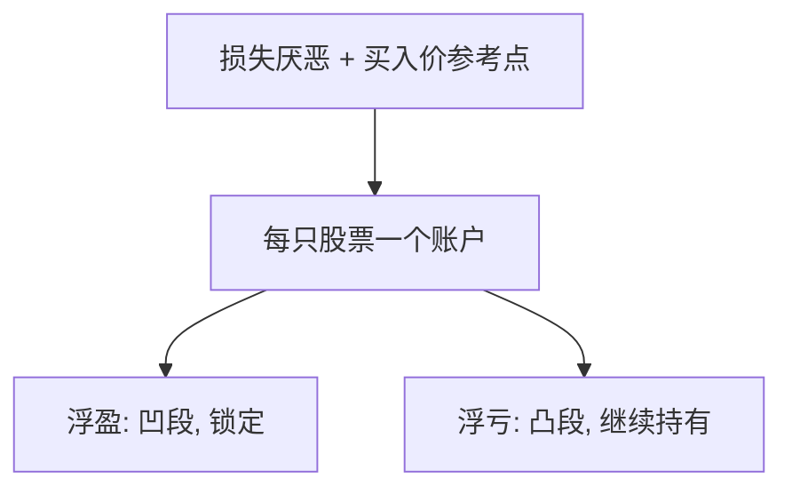

# 处置效应

浮盈愿意兑现，浮亏继续扛着——参考点是买入价，实现把账户结算成确定的收益或损失。

<footer>—— Shefrin and Statman, The Disposition to Sell Winners Too Early and Ride Losers Too Long, Journal of Finance, 1985；Odean, JF 1998</footer>

[上一课](/econ/prospect-theory-asset-pricing)把 $v$ 放进定价。本课缺口是交易：同一损失厌恶预测**实现行为**不对称。不重校准溢价。

## 问题

规范模型按预期收益与风险决定卖不卖，买入价是沉没。Shefrin 与 Statman（1985）用前景理论加心理账户：每只股票一个账户，参考点买入价；实现收益落在 $v$ 的凹段（厌恶风险，想锁定），浮亏落在凸段（寻求风险，想赌回来）。Odean（1998）用经纪账户：相对风险调整后的机会，投资者更常卖赢的。缺口是把参考点钉在成本，而不是再写市场均衡。

税的规范预测相反：应实现亏损抵税、推迟浮盈。处置效应与税冲突，识别更干净。

再平衡、流动性需求也会卖赢的（赢的变大了）。Odean 用卖出后的平均表现对照：卖掉的赢组合后来仍跑赢留下的亏组合，不像最优再平衡。

## 方法

持仓层面：实现概率对浮盈虚变量回归，控制持有期与波动。实验：诱导买入价，看卖出。本课不估计系数。与禀赋效应的差别：禀赋是 WTA/WTP，处置是跨期实现选择；零件都是损失厌恶加账户。

## 机制

机制是结算。未实现时，人还在凸或凹的段上做赌博；实现把结果变成确定的得或失，编辑规则鼓励把确定收益留下、把确定损失推迟。这与动量可以互动：该卖的赢不卖会减少动量供给，该卖的亏不卖会推迟价格对坏消息的调整——信念模型不是唯一的漂移来源。

家庭金融：处置提高换手的同时降低净收益，叠加过度自信。本课以评价为主。

买入价当参考点，实现是编辑：确定收益落在凹段想锁住，确定损失落在凸段想赌回来。税的规范相反，故不能用「理性避税」一笔勾销。Odean 对照卖出后表现，排除单纯再平衡。漂移可以部分来自该卖的亏没卖、坏消息进价格慢——信念模型不是唯一通道。不把止损单的排队写成处置；那是协议，本课是账户结算。

## 边界

专业交易者、可转债强制条款、止损单会减弱效应。买入价作为参考点在多次加仓时含糊。本课不把所有「扛着亏」写成前景理论：卖空限制、没有替代资金，也会让人扛。也不写止损在簿上的排队。

后课默认：异质信念加卖空限制是另一条泡沫通道，不必经过买入价账户。

买入价当参考点，实现把账户结算成确定得失；凹段锁赢，凸段扛亏。税的规范相反。

Odean 用卖出后表现排除单纯再平衡。该卖的亏没卖，坏消息可以进价格更慢。

## 小结

- 处置效应：卖赢留亏，参考点成本，与税的规范相反。
- 心理账户把每只股票单独送进 $v$ 的凹/凸段。
- 可与漂移叠加，但不替代 BSV/DHS 的信念故事。
- 多次加仓时参考点含糊。
- 止损排队是协议，本课是账户结算。
- 出处：Shefrin and Statman, *JF* 1985；Odean, *JF* 1998。
