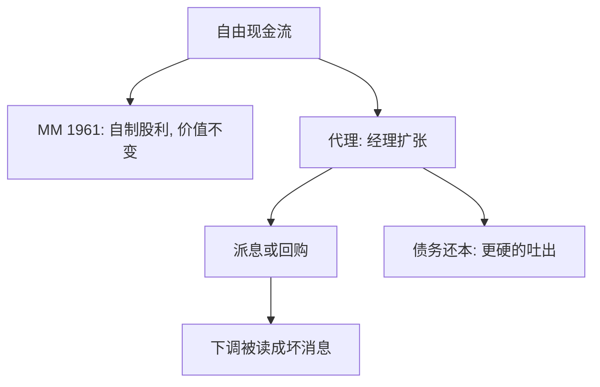

# 股利与自由现金流

投资政策给定时，股利只是把资产换成现金交给股东；股东可以自制股利，企业派不派不影响总价值。

<footer>—— Miller and Modigliani, Dividend Policy, Growth, and the Valuation of Shares, Journal of Business 1961</footer>

定位：[优序融资](/econ/pecking-order)。内部资金排在发行之前，解释了「缺钱时怎么筹」；本课缺口是对称的另一面：钱已经多于可置信的好项目时，为什么要派息或回购，而不是永远囤在账上。不重做发股的柠檬折价。

## 问题

[MM 1958](/econ/modigliani-miller) 说债股切片无摩擦时无关。Miller 与 Modigliani（1961）把同一套利用到股利：投资计划给定，少派息就多留存（或少发新股），股东若需要现金可以自己卖股。派息只改变股东自己持有的「现金 vs 仍留在企业里的要求权」，不改变企业资产产生的收益流。若这句话完整，股利政策没有经济学。

经验上企业平滑股利（Lintner 1956），并在自由现金流高时成为收购目标。缺口因此是：在哪一块摩擦下，把现金留在企业里会改变价值——不是再证明一次自制股利。Jensen（1986）给出代理版本：经理会把自由现金流做成低回报扩张，债务还本付息与派息都是把现金逼出企业的合同。

自由现金流：超过为所有正 NPV 项目筹资之后剩余的、可分配现金。它不是会计净利润。Jensen 的对象是产生大量 FCF 的成熟企业（石油、烟草），不是正在烧钱的成长企业。

## 方法

先钉无关性。设投资与生产计划不变。多派一单位股利，必须少留存或增发一单位新股。新股按公平价格发行时，老股东少持有的那一块正好等于到手的现金，总财富不变。这要求：无税收差、无发行成本、信息对称、投资政策不被股利绑架。

放松代理。经理的私人收益随企业规模上升时，正 NPV 筛子不再自动执行。把 FCF 留在内部，等于给经理一套无监督的投资基金。派息、回购、以及[权衡](/econ/tradeoff-capital)里已经出现的债务，都是减少经理可处置现金的办法。债务与股利的差别是承诺硬度：利息违约可触发控制权转移，股利可以悄悄下调。Lintner 的平滑则是另一套摩擦：下调股利被读成坏消息，于是经理用留存当缓冲，只把「持久」盈利的一部分定为股利。

优序与股利在内部资金上打架：优序希望保留债务容量、少发股，因而倾向少派息；FCF 代理希望把多余现金派掉。成熟、低投资机会的企业更接近后者；高成长、信息不对称重的企业更接近前者。

## 机制

MM 1961 的机制仍是复制：股东能自制的支付，企业代劳没有溢价。代理机制是控制权与现金流权分离：留在企业里的现金，决策权在经理，剩余索取在股东。派息把决策权交回；杠杆把未来的 FCF 预先抵押给债权人。信息机制（Bhattacharya 1979 一类股利信号）把派息写成昂贵信号，与[Spence](/econ/spence-signaling)同构，但不是本课主线——主线是无关性基准加上 Jensen 的 FCF，避免把股利课写成信号综述。

回购与现金股利在 MM 世界里等价；在税与信号世界里，回购更灵活、对「下调」的惩罚更轻。本课只记下：支付形式是摩擦上的细节，对象仍是「现金离开企业还是留下」。

### 投资政策一旦随股利而变

MM 1961 的前提是投资给定。若派息迫使企业放弃正 NPV，或留存迫使企业接受负 NPV，股利就通过投资进入价值。代理路径走后一条：多余现金降低投资门槛。融资约束路径走前一条：缺现金加柠檬，使好项目停摆。同一家企业在生命周期里可以从约束端走到代理端，股利政策跟着变，不是「投资者喜欢支票」的偏好公理。

Lintner（1956）的部分调整：股利对盈利的变动只调一部分，目标发放率缓慢移动。这与无关性不矛盾——它是信息与调整成本下的行为规则，不是对 1961 年套利的否证。

## 边界

不要把「高股利就是好公司」写成定理：在 MM 下股利不增加价值，在成长约束下高股利可能是少投资。也不要把 Lintner 平滑当成投资者「喜欢稳定支票」的偏好公理——它首先是不对称信息下的调整成本。税收（股利税 vs 资本利得税）会破坏无关性，本课不展开税码。

下一课离开公司财务的切片问题，进入资产价格是否已经把这些现金流信息写进去：[有效市场](/econ/emh)。自由现金流折现作为估值操作，要等到有了[随机折现因子](/econ/stochastic-discount-factor)才有严格语言。

公司金融单元到此结束：MM、权衡、优序、股利，都还在引用一个未加定义的市价。下一单元问这个市价已经包含什么信息、用什么核来折现。

后课默认：MM 1961 是无关性基准；自由现金流使投资不再给定。公司金融单元结束。下一课起，市价本身成为对象：它包含什么信息、用什么核折现。不要把股利折现模型提前写成已经有了 $m$。

优序要留现金，Jensen 要吐现金。成长约束企业与成熟高现金流企业不是同一检验对象。

回购与现金股利在 MM 下等价；税与灵活度不同，但都能降低自由现金流。

## 小结

- 投资给定、无摩擦时，股利可自制，政策不改变总价值（MM 1961）。
- 自由现金流的代理成本使派息与债务成为把现金逼出企业的工具（Jensen 1986）。
- 优序要留现金，FCF 要吐现金；哪一口径主导取决于投资机会与信息。
- 出处：Miller and Modigliani, *Journal of Business* 1961；Jensen, *AER* 1986；Lintner, *AER* 1956。
