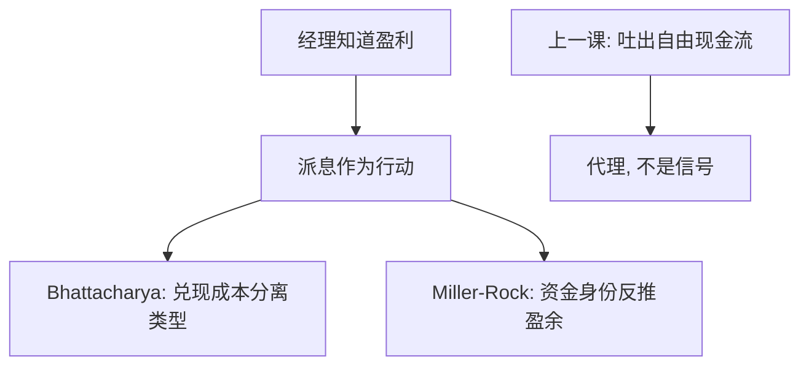

# 股利信号

现金股利之所以能说话，是因为它贵：差的类型模仿不起同样的派息，于是派息把持久盈利从便宜的声明里分离出来。

<footer>—— Bhattacharya, Imperfect Information, Dividend Policy, and the Bird in the Hand Fallacy, Bell Journal of Economics, 1979；Miller and Rock, Dividend Policy under Asymmetric Information, Journal of Finance, 1985</footer>

[上一课](/econ/dividend-fcf)在 MM 1961 无关性之上加上 Jensen 的自由现金流：派息把现金逼出企业。本课缺口是信息：投资与代理都给定之后，为什么还要派——因为经理知道盈利，市场不知道。不重做自制股利，不把回购提前写成主线。

## 问题

MM 世界里股利可自制，不传递新信息。Lintner 平滑已经暗示经理把股利当持久盈利的承诺。缺口是把这句话收成信号均衡，与 [Spence](/econ/spence-signaling) 同构：信号必须对差类型更贵。Bhattacharya（1979）让派息的代价来自外部融资的交易成本（或税收）：好企业预期现金流高，承诺高股利后较少真的去借贵的钱；差企业模仿会经常踩到发行成本。Miller 与 Rock（1985）让股利直接揭示当前盈利：投资加股利加发行必须对上资金来源，多派就是少投资或少留的会计身份，市场从派息反推被隐瞒的盈余。

两种技术不要混成一句「投资者喜欢支票」。一种是分离均衡里的昂贵行动，一种是会计身份加信息不对称下的推断。

信号要烧真资源或放弃真投资。口头「我们很好」太便宜。Bird-in-hand 不是本课：那是把股利当风险更低的现金流，Bhattacharya 标题里已经标成谬误。

## 方法

Bhattacharya：类型是预期盈利，行动是承诺的股利。成本来自为兑现股利而进行的昂贵外部融资。单交叉成立则高类型选高股利。Miller–Rock：经理先看到当期盈余，再选股利与投资；外部人只看到股利。欧拉式的一阶条件让股利成为盈余的充分统计（在他们的设定下），公告超常收益来自修正盈余，而不是来自「现金比资本利得好」。

代理与信号可以同时真：成熟企业既有 FCF 问题，又有要说的私有信息。本课只补信息刀，以免股利课序变成万能袋。

### 下调为何疼

Lintner 平滑在信号里是均衡策略：下调被读成类型变差，于是用留存当缓冲，只把持久部分定为股利。这与无关性不打架——摩擦是信息，不是股东不能自制。

## 机制

机制是逆向选择下的分离。好类型选贵行动，差类型觉得贵得不划算。代价必须落在现金流上：税、发行成本、或放弃的投资。Miller–Rock 的机制更会计：外部人知道预算约束，不知道约束里的哪一项是私有盈余，于是把可观察的股利当充分统计。两种机制都要求市场半强式处理**公告**：价格在派息声明时跳，正是 [EMH](/econ/emh) 后课要管的那一层，本课不检验事件窗口。

Miller and Rock, *JF* 1985。意外股利与意外盈余在会计上连着；把股利反应全部叫成「喜欢分红偏好」，是把推断误读成效用。

## 边界

不要把高股利写成好公司定理：成长约束下高股利可能是少投资，信号与代理会给出相反的福利。也不要在此跑公告超额表——事件研究在量化栏或后课 EMH，本栏只钉均衡。下一课 [股票回购](/econ/share-repurchase)问同一信号能否用回购更便宜地发送，以及它如何替代现金股利。

后课默认：股利可以是昂贵信号或盈余的会计推断；MM 无关性在信息对称时仍是基准。自由现金流是另一条理由，不要互相吞并。

税收差会改变信号成本，本课不展开税码。强式失败（经理有私人信息）是信号的前提，与半强式定价公告可以并存。

Bird-in-hand 把股利当更安全的现金流，在 MM 下不成立：企业少派可以少发股，股东风险来自资产，不来自信封。Bhattacharya 用发行成本造分离，恰恰是为了不靠那条谬误。

回购下一课问：同一笔现金若以买回股份的形式离开，分离是否还成立、承诺是否变软。本课先把现金股利的信号技术钉死。

## 小结

- 股利能说话，因为它贵或因为它钉住资金来源身份。
- Bhattacharya：兑现成本分离类型；Miller–Rock：派息反推盈余。
- 代理吐出现金与信号揭示类型是两条理由，不是一句偏好公理。
- Bird-in-hand 不是本课；信号要烧真资源或放弃真投资。
- 下一课回购问同一现金能否用更软的承诺发送。
- 半强式处理公告；本课不跑事件窗口。
- Lintner 平滑是均衡缓冲，不是对 MM 套利的否证。
- 强式失败是经理有私有信息；与半强式定价公告可以并存。
- 出处：Bhattacharya, *Bell Journal* 1979；Miller and Rock, *JF* 1985。
