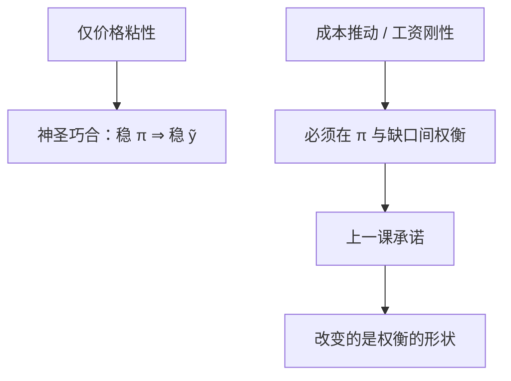

# 神圣巧合

若唯一的名义摩擦是价格粘性，稳定通胀的政策也稳定福利相关缺口；一旦出现真实工资刚性或成本推动，巧合消失，必须权衡。

<footer>—— Blanchard and Galí, Real Wage Rigidities and the New Keynesian Model, Journal of Money, Credit and Banking 2007</footer>

[上一课](/econ/discretion-commitment)在同一损失下给出权变与承诺两条路径。损失里同时罚 $\pi$ 与 $\tilde{y}$，仿佛永远有两项目标。本课的缺口是：在基准 NK（只有 Calvo 价格粘性、没有成本推动）里，两项其实是一个——稳通胀已经稳了福利相关缺口。Blanchard 与 Galí 把这叫做神圣巧合，并指出真实工资刚性会拆掉它。零下限是再下一课的工具约束。

## 问题

NKPC $\pi_t=\beta\mathbb{E}_t\pi_{t+1}+\kappa\tilde{y}_t$ 在没有 markup 冲击时，$\pi=0$（或 $\pi=\pi^*$）的路径要求 $\tilde{y}=0$。灵活价格配置本身就是有效配置（若补贴已抵消垄断加成），于是福利相关缺口与价格缺口重合。央行只要承诺把通胀钉住，缺口自动为零——不必在损失里「平衡」两项。缺口是：这巧合依赖哪一组假设，政策含义不要被三方程的两个损失项吓住。

上一课刚说明同一损失下权变与承诺路径不同。巧合成立时，两条路径在目标上重合（都稳 $\pi$），差只在过渡；巧合破裂后，两项真正分叉，承诺才变成定量地改善权衡。没有本课，损失函数里的两项会被误读成永远有两个独立工具。

巧合不是「通胀无关紧要」。它是：在所列假设下，通胀是缺口的充分统计。有成本推动时，通胀不再是充分统计，必须权衡。

## 方法

基准：垄断竞争加成被稳态补贴抵消，唯一扭曲是交错价格。Woodford 的二次福利近似把损失写成 $\pi$ 与 $\tilde{y}$ 的加权和，但二者被 NKPC 锁死，最优政策（无论权变还是承诺）都是完全稳定通胀。加入独立的成本推动 $u_t$（markup、石油、工资加成）后，

$$
\pi_t=\beta\mathbb{E}_t\pi_{t+1}+\kappa\tilde{y}_t+u_t,
$$

$\pi=0$ 不再蕴含 $\tilde{y}=0$。Blanchard–Galí 的真实工资刚性提供微观：工资不能随效率立刻调整，自然产出与有效产出分开，即使没有外生 $u_t$，稳定价格也不再稳定福利缺口。

权变与承诺在巧合成立时都选零通胀；巧合破裂后，二者的路径差才重新变成定量问题——承诺仍更擅长用历史依赖改善权衡，但不能同时把两项钉在零。

### 不要把两项损失读成两项独立工具

泰勒规则里同时写 $\phi_\pi$ 与 $\phi_y$，容易让人以为永远要「兼顾」。巧合成立时，$\phi_y$ 的角色是识别：技术冲击不应当被当成需求来打。巧合破裂时，$\phi_y$ 才真正是第二目标的反应。卢卡斯批判：用含 $u_t$ 的样本估出的替换，不能拿到无 $u_t$ 的规则下去当菜单。

## 机制

价格粘性造成相对价格错位；通胀是错位的加总。关掉通胀等于关掉错位，缺口回到有效。真实工资刚性把劳动市场的错位加进来：即使价格通胀为零，就业仍可偏离有效。供给冲击让边际成本与需求缺口脱钩，NKPC 的残差就是脱钩。长期中性仍在：无论巧合是否成立，$y$ 回自然路径，$\pi$ 由名义锚决定；权衡只存在于短局。

权变与承诺在巧合破裂后差在如何分摊 $u_t$：承诺用未来一段偏低的 $\pi$ 换今天较小的双偏离；权变没有这笔账。巧合成立时这笔账是空的——两项本来锁死。因此「要不要承诺」的定量重要性，本身取决于巧合是否还在。开放经济的汇率错位、金融摩擦的利差，是后课才能并列的额外缺口，本课不提前写成新的神圣巧合。

开放经济的汇率错位、金融摩擦的利差，也会制造类似的额外缺口。本课只取 Blanchard–Galí 的工资刚性与成本推动，作为「巧合会破」的最小装置。

## 边界

本课不估计牺牲比，不把巧合写成「因此只看通胀」的政治口号——那要先检验 $u_t$ 与工资刚性是否可忽略。量化栏没有宏观权衡。也不在这里展开工资菲利普斯的全套校准。稳态垄断加成若未被补贴抵消，灵活价格配置本身已不是有效配置，巧合在定义上就要重写福利缺口；Woodford 的近似通常先把这项用补贴拿掉，本课跟随，不把一次总付补贴当现实税制。

下限上即使巧合在正利率区成立，工具卡住也会强迫一项偏离——那是工具约束，不是又一个成本推动。本课先在可以执行 $\phi_\pi>1$ 的区域把巧合钉死。

后课默认：基准 NK 可以有神圣巧合；有成本推动或真实刚性则必须权衡。下一课：规则给出的 $i$ 碰到有效下限，承诺必须换工具或换路径语言。

## 小结

- 仅价格粘性、无成本推动时，稳通胀即稳福利缺口。
- markup 冲击或真实工资刚性拆掉巧合。
- 损失里两项在巧合下不是两个独立目标。
- 承诺改善权衡形状，不恢复巧合本身。
- 开放汇率错位与金融利差是后课才能并列的额外缺口。
- 出处：Blanchard and Galí, *JMCB* 2007；对照 Woodford 的福利近似。
