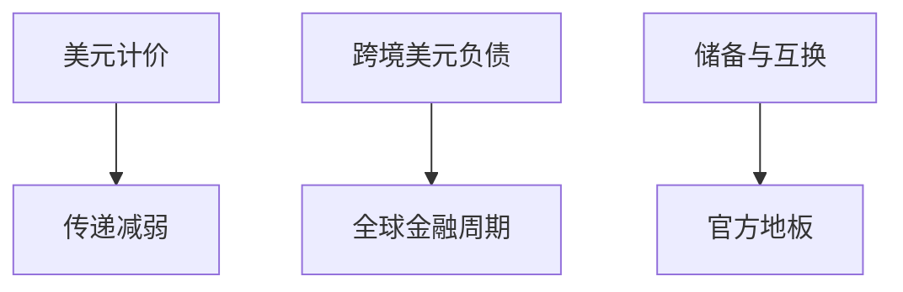

# 美元主导与国际货币

全球安全资产与贸易计价仍高度集中在美元。这是网络与政策背书，不是单一货币数量方程的世界版。

<footer>—— Gopinath 等的计价货币；Rey 的全球金融周期；Eichengreen 对国际货币史</footer>

[上一课](/econ/cbdc)把公共数字负债留在国内设计。本课收束「动态宏观与异质性」：跨境时，美元负债与美联储互换线才是真正的全球地板。公司金融进阶从下一课 ESG 另起，不在这里写治理。开放宏观的危机与互换线，贸易课序后半会再展开。

## 问题

Rey：在资本流动下，中心国家的货币政策经风险承担渠道变成全球金融周期，浮动汇率不能完全绝缘。Gopinath：贸易以美元计价，汇率传递变弱，美国的名义冲击变成别人的实际冲击。若把「国际货币」写成铸币税口号，会漏掉：主导是发票、银行跨境负债、储备和安全资产便利收益（Du–Im–Schreger 一类）的捆绑。

缺口是给后课贸易与危机一张结构图，而不是再推一遍 NK 小国。

Gourinchas 的美元特权讨论。Maggiori, Neiman and Schreger 的货币选择。Miranda-Agrippino and Rey 的全球因子。

## 方法

三层：计价（贸易与金融合同）、中介（全球银行的美元负债）、官方（储备、互换）。冲击：美联储加息 → 全球 $\phi$ 收紧 → 新兴市场信用与汇率。政策：宏观审慎、资本流动管理、互换线（后课）。与主导课：美国财政–货币安排通过安全资产供给外溢。

## 机制

网络外部性：别人用美元开票，你也用，以匹配成本。银行侧：欧洲银行借美元、买美元资产，美元融资紧张时全球信用收缩（Bruno–Shin）。官方侧：美债便利收益使美国能以更低 $r$ 负债，同时输出安全资产短缺的另一面。

## 边界

本课不写欧元区制度史（贸易课欧元区危机）。不把去美元化写成已完成事实。CBDC 跨境结算是实验，不替代互换网络。后课默认：小国模型要声明发票货币与美元负债敞口。动态宏观补层在此封口；下一课程从[NPV 与 IRR](/econ/npv-irr-pitfalls)起写企业项目。

## 小结

- 美元主导是计价、中介与官方地板的捆绑。
- 浮动汇率不能取消 Rey 意义上的全球周期。
- 出处：Rey 全球金融周期；Gopinath 计价；Bruno–Shin 美元信贷。
