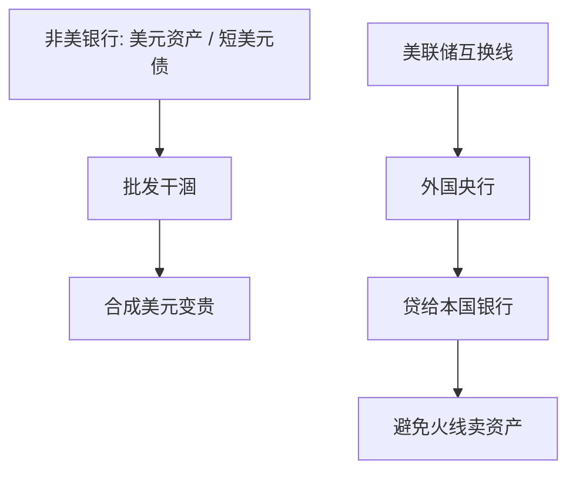

# 美元融资与互换线

全球银行用短美元批发支撑美元资产；私人美元市场一干，本国央行印不出美元。互换线让美联储把美元流动性借给同行，是国际最后贷款人的制度形式。

<footer>—— McGuire and von Peter, BIS；Bahaj and Reis 互换线；Goldberg, Kennedy and Miu</footer>

[上一课](/econ/eurozone-crisis)写欧元同盟内的主权停止。本课——也是本课程国际金融续的收束——把危机换成全球美元融资。主干开放宏观接到三角与原罪；本课补：即使没有钉住，美元批发一停，浮动货币区的银行仍会缺美元。后课若再续，默认已经读完：官方美元流动性是全球金融周期的闸，不是限价簿上的报价技术。

## 问题

非美银行持有大量美元资产（贷款、证券），负债却是短美元（批发、外汇掉期）。国内央行最后贷款人只能提供本币。2008、2020：私人美元融资市场冻结，CIP 偏离飙升（量化栏对象），实体是美元短缺。美联储与主要央行的互换线：对方央行按约定汇率换入美元，再贷给本国银行，美联储持有外汇作为抵押。缺口不是再讲原罪企业债，而是：国际最后贷款人必须是美元的发行者，三角与 OCA 管不到这条批发腿。

Shin 的全球银行杠杆、Rey 的全球金融周期：美元风险偏好驱动跨境信贷。互换线是压力时的官方替代批发市场。Baba–Packer 写危机中的美元短缺。

## 方法

描述链条：资产美元化 + 负债批发化 ⇒ 期限与币种双错配。压力：对手方风险使批发停，掉期变成贵的合成美元（CIP 基差）。互换线把官方美元注入，压基差、避免火线出售美元资产。经验：Bahaj–Reis 显示互换利率与拍卖如何成为边际。本课不报基点时间序列，不写交易员执行。报价层见 `/quant/irp`。

与储备：自有美元储备是自我保险，规模往往不够银行体系；互换是弹性的中央保险，但有对象国资格（并非全球公共品均匀供给）。与 SWF：久期相反，危机要的是现金美元不是股权组合。与欧债：OMT 是欧元名义锚，互换线是美元锚，两套地板。

## 机制

机制是国际最后贷款人。Bagehot 在国内是对本国银行放贷；全球美元体系里，最终流动性在美联储。互换线是央行之间的 Bagehot，避免外国央行「印美元」。这改写三角叙事：浮动 + 独立货币仍可能在美元批发上不独立。原罪是新兴的币种；本课是发达银行业的美元批发——分层，不要合成一句。

欧元区 2011–12：主权回路之外，欧洲银行的美元腿同样要互换。2008 是抵押品与对手方；2020 是基金赎回与商业票据。装置相同，冲击不同。资格政治：谁能进入永久互换，谁只能临时，决定全球安全网的几何。

Cetorelli–Goldberg：全球银行在压力时重新分配内部美元。Bruno–Shin 把跨境信贷写成杠杆周期。本课要的是官方地板，不重写银行微观。

## 边界

本课不提供如何从互换线套利的任何步骤。不重写 `/quant/irp` 的基差回归。课程在此收束开放宏观续：贸易理论从李嘉图走到任务与增长，金融从 Lucas 走到美元最后贷款人。不要把互换线写成已经替代储备需求；对无资格国家，怕浮动与储备仍在。不要进限价簿。下一课程[产业组织](/econ/scp-neio)从 SCP / NEIO 起，不再写美元批发。

后课默认：全球银行的美元批发可以在浮动下仍制造美元荒；互换线是发行者提供的国际 LOLR。CIP 压力是价格症状。欧元主权危机与美元短缺可以同时发生、机制不同。货物比较优势与资本流之谜，到此都已接到制度闸。产业组织不再默认你还停在开放宏观。

## 小结

- 非美银行的美元资产靠短美元批发；本国央行印不出美元。
- 互换线是美联储对同行的国际最后贷款人。
- 浮动不取消美元批发依赖；与原罪分层。
- 储备是自我保险，互换是弹性中央保险，资格不均。
- 出处：McGuire and von Peter（BIS）；Bahaj and Reis；Goldberg, Kennedy and Miu；Shin；Rey。
