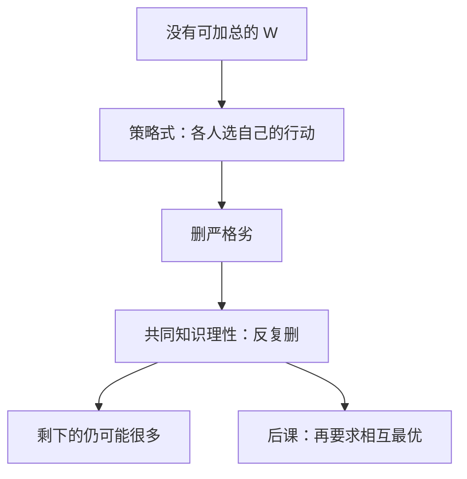

# 优势与反复剔除

严格劣策略不应被使用；若这一点是共同知识，剔除可以一轮一轮做下去。

<footer>—— 据 Osborne and Rubinstein, A Course in Game Theory, 1994 整理</footer>

[上一课](/econ/condorcet-cycles)（孔多塞循环）。表明：没有一组公理能把个人排序免费收成社会排序。缺口是：没有计划者、也没有被接受的 $W$ 时，个人对自己的行动还能提什么最小理性要求？博弈课从这里起。本课只钉优势策略与反复剔除严格劣势（IESDS），相互最优反应还不出场。

## 问题

策略式 $(N,(S_i),(u_i))$。纯策略 $s_i$ 被 $s_i'$ **严格劣势**，若对一切 $s_{-i}$，

$$
u_i(s_i',s_{-i})\gt u_i(s_i,s_{-i}).
$$

只要求理性的人不会选这样的 $s_i$，不必猜测别人怎么做。若每人知道别人也不选严格劣，剩下的博弈里可能又冒出新的严格劣——反复剔除。IESDS 是这个过程的极限。

占优策略更强：同一 $s_i^*$ 对**一切** $s_{-i}$ 都不差，且对某些严格更好。有占优策略时，理性单独就钉死自己的那一手。囚徒困境的招供是占优；协调博弈（选同一家店）没有劣策略，IESDS 什么也不删。

### 还不是均衡

剔除给出的是「理性 + 共同知识理性」的必要条件。活下来的组合不必相互最优，也不必唯一。猜硬币两个纯策略都不劣；囚徒困境的合作被第一轮删掉。本课停在这条必要，不把「相互猜中」写成解。

混合也可以严格压住一个纯策略：石头剪刀布里没有纯策略严格劣，但一旦允许对混合取期望，某些复杂博弈里纯策略会被混合劣势删掉。IESDS 通常在混合扩展上做。弱劣势（$\ge$ 且某处 $\gt $）的剔除顺序会改变结果，本课主钉严格。

## 方法

对象：有限策略式，支付为 vNM 效用（以便对混合取期望）。算法：反复删严格劣（相对留下的对手策略）。严格劣势下，删除顺序不影响最终集合。弱劣势不要当同一算法。

两人零和、囚徒困境、性别战、匹配便士，用来区分：有占优、能反复删、以及删不动。公共品自愿贡献里，「自己少出一点」往往不是严格劣（取决于对方贡献），IESDS 帮不上，那要等到后课的相互最优。

## 机制

为什么可以反复：第一轮删的是「无论别人怎样都差」的招。第二轮用的信息是「别人知道我理性，所以不会把概率放在我已删的招上」——于是原来不劣的招，相对缩小后的 $S_{-i}$ 可能变劣。这是共同知识的迭代，不是心理故事里的「我猜你猜我」。

占优策略均衡（若存在）是 IESDS 的固定点，而且每人的那一手不依赖对别人的信念。它不保证联合有效：囚徒困境双双招供，帕累托劣于双合作。解的这一层从一开始就不附送效率——与[第一定理](/econ/welfare-theorems)的分权有效已经分家，那里个人面对的是价格不是对手的行动。

### 弱劣势不要混进来

弱劣策略在某些 $s_{-i}$ 上同样好，只在另一些上更差。理性人可以在「那些同样好的对手策略概率为正」时保留它。反复删弱劣对顺序敏感，也更容易删掉后来看起来合理的招。本课不用它当定义。实验里的优势可识别性，是对照，不是定义。

Osborne–Rubinstein 把严格劣势写成：存在（混合）策略，在所有对手策略上支付严格更高。有限博弈里这与「对所有对手混合都严格更差」一致。无限策略集要另加技术条件，主干用有限。

## 边界

IESDS 可以剩下整个 $S$。可理性化把「对某个信念是最优反应」写清，集合可以与 IESDS 重合（两人）或分开（$n$ 人相关猜想）。相互正确预期是再下一课。

也不要把优势写成限价簿上的占优报价；本栏行动是抽象的 $s_i$。后课默认：谈到无计划者的互动，先问有没有严格劣可删；有占优则先用占优。

## 小结

- 没有社会排序之后，最小理性是不选严格劣策略。
- 共同知识理性允许反复剔除；严格劣势下顺序无关。
- 占优策略不依赖信念，也不保证有效。
- IESDS 是必要，还不是相互最优反应。
- 出处：Osborne and Rubinstein, *A Course in Game Theory*, 1994。
