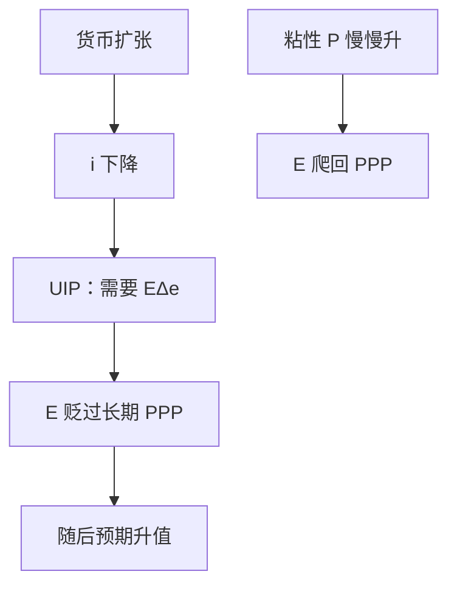

# 多恩布什超调

物价粘住时，货币扩张必须让汇率立刻贬过长期 PPP 水平，预期中的升值才能对齐已经下降的利率。

<footer>—— Dornbusch, Expectations and Exchange Rate Dynamics, Journal of Political Economy 1976</footer>

[上一课](/econ/mundell-fleming)在静态预期下给出固定与浮动的分叉：$i$ 贴近 $i^*$，流量 IS 决定 $Y$。本课的缺口是理性预期补丁：物价短期粘、长期回到 PPP，UIP 要求 $E$ 先走过头。不可能三角是再下一课把制度收成三选二；本课只把超调钉进已经打开的浮动角。

## 问题

MF 用静态预期，$i=i^*$。一旦允许 $\mathbb{E}\Delta e\neq 0$，UIP 写成 $i=i^*+\mathbb{E}\Delta e$。货币扩张立刻压低 $i$，若 $E$ 只走到长期 PPP，预期贬值率为零，UIP 不平。Dornbusch 的缺口是：粘性 $P$ 下，$E$ 必须立刻贬到超过长期水平，使随后的路径是**预期升值**，正好补上 $i-i^*$。长期 $P$ 按数量论（或相对 PPP）追上，$E$ 从超调点爬回，实际汇率 $q$ 的大摆动是过渡，不是新的恒等。

MF 已经给出浮动角上货币相对有效。本课不加新恒等，只把静态 $i=i^*$ 换成带预期的 UIP，让 $E$ 的瞬时值可以离开长期 PPP。三角课仍用制度分叉，不需要再推一遍超调代数。实证基差不在此报，见 `/quant/irp`。

超调是资产市场快、货物市场慢的相对速度，不是「非理性过冲」。理性预期下，走过头是均衡，不是误差。

## 方法

商品市场：$P$ 按超额需求缓慢调整（或 Calvo 式粘性，精神相同）。资产市场：UIP 每期成立，资本高度流动。长期：货币中性，$E$ 与 $P$ 同比例升， $q$ 回初始。短局：$P$ 不动，$M$ 升使 $i$ 降，$E$ 跳到超调点。动态上 $E$ 的预期变化钉住利率差，直到 $P$ 完成调整。

这与巴拉萨–萨缪尔森不冲突：后者是可贸易生产率造成的 $q$ 趋势；超调是名义冲击下的过渡路径。CIP 仍是远期会计，见 `/quant/irp`；超调用的是 UIP，不报基差。

### 仍是会计加均衡

$CA=S-I$ 事后成立。超调改变的是 $q$ 从而支出转换与吸收，均衡中的 $CA$ 可以摆，恒等不破。MF 的「浮动时货币更有效」在此有了汇率通道的放大：同样的 $M$，$q$ 的瞬时变动大于长期，净出口的短反应可以大于 PPP 所暗示的。

## 机制

资产持有者要求本币存款与外币存款（加预期升贬值）回报相等。$i$ 被货币扩张压低的瞬间，唯一能出清的是预期本币升值，因而当前 $E$ 必须已经贬得足够远。物价粘性使实际余额 $M/P$ 上升，这正是 $i$ 下降的来源；若 $P$ 立刻灵活，费雪与 PPP 同时跳，$i$ 与 $E$ 一步到位，没有超调。长期中性恢复：$\tilde{y}=0$，$\pi$ 由新的货币路径决定。自然率不因 $E$ 的名义跳而永久改变。

时间不一致不在 1976 年的原文里，但可读：宣布的货币路径若不可信，超调的终点不是 PPP 算出的那个 $E$，储备或风险溢价会另写一项。本课先取可信规则下的超调。MF 的浮动角上「货币更有效」在此有了放大：瞬时 $q$ 的变动大于长期 PPP，支出转换可以过冲。突然停止切断的是 UIP 所假设的资本流动，超调公式不再适用——那是后课，本课资本仍高度流动。

大国 $i^*$ 内生、风险溢价随头寸变，超调幅度改，符号机制可以还在。原模型是小国、静态价格调整方程，不是 NK 开放经济的全套校准。

## 边界

静态 MF 没有微观基础的 NX；Dornbusch 补的是预期与粘性 $P$，仍不是完整的开放 NK。不要把超调写成对限价簿的外汇订单。也不要把某一周的汇率波动都叫超调——还要有名义冲击与粘性物价这两件家具。CIP 的短端会计不在此重导，实证见 `/quant/irp`。紧缩对称：货币收缩让 $E$ 升过长期水平，随后预期贬值对齐偏高的 $i$。

原罪会让同一 $\Delta e$ 变成净值税，超调的福利符号可以翻。本课资本仍按 UIP 流动、债的币种未写。三角下一课收成三选二，超调只活在已经打开的浮动角。

后课默认：浮动加粘性物价时，$E$ 可以对名义冲击超调。下一课把独立货币、钉住、资本开放收成三选二。

## 小结

- 粘性 $P$ + UIP：货币扩张让 $E$ 贬过长期 PPP。
- 预期升值对齐利率差；$P$ 追上后超调消失。
- 与巴拉萨–萨缪尔森的趋势 $q$ 不是同一机制。
- 长期中性与相对 PPP 仍是终点。
- 资本仍流动；突然停止会切断本课的 UIP 装置。
- 出处：Dornbusch, *JPE* 1976。
