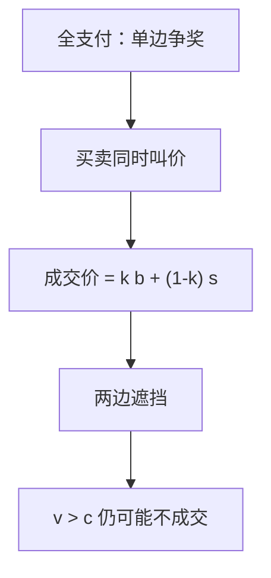

# 双向拍卖

买方报价、卖方要价，成交价取两者的凸组合；两边都遮挡，互利交易以正概率做不成。

<footer>—— Chatterjee and Samuelson, Bargaining under Incomplete Information, Operations Research, 1983</footer>

[上一课](/econ/all-pay-auction)仍是单边：一方设规则，多方争一件奖赏。缺口是双边都有私型——一个卖家一个买家，没有拍卖人替他们定价，两人同时出数。Chatterjee–Samuelson 的 $k$ 双拍卖给出线性均衡与无效率。本课钉这条机制，不把「不可能事后有效」写成定理——那是下一课 Myerson–Satterthwaite。

## 问题

卖方估值 $c\sim F_s$，买方估值 $v\sim F_b$，独立，支撑重叠（例如都在 $[0,1]$）。卖方报要价 $s$，买方报出价 $b$。若 $b\ge s$，以价格 $p=kb+(1-k)s$ 成交，$k\in[0,1]$；否则不成交。$k=1/2$ 是均分价差的教具；$k=1$ 则成交价等于买方的报。

对称均匀、$k=1/2$ 的线性 BNE：买方报 $b(v)=a+bv$，卖方报 $s(c)=a'+b'c$，斜率小于 $1$——买方压低、卖方抬高。成交要求 $b(v)\ge s(c)$，比 $v\ge c$ 更严。故存在 $v>c$ 却不成交的区域：互利交易被遮挡吃掉。

### 不是单边二价的真话

二价里卖方是机制、买方之间竞争，真话占优。双拍卖两边都是策略玩家，没有「第二高别人」来钉价。自己的报既影响是否成交，也影响成交价（除非 $k=0$ 或 $1$ 把价完全钉在对方身上——那时这一边仍要管成交门槛）。两边同时遮挡，是双边垄断加私型的默认结局。

$k$ 只分配成交后的剩余，也改变谁更愿意遮挡。$k$ 靠近 $1$，价跟着买方走，买方更不敢报高；卖方则少担心价、多担心门槛。线性均衡的斜率随 $k$ 与分布变，不是一条万能直线。

## 方法

对象：一人对一人、独立私型、准线性、同时报价。先猜线性策略，代入对方策略后对 $b$ 或 $s$ 求导，匹配系数。再画类型平面：有效集 $\{v\ge c\}$ 与均衡成交集 $\{b(v)\ge s(c)\}$ 的差是无效率。均匀 $[0,1]$、$k=1/2$ 时，成交发生在 $v\ge c+1/4$ 一类半平面（具体截距随正规化变），不是对角线。

均匀 $[0,1]$ 教具把成交集画成半平面，缺口宽度随遮挡斜率变。换分布只改截距，不取消「对角线内侧有不成交」。

对照鲁宾斯坦：完全信息轮流出价有效（立刻同意）。这里类型私有、一次同时动，没有贴现惩罚来逼出真话。$k=0$ 时成交价等于卖方要价，买方的报只当门槛，卖方承担全部价格效应，遮挡更狠；$k=1$ 则相反。两端是「一口价」机制嵌进同时报价，线性均衡的无效率一般更重，不是更轻。

## 机制

买方略微提高 $b$：成交区扩大（边际密度），但一旦成交，$p$ 随 $k$ 上升。最优把「多成交的收益」抵住「价被自己抬高」。卖方对称。两边各留一截信息租金，成交集从有效对角线往里缩。这不是谈判技巧失败，是 IC：报真值会让对方（和价格公式）剥削自己的类型。

实验里双拍卖有时接近有效（Smith 的口头双向），那是多人、重复、剩余信息泄露，不是 Chatterjee–Samuelson 的一次两人密封。本课对象是最瘦的双边机制，用来接到不可能定理：若连「随便造更弯的规则」都救不了事后有效，那线性双拍卖的缺口就不是可以设计掉的摩擦。

### 期望剩余仍为正

无效率是概率上的，不是「永远不交易」。高 $v$、低 $c$ 仍成交；靠近对角线的交易被牺牲。事前剩余低于完全信息，但高于「禁止交易」。机制设计要问的是：能否在 IC、参与、预算平衡下把成交集扩回 $\{v\ge c\}$——下一课给出否定。

Satterthwaite–Williams 把 $k$ 双拍卖嵌进一列买家与卖家；人数变多，个人遮挡的价格影响变小，无效率可以按 $1/n$ 阶消失。两人是最坏的双边垄断，不是大型市场的描述。

## 边界

关联类型、风险厌恶、可选择谈判破裂后的外部分配，线性均衡不必存在。多边、连续交易另有机制。也不要把双拍卖写成限价簿的两边挂单撮合；本课没有时间优先，只有一次同时报价。

线性均衡不是唯一 BNE，但教学上它把遮挡斜率写清楚。非线性均衡仍留下 $v>c$ 不成交的开集——无效率不是直线猜错。有中介、能承诺补贴时，机制已经走出本课的自愿平衡，接到下一课的不可能与 AGV。

后课默认：$k$ 双拍卖的对称线性均衡两边遮挡，事后有效失败。下一课证明这不是特例：任何自愿、激励相容、预算平衡的机制都做不到事后有效。

## 小结

- 单边拍卖之后，双边是买卖同时出数。
- $k$ 双拍卖成交价为报价的凸组合；线性 BNE 遮挡。
- $v>c$ 仍可能不成交，效率缺口来自 IC。
- 多人极限可以变薄；两人是不可能定理的舞台。
- 出处：Chatterjee and Samuelson, *Operations Research*, 1983。
