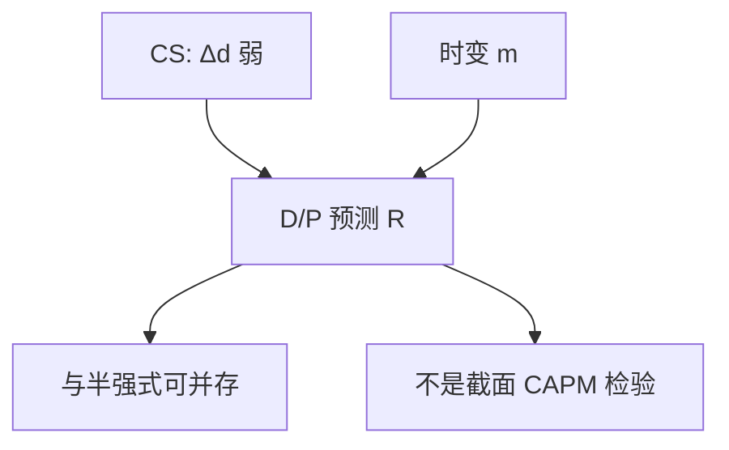

# 股利-价格比预测

股利–价格比是折现率通道的状态变量：它预测回报，是因为会计要求它预测；斜率大小由时变溢价决定，不由「市场无效」单独决定。

<footer>—— 据 Fama and French, Dividend Yields and Expected Stock Returns, Journal of Financial Economics, 1988；Campbell–Shiller 1988</footer>

[上一课](/econ/shiller-excess-volatility)从波动端拒绝恒定折现。本课缺口落到**预测变量本身**：$d-p$（或 $D/P$）作为预期回报的代理。不重画方差界，不把收益率预测做成样本外赛马——那是计量，本栏只要理论地位。

## 问题

Fama 与 French（1988）把股利收益率写成未来股票回报的预测变量。CS 会计已经说明：若 $\Delta d$ 通道弱，这件事必须发生。缺口是把它放进 SDF 语言： $d-p$ 跟踪 $\mathrm{E}_t[m_{t+1}]$ 或风险价格的状态。Lucas 树里状态是 $y$，$d-p=d-p(y)$，预测力来自 Markov；习惯模型里状态是盈余消费比，$d-p$ 与之共变。本课不选哪一个微观基础，只钉：预测变量是折现率的充分统计候选，不是对半强式的自动否证。

与 [CAPM](/econ/capm-theory) 的分界：CAPM 说截面上 $\mathrm{E}[R^e]$ 与 beta 成正比，可以允许市场溢价时变。$D/P$ 预测的是时间序列上的市场溢价，不是横截面异象表。不要在本课排序规模与价值。

Fama and French, *JFE* 22, 1988。同一作者后来的三因子是截面；本课停在总量预测。两件事不要并成「Fama–French 说市场无效」。

## 方法

把 $d_t-p_t$ 当作状态 $z_t$ 的代理。欧拉 $1=\mathrm{E}_t[m_{t+1}(1+R_{t+1})]$ 在 $z_t$ 上投影，得到 $\mathrm{E}[R_{t+1}\mid z_t]$ 随 $z_t$ 变。线性预测 $R_{t+1}=a+b(d_t-p_t)+\varepsilon_{t+1}$ 是这根投影的一阶近似。$b>0$ 与「高 $D/P$ 之后回报高」一致：价格低相对股利，预期折现高。短窗口噪声大、长窗口会计更显——因为 CS 的和是折现长和。

信息：若 $D/P$ 含未被价格完全揭示的基本面，预测力里会混进 $\theta$ 的泄漏。GS 部分揭示允许这一点。理论地位仍是：观测到的预测不必等于「业余投资者没读年报」。联合假说没有消失。

## 机制

机制是状态依赖的风险价格或风险量。坏状态下 $m$ 更抖或更倾斜，要求更高的 $\mathrm{E}[R]$，同时价格已经下跌，$D/P$ 升高——于是 $D/P$ 与后续回报同向。这与流动性接口相容：中介约束收紧时折现升、价格跌，后课 He–Krishnamurthy 会把 $z$ 写成中介资本；本课的 $D/P$ 只是一个可观测的坐标。

不要用 PEAD 解释 $D/P$：公告漂移是注意力；估值比率是慢变量。时间尺度不同。

Goyal–Welch 的样本外批评针对预测回归的稳定性，不否定 CS 会计。会计说必须有通道；哪一个有限样本回归能抓住它，是测量。

## 边界

本课不报告 $R^2$，不比较盈利收益率与股利收益率的赛马。下一课把「时变风险」沿期限展开：短期与长期现金流的风险价格可以不同——风险的期限结构。那是对折现率通道的精细化，不是又一个预测变量清单。

后课默认：$D/P$ 是折现率状态的会计代理；它预测回报与过度波动拒绝恒定 $r$ 是对偶。不是 CAPM 横截面，不是对 EMH 的单独否证。

## 小结

- 股利–价格比预测回报，首先是 CS 会计在 $\Delta d$ 弱时的推论。
- 理论地位是时变 $m$ 的可观测坐标，不是无效的充分统计。
- 时间序列溢价 ≠ 截面因子表。
- 出处：Fama and French, *JFE* 1988；Campbell and Shiller, *RFS* 1988。
