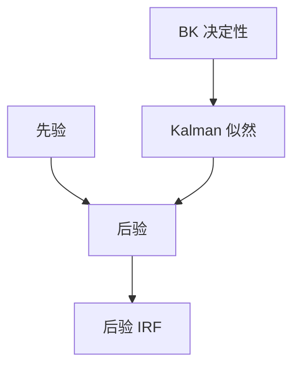

# DSGE 贝叶斯估计

线性高斯 DSGE 有状态空间与似然；先验把微观与稳态信息放进后验，而不是假装样本无限。

<footer>—— Smets and Wouters, An Estimated Dynamic Stochastic General Equilibrium Model, JEEA 2003；*American Economic Review* 2007；对照 An and Schorfheide 的综述</footer>

[上一课](/econ/calibration-moments)把参数分成钉住的与对矩的。本课缺口是**似然**：观测序列 $\{y_t\}$ 经 Kalman 滤波给出 $p(Y\mid\theta)$，再乘先验。不重做校准的稳态会计，不把估计写成「取代理论」。

## 问题

Smets–Wouters：中等规模 NK，多冲击，贝叶斯 MCMC。先验来自微观或惯例（Calvo 概率、习惯、投资调整成本），似然来自产出、通胀、利率、工资、投资等。BK 必须在参数空间的决定性区域成立，否则似然无定义。缺口是：校准留下的「剩余参数」现在可以连同部分结构参数一起估，但识别仍靠先验与观测选择，不是靠口号。

An and Schorfheide, *Journal of Economic Literature* 2007。Del Negro–Schorfheide 的 DSGE-VAR 把模型当先验。本课不写 MCMC 诊断手册。

## 方法

对数线性 + 高斯冲击 ⇒ 状态空间。观测方程含测量误差。Kalman 给似然；Metropolis–Hastings 抽后验。观测要对应模型变量：人均、去趋势方式与模型一致——下一课 HP 与这里的「模型自己的趋势」会打架，必须声明。边缘数据密度可比较模型，但不能把比较当成对「真实冲击」的命名。

识别弱时，后验贴着先验：看起来「估出来了」，其实样本没说话。这与校准把参数钉死是表亲，只是钉死改成了先验分布。

## 机制

机制是贝叶斯更新加结构状态空间。冲击被命名为技术、偏好、货币政策、加成等，IRF 的标签来自模型，不是来自数据单独承认。Lucas 批判的希望：估的是「深」参数，政策反事实可做。希望落空的方式：冲击是残差的重新包装，名义摩擦的先验主导，趋势处理改变一切。Smets–Wouters 能拟合到接近 BVAR，说明似然灵活，不自动说明识别了正确的传导。

一阶线性估不出风险溢价；要资产价格观测，需升阶或另接定价核——本栏不把股权溢价之谜塞进 SW 估计。

Smets and Wouters, *JEEA* 2003；*AER* 97(3), 2007, 586–606。欧元区与美国两套经典估计。

## 边界

本课不识别 SVAR 的符号限制（再后课）。不把粒子滤波、非线性估计写完。异质 HANK 的估计是前沿，默认仍是代表性 SW。滤波后的周期事实与「模型内生趋势」不是同一套矩，混用会双重惩罚。

后课默认：线性 DSGE 可贝叶斯估计；决定性、先验与观测定义是许可证。下一课：数据侧如何把趋势与周期切开，以便和校准矩对话。

## 小结

- SW：先验 + Kalman 似然估计中等 NK。
- 决定性是似然的前提；弱识别时后验等于先验。
- 拟合 BVAR 不等于传导正确。
- 出处：Smets and Wouters, *JEEA* 2003、*AER* 2007；An and Schorfheide, *JEL* 2007。
