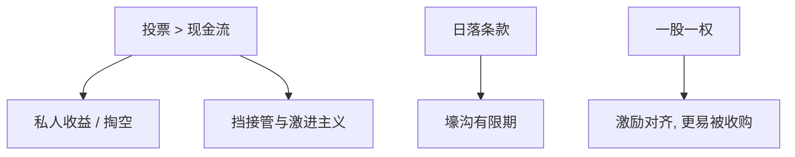

# 双层股权

    
超级投票权把现金流权与投票权劈开：创始人可以在只持有少数经济权益时保有剩余控制权，代理成本随楔子上升，换来的是防止敌意接管与免费搭车式的打断。

    <footer>—— 据 Grossman and Hart 控制权逻辑；Gompers, Ishii and Metrick, Journal of Finance 2010；对照 [控制权与治理](/econ/control-rights)</footer>

[上一课](/econ/venture-capital-staging)在私人阶段已经把表决权与现金流权分开。IPO 时若写入 A/B 股，楔子进入公众市场。本课缺口是双层股权：何时是保护长期项目的承诺，何时是壕沟。不重写 VC 条款清单，不把 LLSV 的国别回归提前。

## 问题

一股一权使投票随现金流走，激励对齐，也使 Grossman–Hart 的收购者更容易积攒投票。双层：创始人用高投票股控制董事会，公众持有低投票的经济权益。楔子 = 投票权 − 现金流权。私人收益与掏空随楔子上升（控制权课已定义）。抗辩：防止短视激进主义打断实物期权，或防止收购者低价打断。缺口是把防御课的「药丸」换成证券设计，并标明无法被赎回——除非日落条款。

Gompers–Ishii–Metrick 用楔子度量公司的「独裁」程度，与价值相关。因果仍受上市选择影响：能维持双层的企业类型不同。识别课再提。

## 方法

比较：双层 vs 毒丸。药丸由董事会持有、可被换董事后拆除；双层写在章程与股票里，拆除要超级投票股东同意——通常是创始人。于是 Hermalin–Weisbach 的议价几乎锁死：董事会监督对控股股东变弱。家族企业金字塔（后课）是另一套楔子：用少量资本控制多层公司。

日落：时间日落或所有权跌破门槛则恢复一股一权，是承诺「壕沟有期限」。没有日落的双层，接近永久防御。

定价：公众股应对楔子要求折价，否则 MM 切片加上控制权私人收益未被补偿。IPO 抑价与双层可以并存：抑价补偿柠檬，折价补偿治理。

## 机制

机制是控制权市场被证券设计关掉。发起激励下降，免费搭车更严重：改善者买不到投票。同时，创始人的人力资本与项目特异性可能值得保护——不完全合同下把权威配给专用性投资的一方（GH）。福利取决于私人收益与特异性哪个大。

与薪酬：低现金流权的控股人，股权激励弱，更依赖私人收益，薪酬合同对职业经理的约束也弱（经理由控股人任免）。激进主义对双层公司几乎只能劝说，不能代理权夺取。

### 不是科技企业的身份象征

机制与行业无关。媒体、家族、科技都可以用。用行业叙事替代楔子分析，会漏掉掏空与壁垒的权衡。

Tirole：一股一权是基准，偏离要有补偿性效率（承诺、特异性）。没有补偿时，楔子是转移。

## 边界

不要把本课写成交易所是否允许双层的政策评论。下一课 LLSV：法律对中小股东保护弱时，楔子与金字塔更危险，控制权私人收益更大。内部人交易则是另一条信息通道。

后课默认：双层是永久型防御加激励楔子；日落改变期限。公众股价格应含治理折价。VC 阶段的分离控制在 IPO 可以锁死。

## 小结

- 双层劈开投票与现金流，挡接管，也抬高私人收益。
- 比毒丸更硬：拆除权在超级投票股东。
- 效率读法是保护专用性投资；转移读法是壕沟。日落是折中。
- 出处：Gompers, Ishii and Metrick, *JF* 2010；Grossman and Hart；Tirole。
