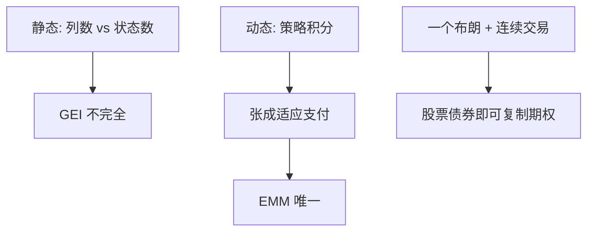

# 动态完备与复制

状态可以很多，证券可以很少：只要能沿信息到达再交易，动态策略可以张成静态菜单张不成的支付。

<footer>—— Kreps, Multiperiod Securities and the Efficient Allocation of Risk, 1982；对照 Harrison–Pliska 的布朗完全性</footer>

[上一课](/econ/equivalent-martingale-measure)写明：完全当且仅当 EMM 唯一。本课缺口是**完全从何而来**——不是一开始就列出 $S$ 张 Arrow 证券，而是动态再交易。不重写 $\mathbb{Q}$ 的定义，不把复制写成限价簿上的对冲执行。

## 问题

静态一期，$J<S$ 则不完全，见 [GEI](/econ/incomplete-markets-gei)。多期：信息是树（或域流 $\mathcal{F}_t$）。每期可按当时价格调整持仓，终端支付是策略的积分。Kreps（1982）强调：动态完备指策略空间张成所有（平方可积、适应的）或有支付，不是指某期现货市场列全。Black–Scholes 的世界只有股票与债券两种证券，连续交易加布朗信息，却能复制欧式期权——因为信息由一个布朗生成，两种连续交易的资产恰好对准那个不确定性来源。

缺口是把「张成」从矩阵的列换成策略的随机积分。FTAP 第二定理现在有了内容：EMM 唯一 ⇔ 动态张成足够。

离散树：每个节点的分叉数不得超过当时可交易的独立风险资产数（加债券），否则局部不满秩。连续时间把这句话换成「风险源的个数 = 连续交易的风险资产个数」。

## 方法

复制：找可积策略 $\phi$，使终端 $x=x_0+\int\phi\,\mathrm{d}S$ 且贴现财富为 $\mathbb{Q}$–鞅（无注入）。完全则每个 $x$ 有复制，价格是复制的初始成本，也等于 $\mathrm{E}^{\mathbb{Q}}[x/B]$。不完全则只有 $\mathrm{span}$ 里的 $x$ 有唯一价格；其余只有超复制的上界与次复制的下界——连续时间课序的定价界再写。

与状态价格课对照：静态完全是 $S$ 张 Arrow；动态完全是「信息有多宽、能交易多少次、有多少独立价格过程」。Radner 式逐期开市场，可以把不完全的静态菜单做完备——前提是每期分叉被当时证券覆盖。

不要把「连续交易」写成「没有买卖价差所以能复制」。连续是域流与路径的理想化；价差会破坏精确复制，那是 Constantinides 后课，不是本课把 FTAP 收回去。

## 机制

机制是信息到达时重新配置。今天分不清的两个状态，明天若被分开，只要那时还有能区分它们的相对价格，就可以把财富挪到正确的枝上。静态菜单必须预先为每一枝准备一张证券；动态菜单用时间换证券数目。布朗之所以「一个噪声源」，是因为无穷小增量只有一个方向；再多一个独立布朗，就要再多一个连续交易的资产，否则不完全。

Kyle 的连续拍卖是信息泄漏过程，不是复制过程。不要把知情者的战略强度当成动态完备——完备是菜单与域流的关系，与是否有人知情无关。有私人信息时，对谁而言的域流可以不同，复制对做市端与对知情者不是同一策略。那是接口，本课用公共域流。

跳跃过程每个跳的幅度若是新方向，可能需要无穷多证券才能完全。 Merton 跳扩散的期权一般不能用股票债券精确复制——不完全，价格落在区间或靠均衡定 $m$。

## 边界

本课不证明随机积分的表示定理。后文 Merton 组合会在完全市场里当策略存在；CIR、Black–Scholes 作为均衡会给出具体的完全经济。也不要把动态完备写成「现实能连续对冲」——执行是量化栏。

下一课回到 Harrison–Kreps：他们如何把鞅定价从套利推到跨期信念，并允许异质预期下的投机。本课只钉张成。

后课默认：动态再交易可以完备静态上看起来缺列的市场；EMM 唯一与可复制是同一件事。价差与跳跃会破坏精确复制。

## 小结

- 动态完备是策略张成适应支付，不是静态 Arrow 证券列全。
- 风险源个数对齐连续交易的风险资产个数时，少量证券即可完全。
- 复制价格 = EMM 期望；不完全则区间。
- 出处：Kreps, 1982；Harrison and Pliska, 1981；对照 Black–Scholes。
