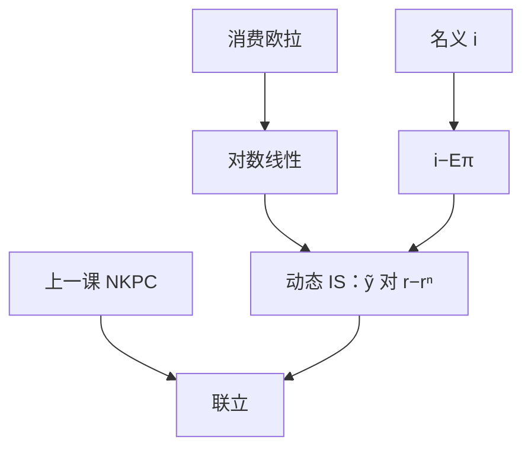

# 从欧拉到动态 IS

商品市场出清之后，欧拉不再只是家庭的一阶条件，而是一条把缺口接到实际利率相对 $r^n$ 之差的前瞻 IS。

<footer>—— Woodford, Interest and Prices, 2003</footer>

[上一课](/econ/hybrid-nkpc)（混合 NKPC）。把供给写成 NKPC。需求侧的欧拉在[跨期消费](/econ/consumption-euler)已经出现，本课不再从 Ramsey 重推。缺口是：对数线性、加上资源约束，把它收成与 NKPC 联立的动态 IS。有了这两条，利率规则才有一个可解的系统。

## 问题

欧拉说：实际利率相对时间偏好越高，消费越往后推。宏观要的不是家庭自己的 $c$，而是产出缺口如何对政策利率反应。若无投资、无政府，商品市场 $y_t=c_t$，对数线性后当期缺口等于预期下期缺口减去跨期替代弹性乘以实际利率相对自然率的偏离。缺口是把「欧拉成立」写成可与 Phillips 配对的 IS，而不是再讲一遍边际效用。

自然实际利率 $r^n_t$ 是灵活价格均衡下的实际利率，下一课会把它叫 $r^*$。本课先把它当 IS 的漂移项：政策盯的是 $i-\mathbb{E}\pi$ 对 $r^n$ 的差，不是 $i$ 的绝对水平。

## 方法

对[欧拉](/econ/consumption-euler)在稳态附近对数线性，并用 $y=c$ 替换，得到 Woodford 的跨期 IS

$$
\tilde{y}_t=\mathbb{E}_t\tilde{y}_{t+1}-\sigma\bigl(i_t-\mathbb{E}_t\pi_{t+1}-r^n_t\bigr).
$$

$\sigma$ 是跨期替代弹性。$r^n_t$ 随偏好、技术、政府购买的灵活价格路径而动；它不是政策选的。有投资或 $G$ 时，式子多若干预期项，形状不变：需求向前看，实际利率相对 $r^n$ 越高，当前 $\tilde{y}$ 越低。

三方程的第三块是后课的利率规则。本课只关闭需求：给定实际利率路径，IS 给出 $\tilde{y}$ 路径；NKPC 再给出 $\pi$。Hicks 的 IS 是 $Y$ 对 $i$ 的同期向下倾斜；动态 IS 的斜率仍在，但截距是 $\mathbb{E}\tilde{y}_{t+1}$ 与 $r^n$。

### 不是把 $C=cY$ 请回来

静态消费函数把可预测收入写成大正的 MPC。欧拉已经拒绝这一点。动态 IS 里当期 $Y$ 仍通过资源约束出现，通道是财富与预期路径。流动性约束家庭会让一部分需求重新变「当期」，那是摩擦，要声明，不能默默退回乘数菜单。

## 机制

央行提高 $i$，若 $\mathbb{E}\pi$ 未一对一跟上，实际利率高于 $r^n$，欧拉要求当前需求下降，$\tilde{y}$ 下降，再经 NKPC 压 $\pi$。预期下期缺口若也被压低，今天的 IS 进一步左移——前瞻使规则的**未来**一段进入当前需求。这与数量论的长期中性不冲突：稳态 $\tilde{y}=0$，$i=\pi^*+r^n$。

$r^n$ 自己会动。正的技术冲击在灵活价格下抬自然产出，也可能改 $r^n$；把观察到的 $y$ 下降全写成需求不足，会把自然率变动误读成缺口。RBC 对照正是这条极限。[神圣巧合](/econ/divine-coincidence)会再问：稳 $\pi$ 是否已经把这条 IS 上的缺口一起关掉；本课只把需求侧方程交给三方程。

政府购买进入资源约束时，动态 IS 的截距含 $G$ 的灵活价格路径：那是 $r^n$ 的一部分，不是把 Hicks 的乘数请回结构。李嘉图下一次总付减税不移动 IS；受约束家庭会。声明摩擦，才能谈乘数。

$\sigma$ 小则同样利率偏离对应更小的缺口反应。估计 $\sigma$ 不是本课。宏观主干只用无风险欧拉；股票溢价留给资产定价，以免吞并量化栏。

## 边界

本课不把金融摩擦写进 IS，不讨论零下限——那是工具卡住之后的课。开放经济下 IS 还含 $q$ 与外国需求，蒙代尔再打开。也不要把限价簿的微观利率当政策 $i$。Hall 的随机游走是欧拉的可观测特例；动态 IS 是同一欧拉的宏观写法，不在此重估消费过度敏感。

后课默认：需求侧是前瞻 IS，政策利率通过 $i-\mathbb{E}\pi-r^n$ 进缺口。下一课对照：若价格灵活，$\tilde{y}$ 消失，周期还剩自然产出自己的波动。

## 小结

- 动态 IS 是欧拉加商品出清的对数线性，不是静态 $C(Y)$。
- $\tilde{y}_t=\mathbb{E}_t\tilde{y}_{t+1}-\sigma(i_t-\mathbb{E}_t\pi_{t+1}-r^n_t)$。
- 政策盯的是实际利率对 $r^n$ 的偏离。
- 前瞻使未来路径进入当前需求。
- 流动性约束让一部分需求重新变当期，必须声明摩擦。
- 出处：Woodford, *Interest and Prices*。
