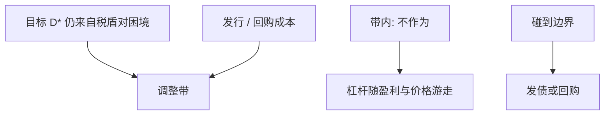

# 动态权衡与调整

    
有发行成本时，企业不会每时每刻对准 $D^\ast$；杠杆在一条调整带里游走，只有撞到边界才发债或回购。

    <footer>—— Fischer, Heinkel and Zechner, Dynamic Capital Structure Choice, Journal of Finance 1989；Goldstein, Ju and Leland, Journal of Business 2001；Leary and Roberts, Journal of Finance 2005</footer>

[上一课](/econ/leland-model)的永久债没有发行成本，杠杆随 $V$ 被动变化，不会主动再平衡。本课缺口是动态权衡：固定或比例发行成本使最优政策变成 $(s,S)$ 式调整带。不重解平滑粘贴，不把优序的柠檬折价提前写成唯一摩擦。

## 问题

静态权衡预测杠杆应紧贴 $D^\ast$。观察上杠杆缓慢、且有大量「不作为」。Fischer–Heinkel–Zechner（1989）把再资本化写成有成本的期权：只有当杠杆偏离带来的税盾与困境损失，超过发行成本，才调整。Goldstein–Ju–Leland（2001）允许按价值比例再平衡，连接 Miles–Ezzell 的 WACC 世界。缺口是：权衡仍然在，但可检验的不是「截面上人人在 $D^\ast$」，而是「偏离的持续性与调整频率」。

Leary–Roberts（2005）：调整行为与有成本的动态权衡一致，对「一次择时留下永久残差」提出挑战。本课先钉机制；下一课 Baker–Wurgler 专写择时。

## 方法

状态是杠杆或 $V$ 相对债务。每期（或连续）权衡：税盾流失、困境逼近 vs 发行/回购成本。最优是反射边界：上沿减债（或发股），下沿加债。带的宽度随成本上升、随波动上升（更常碰到边界，但也不愿频繁付成本）。这与存货、现金管理的 $(s,S)$ 同构，后课现金持有会再见。

实证语言：部分调整回归 $Lev_{t+1}-Lev_t=\lambda(D^\ast-Lev_t)$ 里的 $\lambda$ 不是结构速度——若真实政策是带内零调整，线性 $\lambda$ 会估出一个「慢」的平均数。本课只要：慢不等于没有目标。

盈利冲击：利润高则账面杠杆被动下降，带内可以不回购——看起来像优序的「盈利企业低杠杆」，其实是权衡加成本。识别留给课程最后一课；这里禁止用被动下降否证目标的存在。

## 机制

机制是固定成本破坏凸性规划的「每期一阶条件」。无成本时 Leland 的票息可以随时改；有成本时，等待的期权价值为正，类似实物期权：现在调整放弃「也许价格自己回来」的权利。宏观课序的投资调整成本是近亲；公司金融写在负债侧。

与 APV：带内债务金额路径不规则，资本预算应用 APV 或时变 WACC，而不是一个永远的目标权重——目标是带的中心，不是每时点的实现。

### 动态权衡不是优序

优序：没有目标，杠杆是融资缺口的残差。动态权衡：有目标，有带。两者都可以产生盈利–杠杆负相关。后课择时给出第三种：市场高估时发股，杠杆残差可以永久留下。本课只把「慢」从「无目标」里救出来。

Flannery–Rangan（2006）等报告较快的部分调整；估计对 $D^\ast$ 设定敏感。结构课不拿某一 $\lambda$ 当真理，只拿带政策当机制。

## 边界

不要把本课写成部分调整回归综述。下一课市场择时：若股票被错误定价，边界政策本身会被「窗口」移动。也不要把发行成本只理解成承销费：柠檬、稀释、契约谈判都是成本，会加宽带。

后课默认：权衡目标可以与调整带共存；不作为是最优等待，不是理论失败。择时与个人税尚未进入。

## 小结

- 发行成本把 $D^\ast$ 变成调整带；带内杠杆随盈亏与市值游走。
- 「慢」不等于没有目标；线性 $\lambda$ 不是结构速度。
- 被动的盈利–杠杆负相关不足以否证权衡。
- 出处：Fischer, Heinkel and Zechner, *JF* 1989；Goldstein, Ju and Leland, *JB* 2001；Leary and Roberts, *JF* 2005。
