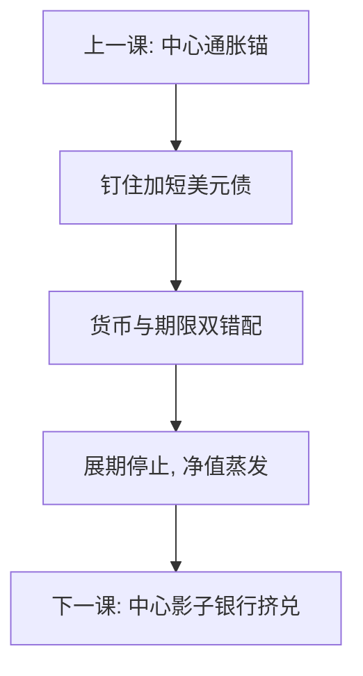

# 东亚危机

钉住加短期外币债，把流动性错配写成可交易的攻击对象。基本面可以有漏洞，恐慌可以把能滚的债变成不能滚——第三代危机是资产负债表，不是「亚洲价值观」。

<footer>—— Krugman 与第三代危机模型；Corsetti, Pesenti and Roubini 的东亚诊断；Kaminsky and Reinhart 孪生危机；对照 Eichengreen；原罪文献</footer>

[上一课](/econ/stagflation-1970s)是中心国家的通胀定锚失败。本课换新兴市场 1997–98：泰国、印尼、韩国等在增长纪录上不像第一代「财政崩了就贬」的剧本，却在几周内失掉平价与信用。缺口是原罪与期限：本币不能在国际上借长期，企业与银行借短美元、资产是本币长项目；钉住把汇率风险藏进表，直到平价一破，净值同时蒸发。后课 2008 把类似的批发挤兑搬到中心国家影子银行。

## 问题

第一代：储备对财政赤字，缓慢见底。第二代：多重均衡，攻击因预期而自实现。东亚更像第三代：公司与银行的外币短债，房地产与出口应收为资产，政府或明或暗担保。钉住鼓励不套期。一旦出口或资产价格动摇，展期停止，储备既要保平价又要救银行，两者不能兼得。缺口不是列 Soros 或哪一天弃钉，而是：**固定汇率加外币短债 = 没有独立的最后贷款人**——本币印出来换不到美元。这与[美元互换线](/econ/dollar-swap-lines)课的批发美元荒是亲戚，层级在新兴市场银行。

孪生危机：货币崩溃与银行崩溃一起出现，Kaminsky–Reinhart 的经验规则在此贴合。

### 不是「亚洲价值观」崩溃

把危机写成文化或裙带的道德剧，会漏掉可迁移的资产负债表。裙带可以解释事前杠杆，不能解释为何这么多国家同一季度爆。国际流动性与共同债权人收缩，是传导。IMF 条件争议是政策史，机制仍是展期与净值。

Corsetti–Pesenti–Roubini 强调或有财政：私人外币债在担保下是隐性主权债。主权可持续课的 $b$ 被低估，直到危机把它显化。

## 方法

对照三句。(1) 钉住：三角牺牲独立 $M$，在资本流入时尤其脆。(2) 原罪：不能用本币借外债，货币错配。(3) 短债：流动性错配，挤兑逻辑与银行相同。政策实验：弃钉后谁有外币流动性谁先稳；资本管制与国际救助是替代的展期安排。不要用「基本面很好所以只是恐慌」或「基本面很差所以只是惩罚」单选：两者可以叠，恐慌放大漏洞。公司部门的外汇敞口表，比 GDP 增长率更能预测谁先爆——这是第三代的可观测矩。

不要把股权组合投资的撤退与银行短债的不展期当成同一流动性。后者是危机核。股权下跌伤净值，但不自动触发必须用美元偿还的到期墙；短债不展期是墙上的砖同时到期。政策若用提高利率保卫平价，国内加速器更狠——与金本位保卫平价是同族工具，对象换成了原罪债。套期比率是可观测的政策目标，增长率不是。

## 机制

机制是未套期的期权：平价是政府卖出的廉价保险，企业乐于借美元。平价破，保险行权，净值为负，投资中断，汇率超调。银行担保把私人亏损并入主权，利差跳升，多重均衡打开——与主权课同一句，货币从本币换成外币。金本位输出通缩；东亚输出的是突然停止与进口压缩。滞胀是供给加弱锚；东亚是金融加钉住。

与 IO 无关，也不进限价簿。救援与道德风险：事前担保鼓励错配，事后不救则加速器更狠——时间一致性，接到最后一课央行与财政边界。资本管制可以拉长展期，代价是事后的配置扭曲；它改变的是攻击速度，不自动修好货币错配。

Krugman 的第三代把危机写成资产价格与资产负债表的循环，而不是商品市场的储备算术。本课用这张图组织，不重推全部微分方程。

## 边界

本课不提供做空钉住货币的任何操作步骤。不把每次评级下调编年。2008 的中心国家版本下一课：抵押品与批发融资替代了「外币」，但挤兑同构。后课默认：东亚用钉住 × 原罪 × 短债来读；文化叙事不当主因果。金本位、布雷顿、滞胀、东亚，是约束形态的序列，不是年代目录。公司部门未套期的美元债，是原罪在企业表上的位置；主权若再担保，两张表并成一张。

## 小结

- 第三代危机核是外币短债加钉住，不是财政第一代剧本。
- 平价是廉价保险，破钉使净值同时蒸发。
- 孪生危机：银行与货币一起倒，隐性主权债显化。
- 恐慌与漏洞可叠加；不要单选道德剧。
- 保平价的加息会经国内加速器加深衰退，与金本位同族。
- 出处：Krugman；Corsetti, Pesenti and Roubini；Kaminsky and Reinhart；Eichengreen。
