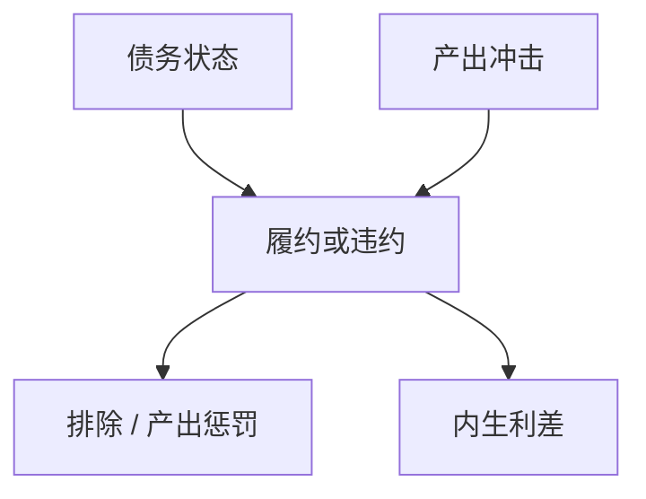

# Eaton–Gersovitz 主权违约

主权不能被抵押法庭强制执行，还款靠未来市场准入与产出惩罚；债务是声誉合约，不是 KM 的土地。

<footer>—— Eaton and Gersovitz, Debt with Potential Repudiation, ReStud 1981</footer>

[上一课](/econ/global-financial-cycle)的借款人仍是可抵押的私人。主权经常不能被扣押资本。本课缺口是 **Eaton–Gersovitz**：违约的期权与内生利率。不重写全球因子，不把 Arellano 的定量校准提前做完。

## 问题

私人 KM：不还则失去抵押品。主权：抵押品有限，惩罚是排除在市场之外、贸易或产出损失。Eaton–Gersovitz：政府每期选借新债或违约，债权人要价使期望回报相等，利率含违约溢价。缺口是给「新兴市场利差」一条合约装置，而不是把利差当外生 GK 冲击。

Eaton and Gersovitz, *Review of Economic Studies* 48(2), 1981, 289–309。Bulow and Rogoff 对声誉能否支持债务的批评（1989）：若能储蓄，惩罚可能不够。后续文献用排除、谈判、政治。

## 方法

政府贝尔曼：状态是债与产出。违约：进入惩罚区（一段时间不能借、产出损失），债归零或进谈判。履约：付息、发新债。债价 $q(b',z)= \mathbb{E}[(1-\delta') (1+coupon)/R]$。长期债、自我履行的滚动，后课 Arellano 定量化。与财政：一次总付税可还债，但政治上限使有效上像约束。

与家庭 Aiyagari：都是不完全执行的债务，惩罚技术不同。主权没有外生的 $a\ge\underline a$ 那么干净，排除是均衡对象。

## 机制

机制是未来剩余损失对今天诱惑。高债、坏 $z$ 时违约期权价内，利差跳升，滚动危机：即使愿意还，市场不给 $q$ 也会逼违约。这与银行挤兑同构，对象是批发债权人。全球金融周期：中心收紧使 $q$ 下降，把原本可滚动的债推入价内——两课相接。

Bulow–Rogoff：若违约后仍能在市场上买资产，惩罚弱。现实排除不完美，故有谈判与发市（Arellano 后的 Chatterjee–Eyigungor、Hatchondo–Martinez）。

本课不把评级公司当理论。也不交易 CDS。

## 边界

本课不定某个国家会不会违约。定量的违约频率与利差匹配是下一课 Arellano。债务可持续的 $r-g$ 会计再下一课，EG 是微观基础。货币主导稀释本币债，与违约是替代，后课。

后课默认：主权债价含内生违约溢价；执行靠惩罚而非土地抵押。下一课：Arellano 的定量递归。

## 小结

- Eaton–Gersovitz：违约期权 + 排除惩罚 ⇒ 内生利差。
- 与 KM 抵押执行不同。
- 滚动危机：利差跳升可自我实现式地逼近违约。
- 出处：Eaton and Gersovitz, *ReStud* 1981。
