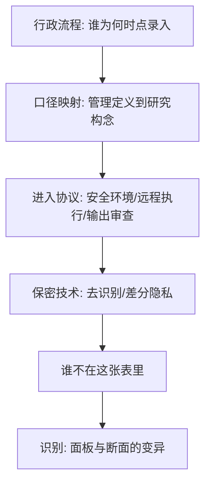
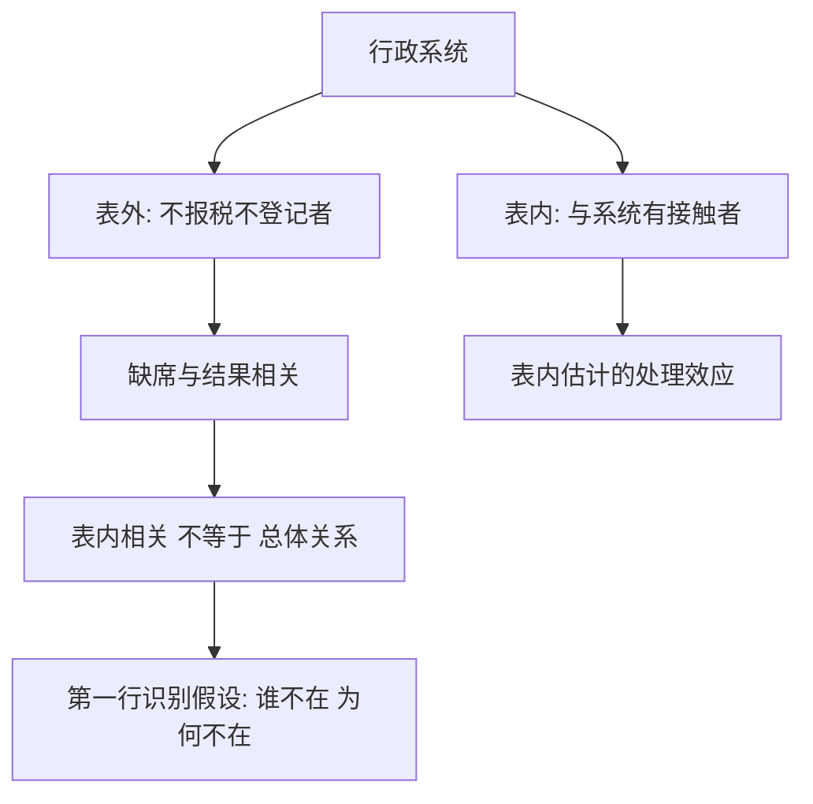

# 行政数据的利用

行政记录回答的是「治理需要知道什么」；研究问的常常是另一件事——把前者当后者用之前，先读懂产生它的流程。

<footer>—— 据 Abowd, The U.S. Census Bureau Adopts Differential Privacy, KDD 2018 整理</footer>

[上一课](/econ/ec-data-sources)把来源谱系摆开、钉了口径五查，行政数据只在谱系里占一格。这一课把那一格放大：它是五类里体量最大、增长最快的一支，也是过去二十年劳动、公共与城市经济学实证重心迁移的方向——不是因为它好用，而是因为别的来源在退化。

## 问题

行政数据的诱惑是规模与精度：近全样本、无回忆误差、能跨十年追踪同一个体。但它是行政过程的副产品，四个缺口随之而来。字段是管理定义：失业登记里的「失业」与劳动力调查的「失业」口径不同，把登记数当调查数用，测的是行政管理不是劳动市场。覆盖由管理边界决定：在税册上的人是申报者，不在税册上的人不是噪声，是系统性缺席。变量缺失是为省成本或为保密：你想要的协变量从未被采集。访问受保密法约束：数据不是下载的，是申请的。

口径就是一套测量规则：谁被算进来、字段按什么定义填。失业登记的『失业』要求你主动登记领取待遇，劳动力调查的『失业』要求无工作且在找工作——同一个词两种规则，两组数字不能直接对表。

### 利用四步

2020 年美国人口普查为防重识别注入差分隐私噪声：隐私损失预算在州、县、街区块之间怎么分配，直接改变小区域数据的可用形状——保密技术从此是口径的一部分，要跟数据手册一起读，而不是事后当局限。

第一步读懂流程：谁、在什么激励下、什么时点录入这条记录，漏登与错登集中在流程哪一段。第二步口径映射：把行政分类显式翻译成研究构念，翻译不了的字段宁可不用。第三步进入协议：统计机构的安全环境、远程执行、输出审查——「代码进、人不出」是常态，研究工作流要为此设计，环境课接着讲。第四步保密技术：去识别、$k$-匿名、差分隐私；它们不只是约束，也改变数据本身的形状。

## 方法

两个范本。其一，Chetty–Friedman–Rockoff 2014 用学区行政记录把数十年前的学生与教师连到成年后的税务记录，把教师质量对长期收入的效应做成可估量——全样本与长纵深使这种跟踪在调查里不可能。其二，Autor–Dorn–Hanson 2013 用海关贸易数据与产业面板度量本地劳动力市场的进口竞争暴露（[中国冲击](/econ/china-shock)），行政数据的高频与细分把处理的断面做细，[双重差分](/econ/difference-in-differences)才有得吃。

## 机制

行政数据的识别优势拆成两条：覆盖把小群体变成可估计的样本——小城镇、细分子行业、少数族裔细分组；纵深把跨代、跨企业的长期结果连成面板。但「全」是行政边界内的全：与管理系统的接触本身可能相关于结果，不报税、不登记、不入学的人，恰恰是许多政策问题里最重要的人。所以用行政数据做识别，识别假设的清单第一行写的是「谁不在这张表里、为何不在」，然后才是处理效应；进入行政系统的选择不是稳健性附录，是识别假设本身。

「接近全样本为什么仍可能有偏」——进入选择的几何：

差分隐私可类比在集体合影上撒细沙：单个人看不清（隐私受保护），想数清某个小方块里站了几个人也变难（小区域统计失真）。沙子撒多粗、往哪里撒，由隐私预算决定——所以它是口径的一部分。

不这么做会错在哪：拿登记口径的失业当调查失业做时间序列；把覆盖变化（扩围、并轨）误读成行为变化；不写清进入机制，把「表内相关」读成总体关系。

## 边界

行政数据不是免费午餐：申请周期长、变量僵化、敏感结论要过输出审查，而且「为研究复制一份历史库」常受保密约束——这让复现工程的权重更高，是环境课的主题。它与调查是互补不是替代：行政缺动机与态度变量，调查缺样本量与代表性锚点，两者怎么组合是下一课。爬取型「准行政」数据另算：它的生成机制更接近网络与文本，回到[第一课](/econ/ec-data-sources)的谱系与[文本测量](/econ/pm-text-as-data)的验证纪律。

常见误区：说『这是接近全体人口的数据，所以没有样本偏差』。研究失业救济时，从未申报的人可能正是最脱离市场的一群——他们不在表里，任何只看表内的结论都会系统性漏掉最需要政策的人。

## 小结

- 行政数据是治理过程的沉淀：字段是管理定义，覆盖是管理边界，访问是法律协议。
- 利用四步：读流程、映射口径、进协议、读保密技术；「谁不在这张表里」是识别假设的一部分。
- 覆盖与纵深是小群体与长期结果的识别来源，代价是进入成本与变量僵化。
- 差分隐私等保密技术改变数据形状，属于口径而非外部约束。
- 出处：Abowd, *KDD* 2018；Chetty, Friedman and Rockoff, *AER* 2014；Autor, Dorn and Hanson, *AER* 2013。
