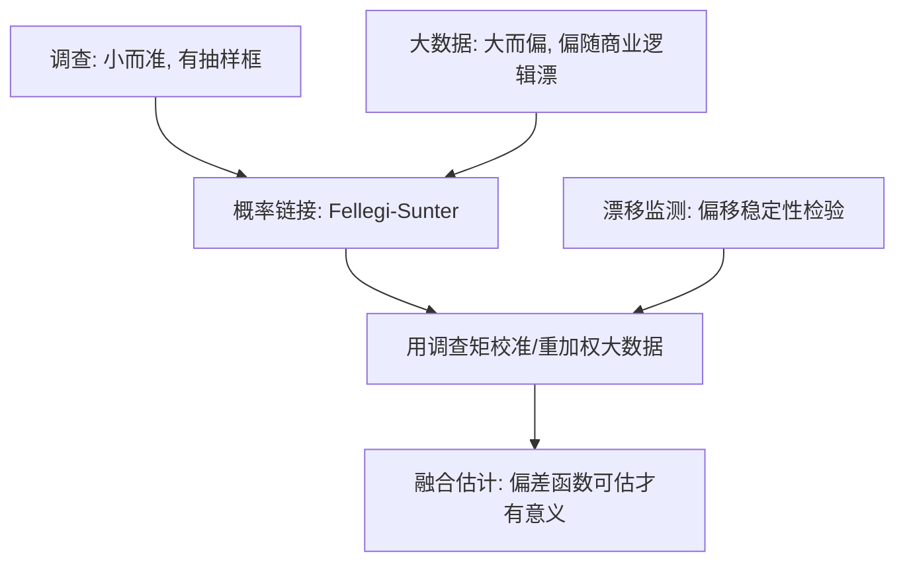

# 大数据与调查的融合

更多数据不会自动稀释偏差；大样本只是把采样管子已有的形状画得更清楚。

<footer>—— 据 Lazer 等, The Parable of Google Flu: Traps in Big Data Analysis, Science 2014 整理</footer>

[上一课](/econ/ec-administrative-data)把行政数据的利用钉在流程、口径与进入协议上；行政之外，扫描仪、网页、手机与信用卡还在产出另一种「大」。缺口是：这些大数据与调查究竟是替代还是互补？答案是互补，而且互补得有计量结构——本课把它写清楚。

## 问题

大数据有三种偏。覆盖偏：在平台里的人不是总体，用手机支付的人与用现金的人消费结构不同。行为偏：写评论、做搜索、点广告的不是全体用户。度量偏：字段是商业定义，「活跃用户」「成交」随产品改版而变。调查这边也不轻松：回答率长期下滑有系统记录（Meyer–Mok–Sullivan 2015），无应答不再可忽略，长回顾期的回忆误差放大，成本把样本量压小。两边的误差结构接近正交：调查小而偏得可描述——有抽样框，知道偏差往哪去；大数据大而偏，且偏随商业逻辑漂移。融合要回答的问题因此不是「用哪个」，而是：偏能不能被校？

### 数据组合的计量结构

Google 流感趋势在 2012–13 流感季把流感就诊率高估了一倍以上：搜索引擎改版与媒体驱动的搜索行为变化，让偏移本身在漂移。Lazer 等称之为「大数据自大」——它已成为教材级反例。

数据组合不是工程杂活，是估计问题：Ridder–Moffitt 2007 把它收进计量经济学。分工是金标准小样本负责测量与锚点——定义构念、校准总量、估计偏差函数；大样本负责条件变异与精度。链接是第一道工序：Fellegi–Sunter 1969 的概率匹配把「同名同生日」变成带估计误差率的决策，链接误差以测量误差的身份进账。校准是第二道：用调查的代表性权重对大数据重加权，使其在已知总体矩上一致。nowcasting 是典型应用：Choi–Varian 2012 用搜索量把当期宏观量「现在化」，其兴衰正是本课边界段的样本。

## 方法

流程分三步。先各自体检：调查的应答机制写在抽样框旁，大数据的进入机制写在采集脚本旁。再选组合方式：链接——同一对象两源都有标识；校准——两源测同一构念但覆盖不同；镶套——大数据找候选、小样本人工核验。最后登记误差从哪进来：链接误配率、覆盖差、校准矩自身的抽样误差；每一项都要有估计，而不是一句「误差可控」。

## 机制

「大数据加小金标准」优于任何单一来源的条件是偏的稳定性。调查给出无偏但高方差的锚，大数据给出低方差但有系统偏移的信号，组合后的均方误差由偏差函数能不能被小样本估出来决定：偏稳定，校一次用一片；偏漂移——平台改版、搜索行为随媒体周期变——校不胜校，GFT 是教案。这与[上一课](/econ/ec-administrative-data)同构：先写清谁不在样本里，再谈加权。加权能救覆盖差，救不了构念错位——两源测的根本不是一个量时，链接再准也没用。

不这么做会错在哪：拿大数据的样本内总量直接当总体统计量发布；把链接成功率当成一百；用今天的平台口径回放历史行为，还报告「长期规律」。

## 边界

文本形态的大数据要过[文本作为数据](/econ/pm-text-as-data)的三重验证，本课不重讲测量。融合不改变识别设计的要求：组合之后再做因果解释，仍回到[潜在结果](/econ/potential-outcomes)的语言。行政与大数据的边界也在模糊——平台数据本质是私有的行政数据，进入协议比统计机构更不透明，上一课的协议思维照用。方法论沉底为一条：先问两源总体的差，再问组合省什么；反过来问，会把工程做成装饰。

## 小结

- 大数据三偏：覆盖、行为、度量；偏随商业逻辑漂移，这是它与抽样误差的本质区别。
- 融合的计量结构：小金标准定测量与锚点，大样本供变异与精度；链接与校准都有误差进账。
- 偏稳定才可校；GFT 的失败不在数据少，在偏移本身漂移。
- 调查的价值从「唯一的量」转向「校准的锚」；回答率下滑让它更贵也更关键。
- 出处：Ridder and Moffitt, Handbook of Econometrics 2007；Fellegi and Sunter, *JASA* 1969；Choi and Varian, *Economic Record* 2012；Lazer 等, *Science* 2014；Meyer, Mok and Sullivan, *JEP* 2015。
